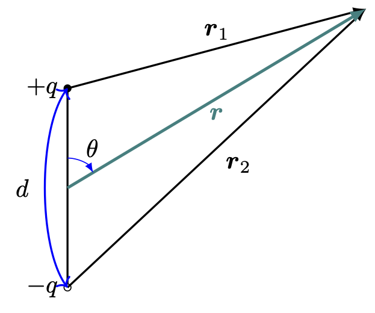
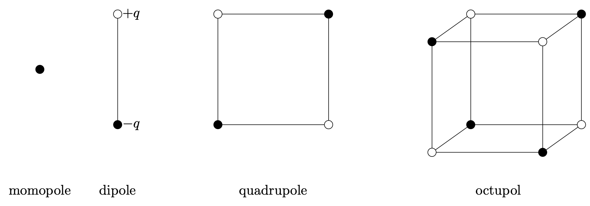



여기서는 어떤 기준틀에서 $\rho(\bf{x},\,t)$ 가 상수인 경우를 다룬다. 이 기준틀에서 전하의 위치는 고정되어 있으며 움직이지 않는다. $\bf{J}(\bf{x},\,t)=0$ 이며 이 때 $\bf{B}=\bf{0}$ 으로 놓을 수 있다. 그렇다면 우리가 가진 멕스웰 방정식은 아래의 두개이다.

$$
\nabla \bf{\cdot E}= \dfrac{\rho}{\epsilon_0},\qquad \nabla \times \bf{E}=\bf{0}
$$

 

## 전기장과 정전포텐셜 {#sec-ED_ES_electric_field_and_potential}

### 전기장과 쿨롱힘 {#sec-ED-ES_electric_field_and_coulomb_force}

가우스 법칙과 발산 정리를 통해 닫힌 곡면 $S$ 로 둘러쌓인 부피 $V$ 에 대해 

$$
\int_V (\nabla \bf{\cdot E}) \, d^3 \bf{r} = \int_S \bf{E\cdot}d\bf{a} = \dfrac{1}{\epsilon_0}\int_V \rho(\bf{x})\,d^3 \bf{r} = \dfrac{Q}{\epsilon_0}
$$

이다. 여기서 $Q$ 는 부피 $V$ 에 포함된 총 전하량이다. 이로부터 우리는 아래의 가우스 법칙의 적분형태를 얻는다.

$$
\oint_S \bf{E\cdot}d\bf{a} = \dfrac{Q}{\epsilon_0}.
$$ {#eq-ED_ES_integral_form_of_gauss_law}

원점에 놓인 점전하 $q'=q'\,\delta(\bf{x})$ 을 생각하자. 원점을 중심으로 반지름 $r$ 인 구를 적분하는 부피로 잡으면 이 부피 안에 전하는 $q$ 이다. 또한 구면좌표계에서 $d\bf{a} = r^2 \sin\theta \,d\varphi d\theta\hat{\bf{r}}$ 이며 $\bf{E}$ 는 대칭에 의해 표면에서 그 크기가 같고 $\hat{\bf{r}}$ 방향이어야 하므로 $\bf{E}=E(r)\hat{\bf{r}}$ 로 놓을 수 있다. 그렇다면 

$$
\dfrac{q'}{\epsilon_0} = \int_S \bf{E\cdot}d\bf{a} = 4\pi r^2 E(r)
$$

이므로 

$$
\bf{E}(\bf{r}) = \dfrac{1}{4\pi\epsilon_0}\dfrac{q'}{r^3}\bf{r}
$$ {#eq-ED_ES_electric_field_by_point_charge}

이며 로런츠 힘을 생각하면 위치 $\bf{r}$ 의 전하 $q$ 가 받는 힘은

$$
\bf{F} = q\bf{E}(\bf{r}) = \dfrac{1}{4\pi \epsilon_0}\dfrac{qq'}{r^3}\bf{r}
$$ {#eq-ED_ES_coulomb_force_by_point_charge_at_origin}

이다. 이 $\bf{F}$ 는 원점에 위치한 점전하 $q'$ 에 의해 $\bf{r}$ 에 위치한 $q$ 가 받는 힘을 의미하며 이런 점전하에 희한 힘을 **쿨롱힘(Coulomb force)** 이라고 한다. 

$\bf{r}'$ 에 위치한 점전하 $q'$ 에 의해 생성되는 전기장과 $\bf{r}$ 에 위치한 점전하 $q$ 가 받는 힘은 다음과 같다는 것을 알 수 있다.

$$
\bf{E}(\bf{r}) = \dfrac{1}{4\pi\epsilon_0} \dfrac{q'(\bf{r}-\bf{r}')}{\|\bf{r}-\bf{r}'\|^3},
$${#eq-ED_ES_electric_field_by_point_charge_at_rprime}

$$
\bf{F} = \dfrac{1}{4\pi\epsilon_0} \dfrac{qq'(\bf{r}-\bf{r}')}{\|\bf{r}-\bf{r}'\|^3}.
$${#eq-ED_ES_coulomb_force_by_point_charge_at_rprime}

또한 점전하가 아니라 전하분포 $\rho(\bf{r}')$ 에 의해 성성되는 전기장은 다음과 같다는 것을 알 수 있다.

$$
\bf{E}(\bf{r}) = \dfrac{1}{4\pi\epsilon_0} \int_V \dfrac{\rho(\bf{r}')(\bf{r}-\bf{r}')}{\|\bf{r}-\bf{r}'\|^3} \,d^3\bf{r},
$${#eq-ED_ES_electric_field_by_point_charge_distribution}

 

### 정전 포텐셜 {#sec-ED_ES_electrostatic_potential}

#### **정전 포텐셜**

[헬름홀츠 정리](https://julia-kaeri.github.io/MathematicalPhysics/src/vector_calculus/vectorcalculus.html#헬름홀츠-정리) 와 정전기 상태의 멕스웰 방정식으로부터 벡터장 $\bf{E}$ 는 스칼라장

$$
\Phi(\bf{r}) := \dfrac{1}{4\pi\epsilon_0}\int_V \dfrac{\rho(\bf{r}')}{\|\bf{r}-\bf{r}'\|}d^3\bf{r}
$$ {#eq-ED_ES_definition_of_electrostatic_potential}

에 대해

$$
\bf{E}=-\nabla \Phi
$$ {#eq-ED_ES_electrostatic_potential_and_electric_field}

이다. 이 때 $\Phi(\bf{r})$ 을 **정전 포텐셜(electrostatic potential)** 이라고 한다. 

 

#### **쿨롱힘과 보존력**

정전기 상태일 경우 @eq-ED_ES_electrostatic_potential_and_electric_field 로 부터

$$
\Delta \Phi_{12}=\Phi(\bf{r}_2)-\Phi(\bf{r}_1) = - \int_{\bf{r}_1}^{\bf{r}_2} \bf{E\cdot}d\bf{l}
$$ {#eq-ED_ES_electrostatic_potential_difference}

이다. 우변의 적분은 경로에 무관하며 따라서 $\bf{r}_2$ 에서 $\bf{r}_1$ 까지 전하를 이동시킬때의 일 $W_{12}$ 는 다음과 같다.

$$
W_{12} = q\int_{\bf{r}_1}^{\bf{r}_2} \bf{E\cdot}d\bf{l}= - q\Delta \Phi_{12}.
$$ {#eq-ED_ES_electro_static_work_by_electrostatic_potential}

 

#### **푸아송 방정식과 라플라스 방정식**

정전기 상태에서

$$
\bf{E}(\bf{r}) = - \nabla \Phi (\bf{r}) 
$$

이며, $\nabla \bf{\cdot E}(\bf{r}) = \rho/\epsilon_0$ 로부터 아래의 미분방정식을 얻는다.

$$
\boxed{\nabla^2 \Phi = -\dfrac{\rho}{\epsilon_0}.}
$$ {#eq-ED_ES_poisson_equation}

위의 미분방정식을 **푸아송 방정식(Poisson equation)** 이라고 한다. 전하 밀도가 $0$ 인 곳에서는 $\Phi(\bf{r})$ 는 아래와 같은 **라플라스 방정식(Laplace equation)** 을 만족한다. 

$$
\boxed{\nabla^2\Phi = 0.}
$$ {#eq-ED_ES_laplace_equation}

#### **포텐셜의 기준점**

일반적으로 포텐셜은 어떤 기준점 $\mathcal{O}$ 을 정하고 그 기준점과의 포텐셜 차이를 포텐셜로 정한다. 즉

$$
\Phi(\bf{r}) = -\int_{\mathcal{O}}^{\bf{r}}\bf{E}\bf{\cdot}\,d\bf{l}
$$

기준점이 바뀌더라도 포텐셜에는 상수 만큼의 차이밖에 나지 않으며 물리에는 변화가 없다. $\displaystyle \lim_{|\bf{r}\|\to \infty} \Phi(\bf{r})=0$ 이면 무한히 먼 점을 기준으로 사용한다.

 

#### **중첩의 원리**

푸아송 방정식을 보자. 전하 밀도 $\rho_1$ 에 대해 포텐셜 $\Phi_1$ 을 얻고 $\rho_2$ 에 대해 포텐셜 $\Phi_2$ 를 얻었다면 $\nabla^2 (\Phi_1+ \Phi_2) = (\rho_1+\rho_2)/\epsilon_0$ 이다. 이것은 전기장 $\bf{E}_1,\,\bf{E}_2$ 에 대해서도 마찬가지이다. 이를 **중첩 원리 (principle of superposition)** 라고 한다.

 

#### **점전하에 의한 포텐셜**

원점에 위치한 점전하 $q$ 에 의한 포텐셜은 @eq-ED_ES_electrostatic_potential_difference 를 이용하여 계산하면 아래와 같다.

$$
\Phi(\bf{r}) = -\int_{\infty}^{\bf{r}} \dfrac{1}{4\pi\epsilon_0}\dfrac{q\bf{r'\cdot}\,d^3\bf{r'}}{r'^3} = -\dfrac{q}{4\pi\epsilon_0} \int_{\infty}^r \dfrac{dr'}{r'^2} = \dfrac{q}{4\pi\epsilon_0 r}
$$ 

즉, $\bf{r}'$ 에 위치한 점전하 $q$ 에 의해 발생하는 $\bf{r}$ 에서의 포텐셜 $\Phi(\bf{r})$ 은 다음과 같다. 

$$
\Phi(\bf{r})= \dfrac{1}{4\pi\epsilon_0}\dfrac{q}{\|\bf{r}-\bf{r}'\|}.
$${#eq-ED_ES_potential_by_point_charge}

 

#### **정전기 시스템의 경계 조건**

우선 표면 전하 밀도가 $\sigma$ 인 표면에 면적 $A$ 인 원통형의 얇은 가우스 표면을 생각하자. 원통의 축은 표면에 수직으로 잡자. 표면을 기준으로 영역을 $1$, $2$ 로 나누고 영역 $1$ 의 원의 전기장과 정전포텐셜을 $\bf{E}_1$, $\Phi_1$ , 영역 $2$ 원의 전기장과 정전포텐셜을 $\bf{E}_2$, $\Phi_2$ 라고 하자. 그리고 영역 $2$ 의 원에 수직한, 원통 밖을 향하는 단위벡터를 $\hat{\bf{n}}_2$ 이라고 하자. 가우스 법칙으로부터 $\hat{\bf{n}}_2 \bf{\cdot} (\bf{E}_2-\bf{E}_1)= -\sigma/\epsilon_0$ 이다. $\bf{E}=-\nabla \Phi$ 이므로

$$
\dfrac{\partial \Phi_2}{\partial n_2}- \dfrac{\partial \Phi_1}{\partial n_2}= \dfrac{\sigma}{\epsilon_0} 
$$ {#eq-ED_ES_electrostatic_boundary_condition_for_normal_derivative_of_potential}

을 만족해야 한다. 또한 @eq-ED_ES_electrostatic_potential_difference 에서 $\bf{r}_1$ 은 영역 $1$, $\bf{r}_2$ 는 영역 $2$ 의 점이며 $\bf{r}_1$ 과 $\bf{r}_2$ 를 경계 근처에 가깝게 잡고 $\bf{r}_1\to \bf{r}_2$ 극한을 취하면

$$
\Phi_1 (\bf{r}_{1\to S_0}) = \Phi_2(\bf{r}_{2\to S_0})
$${#eq-ED_ES_electrostatic_boundary_condition_for_electrostatic_potential}

를 얻는다. 

 

### 정전기적 안정평형상태 {#sec-ED_ES_electrostatic_stable_equilibrium}

평형이란 어떤 시스템의 모든 입자에 대해 가해지는 힘이 $0$ 인 상태이다. 정전기적 안정평형상태, 즉 전하들이 정지된 상태에서 각 전하에 가해지는 힘이 $0$ 이며 또한 미소 변화에 대해 복원력이 작용하는 전하 분포가 존재할까? 여기서는 서로 겹치지 않는 이산적인 점전하의 분포에서 가능한지 여부를 알아보자. 예를 들어 붙어있는 양전하와 음전하는 안정평형상태라고 볼 수 있다. 

$\bf{r}$ 에 위치한 전하 $q$ 에 가해지는 힘 $\bf{F} = q\bf{E} = -q\nabla \Phi$ 이다. 정전기 평형상태이려면 $\bf{F}=0$ 이어야 하므로 $\nabla \Phi(\bf{r}) = 0$ 이어야 한다. 또한 $q\nabla^2\Phi >0$ 이어야 한다. 하지만 우리는 전하 분포가 없는 공간에서 $\nabla^2 \Phi = 0$ 임을 안다. 즉 이산적 전하분포에서 정전기적 안정평형상태는 존재하지 않는다.

우리는 이것에 대해 좀 더 수학적으로 알아보자.

::: {#thm-ED_ES_electrostatics_laplacian_1}

$\Phi(\bf{r})$ 이 라플라스 방정식의 해라면 전하가 없는 공간상의 임의의 구 $V$ 의 표면 $S$ 에 대한 적분값의 평균은 구의 중심에서의 함수값과 같다. 즉 구의 중심 $\bf{r}_0$ 에 대해 다음이 성립한다.

$$
\dfrac{1}{\text{area of }S} \oint_S \Phi (\bf{r})\, da = \Phi (\bf{r}_0)
$$

:::

::: {.proof}

$\bf{r}_0$ 를 원점으로 잡고 원점을 중심으로 반지름 $R$ 인 구의 표면 $S$ 를 생각하자. $\langle \Phi\rangle$ 를 $S$ 에서의 포텐셜의 평균값이라고 하면

$$
\begin{aligned}
\langle \Phi\rangle &= \dfrac{1}{4\pi R^2}\oint_S \Phi(\bf{r}) da = \dfrac{1}{4\pi}\int \Phi(\bf{r}) R^2 d\Omega = \dfrac{1}{4\pi} \int \Phi(\bf{r})d\Omega \\[0.3em]
&= \dfrac{1}{4\pi} \int \Phi(R,\,\theta,\,\varphi) d\Omega
\end{aligned}
$$

이다. 여기서 $d\Omega$ 는 고체각을 의미한다. 그렇다면

$$
\begin{aligned}
\dfrac{d\langle \Phi\rangle}{dR} &= \dfrac{1}{4\pi} \int \dfrac{\partial \Phi}{\partial R}\, d\Omega = \dfrac{1}{4\pi} \int\dfrac{\partial \Phi}{\partial R}\hat{\bf{R}}\cdot \hat{\bf{R}} \, d\Omega \\
&= \dfrac{1}{4\pi R^2} \int \nabla \Phi \cdot d\bf{a} = \dfrac{1}{4\pi R^2}\int_V \nabla^2 \Phi \,dV = 0
\end{aligned}
$$

이므로 $\langle \Phi \rangle=\text{const.}$ 이다. 즉 임의의 구 표면에 대한 평균값은 항상 일정하며 반지름 $R\to 0$ 극한에서의 평균값은 중앙값일 것이므로 $\langle \Phi\rangle = \Phi (\bf{0})$ 이다. $\square$

:::

 

::: {#thm-ED_ES_electrostatics_Earnshaw_principle}

#### Earnshaw 정리

유한하고 전하가 존재하지 않는 공간 $R$ 에서의 전기 포텐셜 $\Phi(\bf{r})$ 의 극점은 $R$ 의 경계에서만 존재한다.

:::

::: {.proof}

$R$ 내부의 점 $\bf{r}_0$ 이 $\Phi(\bf{r})$ 의 극소점이라고 하자. 그렇다면 $\bf{r}_0$ 를 중심으로 하는 작은 구 의 표면 $S_0$ 에 대해 $\bf{r}\in S\implies \Phi (\bf{r}) > \Phi(\bf{r}_0)$ 이며, 따라서 구의 normal vector $\hat{\bf{n}}$ 에 대해 $\hat{\bf{n}}\bf{\cdot} \nabla \Phi (\bf{r})>0$ 이고,

$$
\int_S\hat{\bf{n}}\bf{\cdot}\nabla \Phi \,da >0
$$

이다. 이로부터

$$
0 < \int_S \hat{\bf{n}}\bf{\cdot} \nabla \Phi  \, da = - \int_S \hat{\bf{n}}\bf{\cdot}\bf{E}\,da = -\int_R \nabla \cdot E \, d^3\bf{r} = - \int_R \dfrac{\rho(\bf{r})}{\epsilon_0}\, d^3\bf{r} = 0
$$

이므로 모순이다. $\bf{r}_0$ 가 극대점일 경우 $\hat{\bf{n}}\bf{\cdot}\nabla \Phi <0$ 이므로 위의 식의 부호가 반대가 되어 역시 모순이 된다. $\square$

:::

 

Earnshow 의 정리로부터 우리는 전하로 이루어진 계가 **정전기력만으로는** 안정평형상태를 유지할 수 없다는 것을 알 수 있다. 

 

### 정전기 문제의 유일성 정리 {#sec-ED_ES_uniqueness_theorem_for_electrostatics}

::: {#thm-ED_ES_uniqueness_theorem_for_dirichlet_and_neumann_boundary_condition}

#### 정전기 포텐셜의 유일성 정리

표면 $S_1,\,S_2,\ldots,\,S_n$ 에 대해 디리클레 경계조건 혹은 노이만 경계조건이 정해진 경우 라플라스 방정식의 해가 존재한다면 그 해는 유일하다.

:::

::: {.proof}

$S_i$ 에서의 경계값을 만족하는 두 정전 포텐셜 $\Phi_1$ 과 $\Phi_2$ 가 있다고 하자. 이 때 $\Psi = \Phi_1-\Phi_2$ 라고 하자. $\nabla^2 \Phi_1 = \nabla^2 \Phi_2 = 0$ 이므로 $\nabla^2 \Psi = 0$ 이다. 모든 $S_i$ 로 둘러쌓여진 영역을 포함하는 큰 영역 $V_0$ 를 생각하자. $V_0$ 에서 $S_i$ 에 의해 둘러쌓인 부분을 제외한 영역을 $V$ 라고 하면 $V$ 의 경계면은 $V_0$ 의 경계면 $S_0$ 와 $S_1,\ldots,\,S_n$ 이다. 그 경계 $\partial V = \bigcup_{k=0}^n S_k$ 를 생각 할 수 있다. 이 $V$ 에 대해 $\nabla^2 \Psi = 0$ 와 그린의 제 1 항등식(@eq-ED_ES_green_first_identity) 을 이용하면 

$$
\begin{aligned}
\int_V (\nabla \Psi \bf{\cdot}\nabla \Psi)\,d^3\bf{r} &= \int_V \left[\nabla \bf{\cdot} (\Psi \nabla \Psi)- \Psi \nabla^2 \Psi\right]\,d^3\bf{r} \\[0.3em] 
&= \int_{\partial V} \Psi \dfrac{\partial \Psi}{\partial \bf{n}}\bf{\cdot}d \bf{a} 
\end{aligned}
$${#eq-thm-ED_ES_uniqueness_theorem_for_dirichlet_and_neumann_boundary_condition_1}

이다. 여기서

$$
\int_V (\nabla \Psi \bf{\cdot}\nabla \Psi)\,d^3\bf{r} = \int_V \|\nabla \Psi\|\,d^3 \bf{r} \ge 0
$$ {#eq-thm-ED_ES_uniqueness_theorem_for_dirichlet_and_neumann_boundary_condition_2}

임을 안다. 또한

$$
\int_{\partial V}\Psi \dfrac{\partial \Psi}{\partial \bf{n}}\bf{\cdot}d \bf{a} 
$$

을 생각하자. 디리클레 혹은 노이만 경계조건이 정해졌으므로 $S_1,\ldots,\,S_n$ 에 대해 $\Psi = 0$ 이거나 $\partial \Psi/\partial \bf{n} = \bf{0}$ 이므로 

$$
\int_{\partial V}\Psi \dfrac{\partial \Psi}{\partial \bf{n}}\bf{\cdot}d \bf{a} = \int_{\partial S_0}\Psi \dfrac{\partial \Psi}{\partial \bf{n}}\bf{\cdot}d \bf{a} 
$$

이다. $V_0$ 를 모든 $S_1$ 를 포함하는 매우 큰 반지름 $R$ 을 갖는 구로 잡으며 $\Psi \sim 1/R$, $\|\partial \Psi/\partial \bf{n}\| \sim 1/R^2$ 이며 $d\bf{a} \sim 4\pi \hat{\bf{R}}R^2 d\Omega$ 이므로 이 적분값은 $\sim 1/R$ 이다. 즉 $R\to \infty$ 극한에서 $0$ 이다. @eq-thm-ED_ES_uniqueness_theorem_for_dirichlet_and_neumann_boundary_condition_2 로부터 $\Psi = 0$ 임을 알 수 있다. 즉 $\Phi_1= \Phi_2$ 이다. $\square$

::: 

 

도체에 전하 $Q$ 가 대전되었을 때의 포텐셜 $\Phi_0$ 가 정해져 있다고 하자. 도체에 대전된 전하는 표면에만 존재하며 따라서 표면 전하 밀도 $\sigma$ 를 생성한다. 도체에 대전된 전하가 변했을 때 표면전하밀도가 원래의 표면전하 밀도에 단순히 비례할거라는 보장이 없으며 따라서 포텐셜이 대전된 전하량에 비례할것이라는 보장도 없다. 그러나 유일성 정리는 이것을 보장한다.

 

::: {#thm-ED_ES_linearity_of_surface_charge_density_on_conducting_surface}

전하 $Q$ 가 대전된 도체 표면 $S$ 에서의 표면 전하 밀도가 $\sigma(\bf{r})$ 라면 $\lambda Q$ 가 대전된 도체 표면에서의 표면전하밀도는 $\lambda \sigma(\bf{r})$ 이다. . 

:::

::: {.proof}

전하 $Q$ 가 대전되어있을 때 $\sigma = -\epsilon_0 \dfrac{\partial \Phi}{\partial n}$ 이며 도체 밖에서 $\nabla^2 \Phi = 0$, $\Phi (\|\bf{r}\|\to \infty)=0$ 이고 도체 표면에서 정전 포텐셜이 일정한 값 $\Phi_0$ 를 가진다. $\lambda Q$ 만큼의 전하가 대전되었을 때의 정전 포텐셜을 $\Psi$ 를 $\Psi(\bf{r})=\lambda \Phi(\bf{r})$ 라고 하면 $\Psi$ 역시 라플라스 방정식 $\nabla^2 \Psi = 0$ 과 $\Psi (r\to \infty)=0$ 을 만족한다. 또한 표면 전하 밀도 $\sigma_\lambda = -\epsilon_0 \dfrac{\partial \Psi}{\partial n}= \lambda \sigma$ 로 표면 잔하 밀도의 적분값은 $\lambda Q$ 이다. 또한 표면에서의 포텐셜 $\Psi_0 = \lambda \Phi_0$ 역시 등전위면이 된다. 유일성 정리에 의해 $\Psi=\lambda \Phi$ 이외의 해는 없다. $\square$

:::

 

::: {#exr-ED_ES_green_first_identity}

#### 그린의 제 1 항등식

부피 $V$ 에서 정의된 스칼라장 $\phi,\,\psi$ 에 대해 다음이 성립함을 보여라.

$$
\int_V \left[\nabla \phi \bf{\cdot } \nabla \psi + \phi \nabla^2 \psi \right] = \int_{\partial V} (\phi \nabla \psi)\bf{\cdot}d\bf{a}
$$ {#eq-ED_ES_green_first_identity}

:::

::: {.solution}

$\nabla \bf{\cdot}(\phi \nabla \psi) = \nabla \phi \bf{\cdot} \nabla \psi + \phi \nabla^2 \psi$ 이므로

$$
\begin{aligned}
\int_V \left[\nabla \phi \bf{\cdot } \nabla \psi + \phi \nabla^2 \psi \right] &=\int_V \nabla \bf{\cdot}(\phi \nabla \psi) dV \quad &;\text{Divergent theorem}\\[0.3em]
&=\int_{\partial V} (\phi \nabla \Psi)\bf{\cdot} d\bf{a}.
\end{aligned}
$$

:::

 

::: {#exr-ED_ES_green_second_identity}

#### 그린의 제 2 항등식

부피 $V$ 에서 정의된 스칼라장 $\phi,\,\psi$ 에 대해 다음이 성립함을 보여라.

$$
\int_V \left[ \phi \nabla^2 \psi - \psi \nabla^2 \phi \right] = \int_{\partial V} (\phi \nabla \psi - \psi \nabla \phi)\bf{\cdot}d\bf{a}
$${#eq-ED_ES_green_second_identity}

:::

::: {.solution}

@eq-ED_ES_green_first_identity 로 부터

$$
[\phi\nabla^2 \psi + \nabla \phi \bf{\cdot} \nabla \psi] - [\psi\nabla^2 \phi + \nabla \phi \bf{\cdot} \nabla \psi] = \nabla \bf{\cdot}\left[\phi \nabla \psi - \psi\nabla \phi\right]
$$

임을 안다. 발산정리를 이용하면 @eq-ED_ES_green_second_identity 를 보일 수 있다.

:::

 

### 다중극 전개 {#sec-ED_ES_multipole_expansion}

#### **쌍극자 모멘트** {#sec-EM_electric_dipole_moment}

{#fig-ED_ES_electric_dipole width=200}

전하 $+q$ 와 $-q$ 가 위의 그림과 같이 $d$ 의 거리만큼 떨어져 있다고 하고 원점을 두 전하의 중앙에 두자. 그리고 $+q$ 로부터의 변위를 $\bf{r}_1$, $-q$ 로부터의 변위를 $\bf{r}_2$ 라고 하고 원점으로부터의 변위를 $\bf{r}$ 라고 하자. 그리고 $-q$ 전하의 위치로부터 $+q$ 전하의 위치까지의 변위를 $\bf{d}$ 라고 하자. 이 때의 전기 포텐셜 $\Phi (\bf{r})$ 은 $r=\|\bf{r}\|$ 이라고 할 때 $r>d$ 의 조건과 @eq-ED_MT_legendre_expansion 와 @eq-ED_MT_parity_of_legendre_polynomial 로부터 다음을 얻는다.
$$
\begin{aligned}
\Phi(\bf{r}) &= \dfrac{1}{4\pi\epsilon_0}\left[\dfrac{q}{\|\bf{r}_1\|} - \dfrac{q}{\|\bf{r}_2\|}\right] = \dfrac{q}{4\pi\epsilon_0} \left[\dfrac{1}{\|\bf{r}-\bf{d}/2\|} - \dfrac{1}{\|\bf{r}+\bf{d}/2\|}\right] \\[0.3em]
&= \dfrac{q}{4\pi\epsilon_0} \sum_{k=0}^\infty \dfrac{d^k}{2^kr^{k+1}} \left[P_k(\cos\theta)- P_k (-\cos\theta)\right] \\
&=\dfrac{q}{4\pi\epsilon_0} \sum_{k=0}^\infty \dfrac{2d^{2k+1}}{2^{2k+1}r^{2k+2}} P_{2k+1}(\cos\theta) \\
&= \dfrac{q}{4\pi\epsilon_0} \left[\dfrac{d\cos\theta}{r^2} + \dfrac{d^3(5\cos^3\theta - 3\cos \theta) }{8r^4} + \cdots \right] \approx\dfrac{1}{4\pi\epsilon_0} \dfrac{qd\cos\theta}{r^2}
\end{aligned}
$$ {#eq-ED_ES_electric_potential_dipole_1}

즉 같은 크기의 양전하와 음전하가 떨어져 있다면 총 전하량이 $0$ 이지만 그 변위의 차이로 인해 $r^{-2}$ 에 비례하는 정전포텐셜이 존재하는 경우이다. 이렇게 전하 분포가 균일하지 않으면 전체 전하의 합이 $0$ 이더라도 그 불균일성으로 인해 전위가, 따라서 전기장이 존재 할 수 있다. @eq-ED_ES_electric_potential_dipole_1 에서 $1/r^2$ 에 비례하는 부분에 대해 **전기 쌍극자 모멘트(electric dipole moment)** $\bf{p}$ 를

$$
\boxed{\bf{p}:=q\bf{d}}
$$ {#eq-ED_ES_electric_dipole_moment}

로 정의하면 전기 쌍극자 모멘트에 의한 전기 포텐셜 $\Phi_d(\bf{r})$ 은 다음과 같다. 
$$
\Phi_d (\bf{r})= \dfrac{1}{4\pi\epsilon_0} \dfrac{\bf{p\cdot r}}{r^3}
$$ {#eq-ED_ES_electric_potential_dipole_2}

이로부터 쌍극자 모멘트에 의한 전기장 $\bf{E}_d(\bf{r})$ 을 구하면 아래와 같다.

$$
\bf{E}_d(\bf{r}) = -\nabla \Phi_d(\bf{r}) = \dfrac{1}{4\pi\epsilon_0} \left(\dfrac{3(\bf{p\cdot \hat{\bf{r}}})\hat{\bf{r}}-\bf{p}}{r^3}\right)
$$ {#eq-ED_ES_electric_field_dipole}

 

#### **다중극 전개**

@eq-ED_MT_legendre_expansion 를 사용하여 전하 분포 $\rho(\bf{r}')$ 에 대해 $\|\bf{r}\| > \|\bf{r}'\|$ 일 때의 전기 포텐셜을 계산하면

$$
\begin{aligned}
\Phi(\bf{r}) &=\dfrac{1}{4\pi\epsilon_0}\int_V \dfrac{\rho(\bf{r}')}{\|\bf{r}-\bf{r}'\|}\,d^3\bf{r}' \\[0.3em]
&= \dfrac{1}{4\pi\epsilon_0}\sum_{k=0}^\infty \dfrac{1}{\|\bf{r}\|^{k+1}} \int_V \|\bf{r}'\|^k P_k(\cos\theta')\,\rho(\bf{r}')\,d^3\bf{r'} \\[0.3em]
&= \dfrac{1}{4\pi\epsilon_0}\left[\dfrac{1}{r}\int_V \rho(\bf{r}')\, d^3\bf{r}' + \dfrac{1}{r^2}\int_V r'\cos \gamma \, \rho(\bf{r}')\,d^3\bf{r}'  \right.\\[0.3em]
&\qquad \qquad + \left.\int_V r'^2\left(\dfrac{3}{2}\cos^2 \gamma' - \dfrac{1}{2}\right)\rho(\bf{r}') \, d^3\bf{r}' + \cdots \right]
\end{aligned}
$$

이다. 즉, 다중극 모멘트 $Q_k$ 

$$
Q_k := \int_V (r')^k P_k(\cos\gamma)\,\rho(\bf{r}')\,d^3\bf{r'}
$$ {#eq-ED_ES_electric_multipole_moment}

에 대해 전기 포텐셜을 다음과 같이 쓸 수 있다.
$$
\Phi(\bf{r}) = \dfrac{1}{4\pi\epsilon_0} \sum_{k=0}^\infty \dfrac{Q_k}{r^{k+1}}
$$ {#eq-ED_ES_multipole_expansion}

여기서 전기 쌍극자 모멘트 $Q_1$ 은

$$
Q_1 = \int_V r' \cos \gamma \rho(\bf{r}')\, d^3\bf{r}'
$$

이며 @fig-ED_ES_electric_dipole 의 전하 분포 $\rho(\bf{r}') = q\delta(\bf{r}'-\bf{d}/2) -q\delta(\bf{r}'+\bf{d}/2)$ 및 $\bf{p}= q\bf{d}$ 를 대입하면 $Q_1 = qd\cos \gamma$ 이고 @eq-ED_ES_electric_potential_dipole_2 의 결과를 얻는다. 

 

르장드르 다항식을 이용한 다중극 전개는 위치 벡터 $\bf{r}$ 을 중심으로 전개하지만 @eq-ED_MT_spherical_haromics_expansion_of_inverse_vector_difference 를 이용하여 구면조화함수를 사용하면 정해진 좌표계에서 표현 할 수 있다. 즉

$$
\begin{aligned}
\Phi(\bf{r}) &= \dfrac{1}{4\pi\epsilon_0} \sum_{l=0}^\infty \sum_{m=-l}^l \dfrac{4\pi}{2l+1}\dfrac{Y_l^m (\theta,\, \varphi) }{r^{l+1}} \int_V (r')^l {Y_{l}^m}^\ast (\theta',\, \varphi') \rho(r',\,\theta',\, \varphi') \, d^3\bf{r}' 
\end{aligned}
$$ {#eq-ED_ES_electrostatics_multpile_expansion_using_spherical_harmonics}

이다. 여기서 구면좌표계에서 $d^3\bf{r}' = r'^2 \sin \theta' \, dr'd\theta'd\varphi'$ 임을 알며 

$$
\begin{aligned}
Q_{lm} := & \int_V (r')^l {Y_{l}^m}^\ast (\theta',\, \varphi') \rho(r',\,\theta',\, \varphi') \, d^3\bf{r}' \\[0.3em]
=&\int_V (r')^{l+2} {Y_{l}^m}^\ast (\theta',\, \varphi') \rho(r',\,\theta',\, \varphi') \, \, dr'd\sin\theta' d\varphi'
\end{aligned}
$$ {#eq-ED-electrostatics_moltiple_moment_2}

이라고 하면

$$
\Phi(\bf{r}) = \dfrac{1}{4\pi\epsilon_0} \sum_{l=0}^\infty \sum_{m=-l}^l \dfrac{4\pi}{2l+1}\dfrac{Y_l^m (\theta,\, \varphi) }{r^{l+1}} Q_{lm}
$${#eq-ED_ES_electrostatics_multpile_expansion_using_spherical_harmonics_2}

이다.

 

::: {#exm-EM_multipole_expansion_of_potentials_monopoe_dipole_cases}
@eq-ED_ES_electrostatics_multpile_expansion_using_spherical_harmonics_2 을 이용하여 아래 그림의 다중극 상태를 보자.

{#fig-ED_ES_electrostatics_manipoles width=600}

#### **Monopole**

$\rho(\bf{r}') = q\delta(\bf{r}') = \dfrac{q}{r'^2 \sin \theta'}\,\delta(r')\delta(\theta')\delta(\varphi')$ 이다. 

$$
\begin{aligned}
Q_{lm} &= q\int_{V} (r')^{l} {Y_{l}^{m}}^\ast (\theta',\, \varphi') \delta (r')\delta(\theta')\delta(\varphi') dr'd\theta'd\varphi' \\
&= q{Y_0^0}^\ast(0,\, 0)\delta_{l0}\delta_{m0}
\end{aligned}
$$

이므로 

$$
\Phi(\bf{r}) = \dfrac{1}{4\pi\epsilon_0} \dfrac{4\pi q}{r} Y_0^0(\theta,\, \varphi){Y_0^0}^\ast(0,\,0)=\dfrac{1}{4\pi\epsilon_0} \dfrac{q}{r}
$$

이다.

 

#### **Dipole**

$\rho(\bf{r}') = q\delta\left(\bf{r}'-\dfrac{d}{2}\hat{\bf{z}}\right) - q\delta\left(\bf{r}'+\dfrac{d}{2}\hat{\bf{z}}\right)$ 라면, 즉 전하가 $z$ 축상에 위치한다면 

$$
Q_{lm} = q\left(\dfrac{d}{2}\right)^{l}\left[{Y_{l}^m}^\ast (0, 0) - {Y_l^m}^\ast(\pi,0)\right]
$$

이다. @eq-ED_MT_conjugate_of_spherical_harmonics 의 두번째 식으로 부터 

$$
\begin{aligned}
Q_{lm}&= q\left(\dfrac{d}{2}\right)^{l} \left(1-(-1)^l\right) {Y_{l}^m}^{\ast}(0, 0) \\[0.3em]
&= \dfrac{q\sqrt{2l+1} }{\sqrt{4\pi}}\delta_{m0} \left(\dfrac{d}{2}\right)^{l} \left(1-(-1)^l\right)
\end{aligned}
$$

이다. $l$ 이 홀수일 때만 $Q_{lm}\ne 0$ 이므로 전기 포텐셜은
$$
\begin{aligned}
\Phi(\bf{r}) &= \dfrac{2q}{4\pi\epsilon_0} \sum_{l=1,\,l=\text{odd}}^\infty \sqrt{\dfrac{4\pi}{2l+1}}\dfrac{Y_{l}^0(\theta,\,\varphi)}{r^{l+1}} \left(\dfrac{d}{2}\right)^{l} \\
&= \dfrac{2q}{4\pi\epsilon_0} \left[\sqrt{\dfrac{4\pi}{3}} \dfrac{Y_{1}^0(\theta,\varphi)}{r^2}\left(\dfrac{d}{2}\right) + \sqrt{\dfrac{4\pi}{7}} \dfrac{Y_3^0(\theta,\, \varphi)}{r^4}\left(\dfrac{d}{2}\right)^{3}  + \cdots\right] \\[0.3em]
&= \dfrac{1}{4\pi\epsilon_0}\left[\dfrac{qd \cos \theta}{r^2} + \dfrac{qd^3(5\cos^3\theta - 3 \cos \theta)}{8r^4} + \cdots \right] 
\end{aligned}
$$

전기 포텐셜의 첫번째 항은 @eq-ED_ES_electric_potential_dipole_2 와 같음을 알 수 있다.
:::

 

## 정전기 에너지

### 정전기 에너지의 의미 {#sec-ED_ES_meaning_of_electrostatic_energy}

정전기 에너지는 역학적 포텐셜 에너지와 같이 무한히 먼 지점에서 특정 지점까지 전하 $q$ 를 움직이는데 해준 일을 의미한다. 즉 정전기 에너지 $U(\bf{r})$ 는 다음과 같다.

$$
U(\bf{r}) = -\int_{\infty}^\bf{r} \bf{F\cdot}\, d\bf{l} = q\int_{\infty}^\bf{r} \nabla \Phi \bf{\cdot}\,d\bf{l} = q\Phi(\bf{r}).
$$ {#eq-ED_ES_electrostatic_energy_for_single_paticle_over_potential}

여기서 $\Phi(\infty) = 0$ 이라는 경계조건을 사용하였다. 

 

### 점전하 시스템의 정전기 에너지 {#sec-ED_ES_electrostatic_energy_for_point_charges}

이제 전하 $q_1,\ldots,\,q_N$ 을 각각 순서대로 $\bf{r}_1,\ldots,\,\bf{r}_N$ 에 위치시키는데 필요한 일을 알아보자. $1\le i < j\le N$ 에 대해 $W_{ij}$ 를 이미 $\bf{r}_i$ 에 위치한 전하 $q_i$ 가 존재할 때 $q_j$ 를 $\infty$ 에서 $\bf{r}_j$ 까지 이동시키는 데 필요한 일이라고 하면,

$$
W_{ij} = \dfrac{q_iq_j}{4\pi\epsilon_0r_{ij}}
$$ {#eq-ED_ES_total_electrostatic_energy_for_2_point_charge}

이다. 여기서 $r_{ij} = \|\bf{r}_i-\bf{r}_j\|$ 이다. 그렇다면 이 전하를 배치하는데 필요한 일 $W_{\text{tot}}$ 는

$$
\begin{aligned}
W_{\text{tot}} &= W_{12} + W_{13}+ W_{23} + W_{14}+ W_{24}+W_{34}+W_{44} + \cdots \\[0.3em]
&= \sum_{1\le i<j\le <N} W_{ij} = \dfrac{1}{2} \sum_{1\le i\ne j \le N} W_{ij}
\end{aligned}
$$

이다. 즉 이 시스템의 정전기 에너지 $U(\bf{r})$ 은 $W_\text{tot}$ 와 같으므로 

$$
U(\bf{r}) = \dfrac{1}{2} \sum_{i,\,j=1,\, i\ne j}^N \dfrac{q_iq_j}{4\pi\epsilon_0 r_{ij}} = \dfrac{1}{2} \sum_{i=1}^N q_i \Phi(\bf{r_i})
$$ {#eq-ED_ES_total_electrostatic_energy_for_N_point_charges_system}

임을 알 수 있다. 또한 이로부터 정전기 에너지 밀도 $u$ 를

$$
u := \dfrac{\epsilon_0 \|\bf{E}\|^2}{2}
$$ {#eq-ED_ES_definition_of_electrostatic_energy_density}

로 정의 할 수 있다.

 

### 전하 분포의 정전기 에너지 {#sec-ED_ES_electrostatic_energy_for_charge_distribution}

이제 점전하가 아니라 전하가 연속적인 분포를 이룰 경우에 대해 생각해보자. 전하의 분포가 특정 영역에 한정되어 있다고 가정한다. 그렇다면 @eq-ED_ES_total_electrostatic_energy_for_N_point_charges_system 은 아래와 같이 변경 될 수 있을 것이다.

$$
U = \dfrac{1}{2} \int \rho (\bf{r})\,\Phi (\bf{r})\,d^3\bf{r}
$$

이 식은 아래와 같이 변경 될 수 있다.

$$
\begin{aligned}
U &= \dfrac{1}{2} \int \epsilon_0 (\nabla \bf{\cdot E}) \Phi \,d^3\bf{r} = \dfrac{\epsilon_0}{2} \int \left[\nabla \bf{\cdot} (\bf{E}\Phi) - \bf{E\cdot} \nabla \Phi\right]\,d^3\bf{r} \\[0.3em]
&= \dfrac{\epsilon_0}{2}\int_S \Phi \bf{E \cdot} d\bf{a} + \dfrac{1}{2}\int \epsilon_0\|\bf{E}\|^2 \,d^3\bf{r}
\end{aligned}
$$

만약 우리가 전체 공간에 대해 적분을 한다고 생각해보자. 그렇다면 첫번째 항은 $\Phi(r\to \infty) = 0$ 조건에 의해 $0$ 이 될 것이며, 따라서 다음을 얻게 된다.

$$
U = \dfrac{\epsilon_0}{2} \int_{\text{Universe}} \|\bf{E}\|^2\,d^3\bf{r}
$$ {#eq-ED_ES_total_electrostatic_energy_for_charge_distribution}

 

### 정전기 에너지 비교 {#sec-ED_ES_comparison_of_electrostatic_energy}

자 이제 @eq-ED_ES_total_electrostatic_energy_for_2_point_charge 와 @eq-ED_ES_total_electrostatic_energy_for_charge_distribution 을 비교해보자. $e,\,-e$ 의 전하를 가진 두 입자가 떨어져 있다면 그 전기 포텐셜 에너지는 @eq-ED_ES_total_electrostatic_energy_for_2_point_charge 에 의하면 음수이고 @eq-ED_ES_total_electrostatic_energy_for_charge_distribution 에 의하면 양수이다. 이 차이는 어디서 왔을까?

우선 우리의 유도 과정을 살펴보자 우리는 @eq-ED_ES_total_electrostatic_energy_for_N_point_charges_system 에서 $q_i \Phi(\bf{r}_i)$ 를 $\rho(\bf{r})\Phi(\bf{r})$ 로 바꾸어 @eq-ED_ES_total_electrostatic_energy_for_charge_distribution 을 얻었다. @eq-ED_ES_total_electrostatic_energy_for_N_point_charges_system 에서는 각각의 전하 $q_i$ 가 이미 조립된 상태로 존재하지만 @eq-ED_ES_total_electrostatic_energy_for_charge_distribution 에서는 그렇지 않다는 것이다. 예를 들어 전하 $q=-e$ 를 가진 전자에 의한 정전기 에너지를 계산해 보자. 이 때 전자의 반경을 $r_e$ 라고 하고 @eq-ED_ES_total_electrostatic_energy_for_charge_distribution 를 사용하면

$$
U = \dfrac{\epsilon_0}{2} \int \dfrac{e^2}{4^2\pi^2 \epsilon_0^2 r^4}r^2 d\Omega = \dfrac{e^2}{8\pi \epsilon_0 r_e}
$$

이며 $r_e\to 0$ 극한에서 발산한다. 물론 점전하가 아니라 연속적인 전하분포에서는 발산하지 않지만 정전기 에너지에 큰 양의 기여를 하기때문에 @eq-ED_ES_total_electrostatic_energy_for_charge_distribution 가 양수인 것을 설명 할 수 있다. 여기에 대해 더 정확하게 이해하기 위해서는 여기의 범위를 벗어나는 양자전기역학이 필요하다.

 

### 전기쌍극자 사이의 상호작용 {#sec-ED_ES_force_between_electric_dipoles}

@eq-ED_ES_electric_potential_dipole_2 은 전기 쌍극자에 의한 포텐셜이다. 두 쌍극자 $\bf{p}_1,\, \bf{p}_2$ 에 의한 정전기 에너지를 생각하자. $\bf{p}_2=q\bf{d}_2$ 라고 하자. 전하 $q$ 가 $\bf{r}+\dfrac{\bf{d}}{2}$ 에, 전하 $-q$ 가 $\bf{r}-\dfrac{\bf{d}}{2}$ 에 위치한다고 하고 $r \gg d$ 라고 하자. 두 쌍극자에 의한 정전기 에너지 $U$ 는 다음과 같다. 

$$
\begin{aligned}
U &= \dfrac{q}{2}\left[\Phi\left(\bf{r}+\dfrac{\bf{d}}{2}\right)-\Phi\left(\bf{r}-\dfrac{\bf{d}}{2}\right)\right] =  \dfrac{q}{2} \bf{d \cdot } \nabla \Phi (\bf{r}) \\[0.3em]
&= \dfrac{q}{8\pi\epsilon_0} \left(\dfrac{\bf{d\cdot p}_1}{r^3} - \dfrac{3(\bf{p}_1\bf{\cdot r})(\bf{d\cdot r})}{r^5}\right) \\[0.3em]
&= \dfrac{1}{8\pi\epsilon_0}\left(\dfrac{\bf{p}_1\bf{\cdot p}_2}{r^3} - \dfrac{3(\bf{p}_1 \bf{\cdot r})(\bf{p}_2 \bf{\cdot r})}{r^5}\right).
\end{aligned} 
$$

이제 $\bf{r}_1,\ldots,\bf{r}_N$ 에 위치한 전기쌍극자 $\bf{p}_1,\ldots,\,\bf{p}_N$ 로 이루어진 시스템을 생각하자. 이 시스템의 정전기 에너지 $U$ 는 다음과 같다.

$$
U = \dfrac{1}{2}\sum_{i,\,j=1,\,i\ne j}^N \dfrac{1}{8\pi\epsilon_0}\left(\dfrac{\bf{p}_1\bf{\cdot p}_2}{\|\bf{r}_i-\bf{r}_j\|^3} - \dfrac{3(\bf{p}_i \bf{\cdot}(\bf{r}_i-\bf{r}_j))(\bf{p}_j \bf{\cdot}(\bf{r}_i-\bf{r}_j))}{\|\bf{r}_i-\bf{r}_j\|^5}\right).
$$ {#eq-ED_ES_electrostatic_energy_for_electric_dipole_system}

