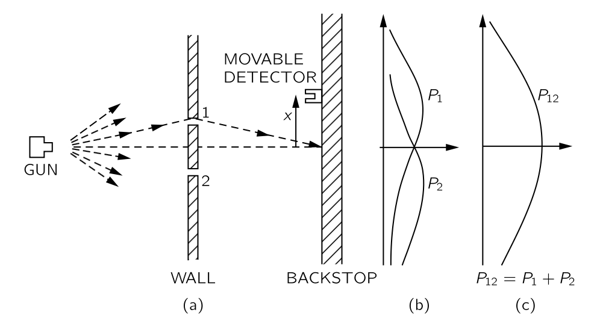
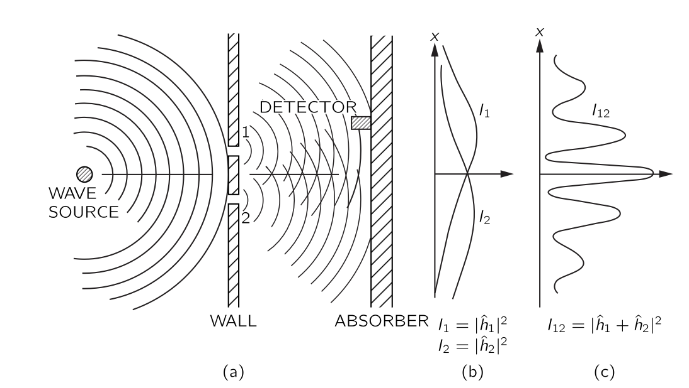
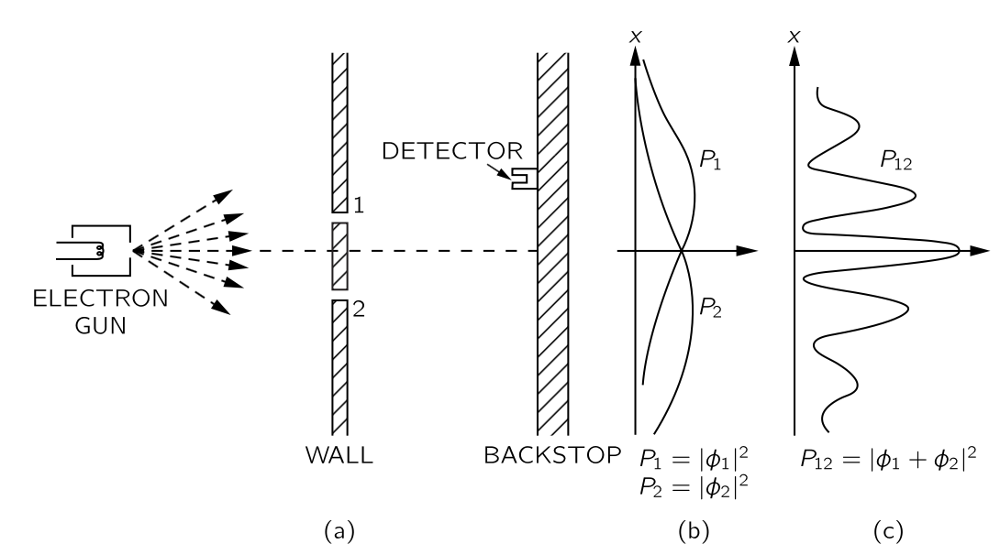
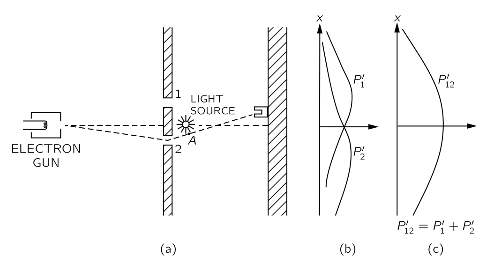
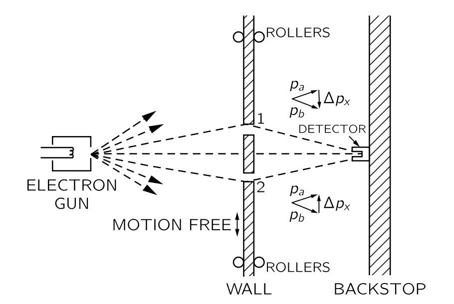
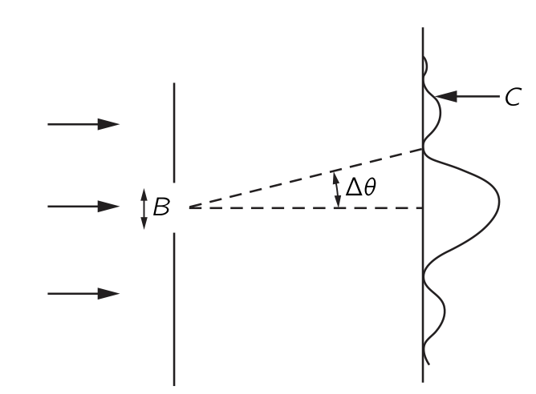
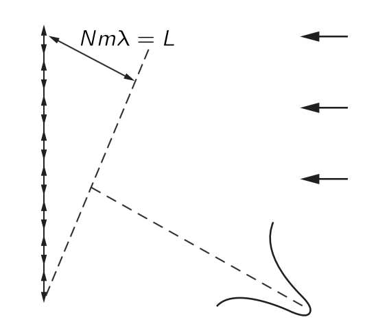
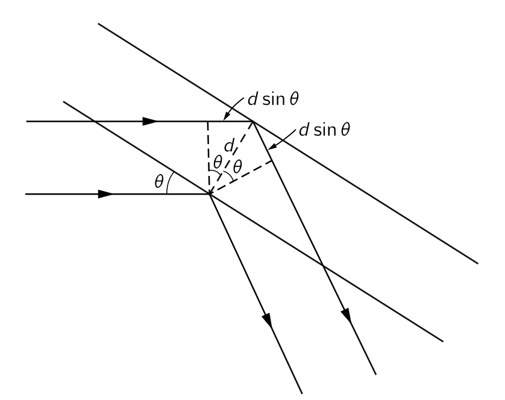
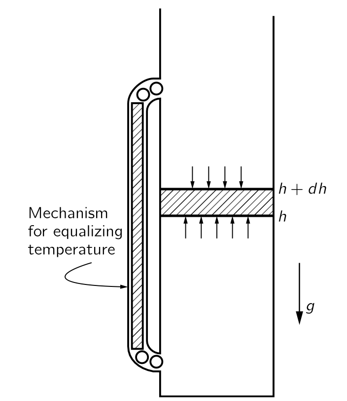

 

## I.37 Quantum Behavior {#sec-FLP_1_37}

### I.37-1 Atomic mechanics {#sec-FLP_1_37_1}

 

### I.37-2 총알 실험 {#sec-FLP_1_37_2}

{#fig-FLP_1_37_1 width=400}

위의 그림과 같이 설정된 기관총 실험을 생각하자. 기관총은 성능이 훌륭하지 못해 고정된 각으로 발사하지 못하고 임의로 퍼져서 발사한다고 생각하자. 우리가 관심있는 것은 총알이 1번 혹은 2번 구멍을 거쳐 backstop 의 중심으로부터 거리 $x$ 에 박힐 확률이다. 이를 $P_{12}(x)$ 로 표기하자. 

- 확률을 도입했다. 기관총에서 각각의 총알이 정확히 어떤 방향으로 가는지 모르기 때문이다. 이 확률은 특정 시간 범위 안에 $x$ 와 $x+dx$ 사이에 박힌 총알의 개수를 이 시간 범위 안에 backstop 에 박힌 모든 총알의 개수 $N$ 으로 나누는 것으로 측정 할 수 있다.

- 여러가지 자잘한 가정이 들어간다. 총알이 구멍에 부딛쳐 여러개로 쪼개지지 않고 온전한 총알로 backstop 에서 검출된다, 총알을 발사하는 속도가 일정하다.. 등등

이제 2번 구멍을 막고 같은 시간동안 같은 실험을 반복하면 모든 총알은 1번 구멍을 통과할 것이며 $x$ 와 $x+dx$ 에 총알이 박힌 개수를 $N$ 으로 나누면 분포 $P_1(x)$ 를 계산 할 수 있다. 또한 1번 구멍을 막고 2번 구멍을 통과하는 실험을 통해 $P_2(x)$ 를 계산 할 수 있다. 당연히 아래의 결과가 나온다.

$$
P_{12}(x) = P_1 (x) + P_2(x).
$$ {#eq-FLP_1_37_1}

 

### I.37-2 파동 실험 {#sec-FLP_1_37_3}

{#fig-FLP_1_37_2 width=400}

위의 그림과 같이 설정된 파동 실험을 생각하자. 검출기가 움직이는 벽으로부터 파동이 반사되는 것을 막기 위해 벽은 파동을 흡수하는 흡수벽(absorber)이어야 한다. 검출기에서 파동의 높이를 측정한다면 파동의 강도는 진폭의 제곱이다. 파동의 강도 $I_\text{12}$ 를 흡수벽 의 중심으로부터의 변위 $x$ 에 대한 함수로 측정한다. 또한 총알 실험과 같이 $2$ 번 홀을 막은 상태에서 $I_1$ 을 측정하고 $1$ 번 홀을 막은 상태에서 $I_2$ 를 측정한다. $I_1$ 측정시 검출기에서 검출되는 파동은 $\hat{h}_1e^{i\omega t}$ 로 기술된다. 여기서 $\hat{h}_1$ 은 복소수이다. 마찬가지로 $I_2$ 측정시 검출기에서 검출되는 파동은 $\hat{h}_2 e^{i\omega t}$ 로 기술된다. 그렇다면 $I_{12}$ 에 대한 파동은 $\hat{h}_1 e^{i\omega t}+ \hat{h}_2 e^{i\omega t}$ 로 기술되며 

$$
I_1 = |\hat{h}_1|^2,\quad I_2=|\hat{h}_2|^2,\quad I_{12} = |\hat{h}_1 + \hat{h}_2|^2
$$ {#eq-FLP_1_37_2}

이다. 즉 $\hat{h}_1,\,\hat{h}_2$ 의 위상차 $\delta$ 에 대해 다음이 성립한다.

$$
I_{12} = I_1 + I_2 + 2\sqrt{I_1I_2} \cos \delta
$$ {#eq-FLP_1_37_4}

여기서 마지막 항 $2\sqrt{I_1I_2}\cos \delta$ 를 간섭항(interference term) 이라고 한다.

 

### I.37-4 전자 실험 {#sec-FLP_1_37_4}

{#fig-FLP_1_37_3 width=400}

이제 전자로 동일한 실험을 해 보자. @fig-FLP_1_37_1 에서 기관총을 전자총으로 바꾸고 다른 실험 장비의 스케일을 아주 작게 맞추는 것이라고 생각하자. 실제로 이런 장비를 갖추는 것은 불가능하지만. 이 실험 과정에서 우리는 아래와 같은 사실을 알게 된다.

  - **결과 1** : 검출되는 전자는 개수이다. 즉 전자가 두개 이상으로 쪼개져서 검출되지 않는다.

  - **결과 2** : 전자 하나가 발사되었을 때, 그리고 두개 이상의 검출기를 동시에 설치했을 때 두 검출기에서 동시에 검출되지 않는다.

자 이제 [총알 시험](#sec-FLP_1_37_2) 에서와 같이 확률 $P_{12},\, P_1,\, P_2$ 를 구할 수 있다. 그리고 그 결과(@fig-FLP_1_37_3) 는 놀랍게도 @fig-FLP_1_37_1 이 아닌 @fig-FLP_1_37_2 과 같다.

 

### I.37-5 전자 파동의 간섭 {#sec-FLP_1_37_5}

결과 2 로부터 우리는 다음과 같은 가설을 새울 수 있다.

**가설 A**: 각각의 전자는 1 번 구멍을 통과하거나 2번 구멍을 통과한다.

이로부터 우리는 $P_{12} = P_1+P_2$ 라는 결론을 내릴 수 있지만 실험 결과와는 모순되다. 그렇다면 우리는 간섭이 있다고 볼 수 밖에 없다. 그렇다면 어떻게 간섭이 발생할 수 있을까? 둘 (혹은 그 이상으로) 분리되어 간섭한다는 논리는 결과 1과 상충된다. 혹시 구멍 하나를 닫으면 열린 구멍으로 더 많은 전자가 통과할까? 그러나 결과는 $P_{12}(0)  = 2(P_1(0)+P_2(0))$ 라는 것을 보여준다. 전자가 매우 복잡한 경로로 진행한다는 가정은 별로 설득력이 없어 보인다.

이것을 해결하기 위해 많은 아이디어가 제시되었지만 $P_1,\,P_2$ 로 $P_{12}$ 를 표현하는데 성공하지 못했다. 수학은 간단하다 $P_1,\, P_2,\, P_{12}$ 이 파동식험에서의 $I_1,\, I_2,\, I_{12}$ 와 같은 관계를 가지면 된다. Backstop 에서 벌어지는 일은 어떤 복소함수 $\hat{\phi}_1(x),\, \hat{\phi}_2(x)$ 에 대해 

$$
P_1(x) = |\hat{\phi}_1(x)|^2,\quad P_2(x) = |\hat{\phi}_2(x)|^2,\quad P_{12}=|\hat{\phi}_1(x)+\hat{\phi}_2(x)|^2
$$ 

이면 된다. 이제 우리는 다음과 같은 결론을 내릴 수 밖에 없다.

>전자는 총알에서처럼 같이 온전한 입자 형태로 도착하며, 이러한 온전한 입자가 도착할 확률의 분포는 파동의 강도 분포와 같다. 이러한 의미에서 전자는 때때로 입자처럼, 때때로 파동처럼 행동한다.

우리가 파동을 다룰 때 복소수를 사용하는 것은 일종의 수학적 트릭이었다. 그러나 양자역학에서의 이 진폭은 실제 복소수여야 한다는 것이 밝혀졌다. 실수만으로는 작동하지 않는다. 그리고 그렇게 되면 가설 A 는 폐기되어야 한다. 즉 전자는 1번 혹은 2번 구멍중에 하나만을 통과하지 않는다.

 

### I.37-6 전자 관찰 {#sec-FLP_1_37_6}

{#fig-FLP_1_37_4 width=400}

이제 이전의 실험장비에 위의 그림과 같이 강한 광원을 놓자. 빛은 전자에 의해 산란되므로 전자가 1번 구멍 혹은 2번 구멍을 통과하는지 알 수 있다. 2번 구멍을 통과하면 아래쪽에서, 1번 구멍을 통과한다면 위쪽에서 신호가 올 것이다. 둘을 동시에 통과한다면? 어쨌든 해 보자. 그리고 그 결과는 다음과 같다.

- 전자가 검출될 때 마다 위쪽 혹은 아래쪽으로 신호가 온다. 그러나 이 신호는 동시에 오지 않는다. 검출기를 어디에 두더라도 마찬지다.

즉 전자는 1번 혹은 2번 구멍 가운데 하나만을 통과한다. 가설 A 는 정확했다. 그런데 놀라운 결과가 나왔다. 1번 구멍을 통과할 때만의 결과를 모아 $P'_1$ 이라고 하고 2번 구멍을 통과할 때만의 결과를 모아 $P'_2$ 를 구성 할 수 있다. 그리고 그 합인 $P'_{12}=P'_1+P'_2$ 도 구할 수 있으며 그 결과는 @fig-FLP_1_37_4 와 같다. 놀라운 결과가 나왔다. 

- [전자 파동의 간섭](#sec-FLP_1_37_5) 의 $P_1,\, P_2$ 와 비교해 보면 $P'_1=P_1,\, P'_2=P_2$ 이다. 그러나 $P'_1,\, P'_2$ 는 구멍을 막지 않았다. 구멍을 막든 막지 않든 1번 구멍을 통과하는 전자는 동일한 확률 분포를 보인다. 2번 구멍도 마찬가지.

- $P'_{12}= P'_1+P'_2 \ne P_{12}$ 이다. 우리가 광원을 끈다면 $P'_{12}(\text{off})=P_{12}$ 이다. 즉 우리가 광원을 켬으로서 전자의 경로가 뒤틀렸다. 우리가 전자의 경로를 본다면 간섭 효과는 사라진다.

- 혹시 밝기가 너무 강하여 전자의 경로를 변경시켰을까? 이제 밝기를 낮춰 보자. 밝기를 낮추는 것은 광자의 에너지를 바꾸지 않고 단위 시간당 방출되는 광자의 개수를 줄인다는 것이다. 이제 일부 전자는 빛에 산란되지 않고 검출기에 계측된다. 이 경우 전자가 통과했을 때 주변에 광자가 없었다. 

- 이제 검출기에서 클릭 소리가 들릴 때마다 우리는 세가지로 분류한다: (1) 1번 구멍을 통과하는 신호를 낸 전자들의 분포 $P''_1$
, (2) 2번 구멍을 통과하는 신호를 낸 전자들의 분포 $P''_2$, (3) 구멍 통과 신호를 내지 않고 계측된 전자들의 분포 $P''_{12}$. 결과는 다음과 같다.

  $$
  P''_1 = P'_1=P_1,\qquad P''_2 = P'_2 = P_2,\qquad P''_{12} = P_{12} \ne P'_{12}.
  $$

  즉 전자가 관찰되지 않으면 간섭이 발생한다. 우리가 전자의 경로를 관하지 못하면 어떤 광자도 전자를 교란시키지 않으며, 전자의 경로를 관찰한다면 광자가 전자를 교란한다. 광자는 모두 동일한 크기의 효과를 발생시키고, 광자가 산란되는 효과는 간섭의 효과를 뭉게기에 충분하기 때문에 항상 동일한 양의 교란이 발생한다.

우리는 광자의 운동량이 파장에 반비례한다는 것을 안다($p=h/\lambda$). 광자가 전자에 주는 충격은 광자의 운동량에 의존할 것이다. 따라서 이 충격을 줄이기 위해서는 빛의 강도를 약하게 할 것이 아니라 운동량을 줄여야 한다. 장파장의 빛을 사용한다면 전자를 교란하는 것을 피할 수 있을것이다. 그러나 여기에 한계가 있다. 우리는 앞서 광학 기구의 분해능에 대해 공부했었다. 만약 빛의 파장이 두 구멍 사이의 거리보다 길다면 전자가 어떤 구멍을 통과하는지 알 수 없게 된다. 그리고 이 부근부터 $P'_{12}$ 는 $P_{12}$ 와 비슷해진다. 즉 간섭의 효과가 발생한다. 그리고 파장이 두 구멍 사이의 거리보다 충분히 크다면 $P'_{12}=P_{12}$ 가 된다. 간섭의 효과가 완전히 살아난다. 

이 사고실험을 통해 전자가 어떤 구멍을 통과하는지 아는 것과 간섭 효과를 유지시키는 것을 동시에 하는것이 불가능하다는 것을 알게되었다. 이것이 하이젠베르크가 제안한 "불확정성의 원리" 이다.

그렇다면 첫 번째 총알 시험에서는 왜 간섭이 발생하지 않을까? 총알의 경우 파장이 너무 작아 간섭 패턴이 매우 미세해졌다. 사실, 매우 미세하여 유한한 크기의 어떤 검출기라도 최대값과 최소값을 구분할 수 없으며 우리가 본 것은 관측 가능한 범위에서의 일종의 평균일 뿐이다. 

 

### I.39-7 양자역학의 첫번째 원리 {#sec-FLP_1_37_7}

이제 실험의 주요 결론에 대한 요약하자. 이런 종류의 실험의 일반적인 범주에 대해서도 요약의 결과가 사실이 되도록 하겠다. 여기서 두가지 용어를 명확하게 하자.

- **이상적인 실험** : 불확실한 외부 영향이 없는, 즉 흔들림이나 우리가 고려할 수 없는 다른 일들이 없는 실험. "실험의 초기 및 최종 조건이 모두 완전히 명시된 경우" 라고 한다면 상당히 정확하다. 
- **사건** : 일반적으로 초기와 최종 조건의 특정한 집합. (예: 전자가 총을 떠나 검출기에 도착하고, 그 외에는 아무 일도 일어나지 는 경우)

요약은 아래와 같다.

::: {.callout-important icon="false"}

#### **요약**

1. 이상적인 실험에서 사건의 확률 $P$ 는 복소수 $\phi$ 의 절대값의 제곱으로 주어지며, 이를 **확률진폭(probability amplitude)** 라고 한다. 즉 $P = |\phi|^2$ 이다.
  
2. 사건이 여러 가능한 대안들($f_1,\dots,\,f_N$) 가운데 하나로 발생할 수 있는 경우, 그 사건의 확률 진폭($\phi$) 은 각 대안들에 대한 확률진폭($\phi_1,\ldots,\,\phi_N$) 의 합이다. 즉 $\phi = \sum_i \phi_i$, $P=|\phi|^2$ 이다. 즉 간섭이 발생한다.

3. 실제로 하나의 대안이 취해졌는지 여부를 판단할 수 있는 실험이 수행된다면, 그 사건의 확률 $P$ 은 각 대안에 대한 확률 ($P_1,\ldots,\,P_N$) 의 합이다. 즉 $P_i=|\phi_i|^2$ 에 대해 $P = \sum_i P_i$ 이다. 간섭은 발생하지 않는다.

:::

이 요약보다 더 근본적인 수준에서의 설명은 존재하지 않는다. 

>이제 고전 역학과 양자역학의 중요한 차이에 대해 강조하고자 한다. 앞서 주어진 상황에서 전자가 도착할 확률에 대해 이야기 했으며 정확히 어떤 일이 일어날지 예측하는 것이 불가능함을 암시했다. 우리는 확률만 예측할 수 있다! 이는 물리학이 특정 상황에서 정확히 어떤 일이 일어날지 예측하는 것을 포기했다는 의이이다. 우리는 주어진 상황에서 일어날 일을 예측하는 방법을 알지 못하며, 이제는 그것이 불가능하다고 믿으며, 예측할 수 있는 유일한 것은 다양한 사건의 확률이라고 생각한다. 이는 이전의 우리가 자연을 이해한다는 이상에 대한 재제한(retrenchment) 임을 인식해야 한다. 그것은 뒤로 물러나는 단계일 수도 있지만, 이를 피할 방법은 아직 없다.
>
>혹은 “아마도 전자는 아직 알지 못하는 일종의 내부 작용—어떤 내부 변수—를 가지고 있는 것일지도 모른다. 아마도 그것이 우리가 일어날 일을 예측할 수 없는 이유일 것이다. 우리가 전자를 더 자세히 관찰할 수 있다면, 종래는 어디에 위치하게 될지 알 수 있을 것이다." 라고 생각할수도 있다. 그러나 우리가 알기로는 그것은 불가능하다. 우리는 여전히 관란에 처하게 될 것이다. 예를 들어, 전자 내부에 어떤 종류의 machinary 가 있어 그것이 어디에 도착할지 결정한다고 가정해 보자. 그 기계는 또한 진행 중에 어느 구멍을 통과할지 결정해야 한다. 하지만 우리는 전자 내부에 있는 것이 우리가 하는 일에 의존해서는 안 되며, 특히 우리가 구멍 가운데 하나를 열거나 닫는지에 의존해서는 안된다. 따라서 전자가 출발하기 전에 이미 (a) 어떤 구멍을 통과할지, (b) 어디에 도착할지를 결정했다면, 1번 구멍을 선택한 전자는 $P_1$ 을, 2 번 구멍을 선택한 전자는 $P_2$ 를 구하고, 두 개의 홀을 통과하는 전자는 반드시 $P_1+P_2$ 의 합을 구해야 한다. 이것을 고를 방법이 없는 것 같습니다. 하지만 우리는 실험적으로 그것이 그렇지 않다는 것을 확인했다. 그리고 아무도 이 퍼즐에서 탈출할 방법을 찾지 못했다. 따라서 현재는 우리는 확률을 계산하는 데만 국한해야 합니다. 우리는 “현재는” 라고 말하지만, 그것이 영원히 우리와 함께할 것이라고-그 퍼즐을 이기는것이 불가능하다고-매우 강하게 의심합니다. 즉 이것이 자연이 실제로 존재하는 방식이라는 것이다.

 

### I.37-8 불확정성의 원리 {#sec-FLP_1_37_8}

하이젠베르그가 최초로 제안한 형태는 아래와 같다.

> 운동량의 $x$ 성분 $p_x$ 를 $\Delta p_x$ 의 불확도로 측정했을 때, 동시에 $x$ 방향 위치를 측정한다면 그 불확도 $\Delta x$ 는 $\hbar/2\Delta p_x$ 보다 크다.

더 일반적인 진술은 아래와 같다.
> 두 대안 중 어느 것이 취해지는지를 판단하면서 동시에 간섭 패턴을 파괴하지 않는 실험장비를 고안할 수 없다.

하이젠베르크가 제시한 관계가 반드시 참이어야 문제가 발생하지 않는 특정한 예를 들어보자.

::: {#exm-FLP_uncertainty_original}

#### 이중슬릿실험의 개선과 불확정성의 원리

{#fig-FLP_1_37_6 width=400}

@fig-FLP_1_37_3 의 실험을 위와 같이 개선해 보자. 여기서는 벽(wall)은 롤러로 지탱하는 판으로 구성되었고 판은 위나 아래로 ($x$-방향으로) 자유롭게 움직일 수 있다. 그리고 검출기는 $x=0$ 에 고정되어 있다.

검출기에 계측된 전자가 벽이 1번 구멍을 지난다면 회절에 의해 운동량이 아래로 꺽이며, 운동량 보존에 의해 벽의 판은 위로 반동된다. 계측된 전자가 2번 구멍을 지난다면 벽의 판은 아래로 반동된다. 우리는 전자를 교란시키지 않고 판의 움직임만 보고서도 전자가 어느 구멍을 통과했는지 알 수 있게된다.

우리는 전자가 통과하고 난 뒤 판의 운동량의 변화를 측정해야 한다. 그러나 불확정성의 원리에 의해 판의 위치와 운동량을 동시에 정확하게 측정 할 수 없다. 우리가 판의 위치를 정확하게 알 수 없다면 두 구멍의 위치도 정확하게 알 수 없다. 각각의 전자가 통과할 때 마다 서로 다른 위치에 있게 되며 따라서 간섭무늬의 중심도 움직이며 간섭 무늬 자체가 뭉개진다. 

:::

다음 장에서 우리는 판의 운동량을 충분히 정확하게 결정하여 반동 측정으로부터 어떤 구멍을 통과했는지 판단할 수 있다면, 불확정성 원리에 따라 판의 $x$ 위치에 대한 불확정성이 검출기에서 관찰되는 패턴을 최대값에서 가장 가까운 최소값까지의 거리만큼 위아래로 이동시키기에 충분하다는 것을 정량적으로 보여줄 것이다. 즉 간섭이 관찰되지 않을 정도로 충분하다.

하이젠베르크는 운동량과 위치를 동시에 더 높은 정확도로 측정할 수 있다면 양자역학이 붕괴될 것임을 인식으며 따라서 그것이 불가능해야 한다고 제안했다. 그 당시 사람들은 자리에 앉아 방법을 찾으려 했지만 위치와 운동량을 더 정확하게 측정할 방법을 아무도 찾지 못했다. 

 

## I.38 입자 관점과 파동 관점의 관계 {#sec-FLP_1_38}

### I.38-1 확률파의 진폭 {#sec-FLP_1_38_1}

> In this chapter we shall discuss the relationship of the wave and particle viewpoints. We already know, from the last chapter, that neither the wave viewpoint nor the particle viewpoint is correct. Usually we have tried to present things accurately, or at least precisely enough that they will not have to be changed when we learn more—it may be extended, but it will not be changed! But when we try to talk about the wave picture or the particle picture, both are approximate, and both will change. Therefore what we learn in this chapter will not be accurate in a certain sense; it is a kind of half-intuitive argument that will be made more precise later, but certain things will be changed a little bit when we interpret them correctly in quantum mechanics. The reason for doing such a thing, of course, is that we are not going to go directly into quantum mechanics, but we want to have at least some idea of the kinds of effects that we will find. Furthermore, all our experiences are with waves and with particles, and so it is rather handy to use the wave and particle ideas to get some understanding of what happens in given circumstances before we know the complete mathematics of the quantum-mechanical amplitudes. We shall try to illustrate the weakest places as we go along, but most of it is very nearly correct—it is just a matter of interpretation.

양자역학에서는 발생할 수 있는 모든 사건에 진폭을 부여한다. 그리고 사건이 한 입자의 reception 과 관련된다면 우리는 이 입자가 다른 시간 다른 장소에서 발견될 진폭을 부여할 수 있다. 그리고 입자를 발견할 확률은 진폭의 절대값 제곱이다. 한 입자를 다른 장소와 다른 시간에 발결할 확률은 위치와 시간에 따라 변한다.

특별한 경우 진폭은 정해진 진동수 $\omega$ 와 파수 벡터(wave vector) $\bf{k}$ 에 대해 $e^{i(\omega t - \bf{k\cdot r})}$ 와 유사한 형태이다. 이것은 입자의 에너지 $E$ 가 알려져 있으며 진동수와 

$$
E= \hbar \omega 
$${#eq-FLP_1_38_1}

의 관계가 있으며 운동량 $\bf{p}$ 역시 알려져 있고 파수 벡터 $\bf{k}$ 와
$$
\bf{p}=\hbar \bf{k}
$$ {#eq-FLP_1_38_2}

의 관계가 있는 고전적인 극한에 해당한다. 이것은 입자 관점의 한계이다. 입자 관점, 즉 위치와 운동량으로 기술하는 관점인데 진폭 $e^{i(\omega t -\bf{k\cdot r})}$ 의 절대값의 제곱은 상수이며 이는 모든 지점에서 발견될 확률이 동일하다는 의미이기 때문이다.

반대로 입자의 위치가 어느 정도 잘 알려져 있고 향후의 위치도 잘 예측 할 수 있다면 입자를 다른 장소에서 발견할 확률은 특정 영역에 제한적이다. 이 영역을 $\Delta x$ 라고 하며 이 영역 밖에서 발견할 확률은 $0$ 이다. 확률은 진폭의 절대값 제곱 이며 따라서 진푝 역시 $\Delta x$ 영역 밖에서는 $0$ 이다. 즉 우리는 길이가 $\Delta x$ 인 **파동 패킷(wave packet)**$^1$ 을 얻으며 이 파동 패킷의 파장은 입자의 운동량에 대응한다. [$^1$ 파인만은 wave train 이란 용어를 사용한다.]{.aside} 그러나 이런 파동 패킷에 고유한 파장을 정할수 없다는 것이 잘 알려져 있다. 이 파동 패킷이 특정한 파장을 가지지 않는다면 파수에도 이 패킷의 폭과 관련된 불확실성이 존재하며 이것은 운동량의 불확실성이다.

 

### I.38-2 위치와 운동량의 측정 {#sec-FLP_1_38_2}

::: {#exm-FLP_1_28_2_1}

#### 단일 슬릿을 통과하는 입자의 회절

{#fig-FLP_1_38_2 width=270}

위의 그림과 같은 단일 슬릿 실험을 생각하자. 입자들은 정해진 에너지를 가지고 아주 멀리서부터 수평 방향으로 진입한다. 모든 입자들은 고전적인 의미에서 수평방향의 운동량을 $p_0$ 와 수직방향의 운동량 $p_y$ 를 갖는다. 입자는 멀리 떨어진 곳에서 왔기 때문에 위나 아래로 움직이지 않으며, 따라서 수직 운동량은 당연히 0 이다. 이제 이 입자가 폭이 $B$ 인 슬릿을 통과한다고 하자. 이제 우리는 입자의 수직 위치에 대한 불확실성은 $\pm B/2$ 이다.

이제 우리는 운동량이 절대적으로 수평임을 알고 있기 때문에 $\Delta p_y=0$ 이라고 말하고 싶을 수도 있지만, 그것은 틀렸다. 우리는 한때 그 운동량이 수평방향만 존재한다는 것을 알았을 뿐, 더 이상을 알지 못한다. 입자들이 구멍을 통과하기 전에, 우리는 그들의 수직 위치를 알지 못했다. 이제 입자가 구멍을 통과하도록 하여 수직 위치를 찾았으나 수직 운동량에 대한 정보를 잃어버렸다! 왜? 파동 이론에 따르면, 빛과 마찬가지로 파동이 슬릿을 통과한 후에도 회절이 일어나며 따라서 슬릿에서 나오는 입자들이 정확히 직선으로 나오지 않을 가능성이 있다. 패턴은 회절 효과로 인해 퍼지며 첫 번째 최소값의 각도로 정의할 수 있는 확산각은 최종 각도의 불확실성을 측정한 것이다.

패턴은 어떻게 확산되는가? 그것이 퍼졌다고 말한다는 것은 입자가 위아래로 움직일 가능성이 어느 정도 있다는 의미이며, 즉 운동량의 수직 성분이 $0$ 이 아니라는 의미이다. 우리는 이 회절 패턴을 입자 카운터로 감지할 수 있으며 카운터는 온전한 입자를 세기 때문에 **가능성** 과 **입자** 라고 말한다. 그리고 예를 들어 @fig-FLP_1_38_2 의 $C$ 에서 온전한 입자를 측정하기 때문에, 고전적인 의미에서 입자는 슬릿에서 $C$ 까지 도달하기 위해 수직 운동량을 갖는다.

수직 운동량 $p_y$ 은 대략 $p_0 \Delta \theta$ 와 같은 확산을 가진다. 그렇다면 확산 패턴에서 $\Delta \theta$ 는 어느 정도인가? 우리는 패턴의 첫번째 최소값이 $\Delta \theta$ 각도에서 발생하여 슬릿의 한쪽 가장자리에서 나오는 파동이 반대쪽에서 오는 파동보다 한 파장 더 많이 이동해야 한다는 것을 알고 있다. 따라서 $\Delta \theta$ 는 $\lambda /B$ 이며, 따라서 이 실험에서 $\Delta p_y = p_0 \lambda/B$ 이다. $B$ 를 작게 만들어 입자의 위치를 보다 정확하게 측정하면 회절 패턴이 넓어진다는 것을 기억하라. 이는 입자가 수직방향의 운동량을 가지고 있음을 발견할 가능성이 높아짐을 의미한다. $\Delta y = B/2$ 이며 $p_0 = h/\lambda$ 이므로 우리는 $(\Delta y)(\Delta p_y) \approx h$ 라는 규칙을 얻는다. 정확히는 아래와 같다.

$$
(\Delta y ) (\Delta p_y) \ge \dfrac{\hbar}{2}, \quad\text{where }\hbar = \dfrac{h}{2\pi}
$$ {#eq-FLP_1_38_3}

우리는 입자의 수직 위치를 알고, @eq-FLP_1_38_3 에서 제시된 것보다 더 높은 확신을 가지고 입자의 수직 이동을 예측할 수 있는 시스템을 준비할 수 없다. 즉, 수직 운동량의 불확실성은 $\hbar/2\Delta y$ 를 초과해야 한다.

우리가 입자가 슬릿을 통과하기 전의 운동량을 충분히 작은 불확실성 $\Delta p_y^{(i)}$ 으로 안다고 하자. 그리고 입자가 슬릿을 통과하면서 위치에 대한 정보도 충분히 작은 불확실성으로 일 수 있다. $\Delta y = B$. 이 값의 곱이 $\hbar/2$ 보다 작게 만들 수 있으며 이는 @eq-FLP_1_38_3 와 모순된다. 무엇이 어디서부터 잘못됬을까? @eq-FLP_1_38_3$ 이 의미하는 바는 상황의 예측 가능성을 의미하며, 과거에는 의미가 없다. 슬릿을 통과하는 순간 과거 운동량에 대한 지식은 무의미하다.

:::

 

::: {#exm-FLP_1_28_2_2}

#### 단일 슬릿을 통과하는 입자의 회절

{#fig-FLP_1_38_3 width=220}

많은 수의 선으로 이루어진 회절격자([I.30 회절](#sec-FLP_1_30) 을 참고하라)에 빛을 입사시키면 간섭으로 인해 특정한 각도에서 강한 빛을 얻는다. 여기서 얼마나 정확하게 빛의 운동량을 측정할 수 있을지 생각해보자. 주어진 회절격자의 분해능은 @eq-FLP_1_30_9 이다. 여기서 $N$ 은 선의 개수이고 $m$ 은 회절격자의 치수이다. 여기서 $L=Nm\lambda$ 라고 하면 회절격자의 양 끝단에서 반사된 빛 혹은 입자의 경로차이다. 회절격자의 분해능과 $L$ 로 부터 다음 식을 얻는다.

$$
\dfrac{\Delta \lambda}{\lambda^2} = \dfrac{1}{Nm\lambda} = \dfrac{1}{L}.
$$ {#eq-FLP_1_38_5}
 
즉 회절 패턴을 형상하는 파동등은 격자의 다른 부분으로부터 오는 파동들이다. 위의 식으로 부터 $\Delta \lambda$ 를 최소화 하기 위해서는 최대한의 $L$ 을 사용해야 한다는 것을 알 수 있다. 또한

$$
\dfrac{\Delta \lambda}{\lambda^2} = \Delta \left(\dfrac{1}{\lambda}\right) = \dfrac{\Delta k}{2\pi}
$$ {#eq-FLP_1_38_6}

이므로

$$
\Delta k = \dfrac{2\pi}{L}
$$ {#eq-FLP_1_38_7}

이다. $p=hk$ 이므로 $\Delta p = h\Delta k$ 이다. 또한 $L$ 은 관측 지점에 도착하는 파동 패킷의 폭을 결정한다. 즉 $\Delta x= L$ 이다. 실제로 파동 패킷의 길이와 파수의 불확정도를 곱하면 $\pi$ 보다 크다는 것은 양자역학 이전에도 잘 알려져 있는 사실이다. 

... to be updated ...

:::

 

### I.28-3 결정 회절 {#sec-FLP_1_28_3}

원자, 이온, 분자 등이 3차원 공간에서 규칙적이고 주기적인 패턴으로 배열된 고체 물질을 **결정(Crystal, 結晶)** 이라고 한다. 강한 반사 신호를 얻기 위해서는 모든 원자로부터의 산란의 위상이 일치해야 한다. 

{#fig-FLP_1_38_4 width=300}

위의 그림과 같은 두 평면을 생각하자. 이 두 면에서의 파동이 산란될 때 경로차가 파장의 정수배라면 산란된 파동은 동일한 위상을 갖게 된다. 이 결맞는 반사(coherent reflection) 의 조건은 다음과 같다.

$$
2d\sin \theta = n \lambda \qquad (n=1,\,2,\ldots).
$$ {#eq-FLP_1_38_9}

결정의 원자들이 @eq-FLP_1_38_9 에서 $n=1$ 을 만족하는 면 위에 있다면 강한 반사가 생긴다. 반면 같은 성질을 갖는 원자들이 같은 밀도로 중간에 존재한다면 중간의 평면에 의해 소멸간섭이 발생하여 아무 일도 벌어지지 않을 것이다. 따라서 $d$ 는 가장 가까운 평면 사이의 거리가 되어야 한다. 

@eq-FLP_1_38_9 에서 $d< \lambda/2$ 라면, 즉 $\lambda > 2d$ 이면 만족하는 $\theta$ 가 존재하지 않는다. 즉 회절에 의한 신호가 발생하지 않는다. 가시광선의 경우 일반적인 결정의 $d$ 에 비해 매우 크기 때문에 회절 패턴이 검출되지 않는다. 

 

### I.38-4 원자의 크기 {#sec-FLP_1_38_4}

#### **수소 원자의 크기와 에너지**

여기서는 원자의 크기에 대해 불확정성의 원리를 이용하여 근사적 계산을 수행하려 한다. 아이디어는 옳지만 실제 계산은 정확하지 않다. 

수소 원자의 전자의 위치를 측정한다고 하자. 전자가 정확히 어디에 위치할지 예측할 수 없으며, 그렇지 않으면 운동량은 무한히 퍼져있게 된다. 전자의 위치를 측정할 수 있지만 다른 위치에서 발견될 가능성이 있다. 이 위치는 핵은 아니며, $a$ 정도로 퍼져있다고 가정하자.즉, 전자와 핵 사이의 거리는 보통 약 $a$ 이다. 이제 원자의 전체 에너지를 최소화함으로써 $a$ 를 결정해 보자.

우선 $(\Delta p_x)^2 = \langle p_x^2\rangle - \langle p_x \rangle^2$ 이며 대칭을 고려하면 의해 $\langle p_x\rangle =0$ 이므로 $(\Delta p_x)^2 = \langle p_x^2\rangle$ 이다. 따라서 

$$
\langle p^2\rangle = (\Delta p_x)^2 + (\Delta p_y)^2 + (\Delta p_z)^2 \approx \dfrac{\hbar^2}{a^2}
$$

을 얻는다. 그렇다면 총 에너지 $E$ 는

$$
E = \dfrac{\langle p^2\rangle}{2m^2} - \dfrac{e^2}{a} = \dfrac{\hbar^2}{2ma^2} - \dfrac{e^2}{4\pi\epsilon_0 a}
$$

이며 $E$ 를 최소로 하는 $a$ 값을 $dE(a_0)/da=0$ 을 통해 계산하면

$$
a_0 = \dfrac{4\pi\epsilon_0\hbar^2}{me^2} = 0.528 \times 10^{-10}\,\text{m}
$$ {#eq-FLP_1_38_12}
 
이다. 이 $a_0$ 를 **보어 반지름 (Bohr radius)** 라고 하며 실제로 꽤 정확한 값이다. 또한 이 $a_0$ 를 통해 수소원자의 전자의 에너지 $E_0$ 를 계산하면

$$
E_0 = \dfrac{\hbar^2}{2ma_0^2} - \dfrac{e^2}{4\pi\epsilon_0 a_0} = -13.6 \text{ eV}
$$ {#eq-FLP_1_38_13}

이다. 에너지가 음수인 것은 전자가 수소 원자에 묶여 있기 때문이다. 그리고 이 값은 계산 과정에서 대략적인 근사를 사용했음에도 불구하고 매우 정확한 수소 원자의 이온화 에너지값이다. 

#### **원자의 안정성**

이제 우리가 바닥을 뚫고 지나가서 떨어지지 않는 이유를 알 수 있다. 우리가 걸을 때 우리 신발은 원자의 질량으로 바닥의 원자를 누른다. 이 원자들이 서로 뭉뜽겨러지기 위해서는 원자들이 서로 매우 가까워지고 전자들 역시 훨씬 좁은 공간으로 제한되어야 한다. 그러나 불확정성의 원리에 의해 운동량이 매우 커지게 되고 이는 에너지를 증가시킨다. 원자를 압축시킬때의 이런 효과는 고전적인 효과가 아닌 양자역학적인 효과이다. 고전적으로는 전자와 양성자의 바닥상태는 둘이 붙어있는 상태이다. 양자역학이 등장하기 전까지 원자의 존재는 풀리지 않는 문제였다. 

말이 나온김에 말하자면, 많은 전자가 있는 상황에서는 전자들이 서로 멀리 두려고 한다. 한 전자가 특정 공간을 차지하고 있다면, 다른 전자는 같은 공간을 차지하지 않는다. 정확히 말하면, 두 개의 스핀 케이스가 있어 두 개가 서로 위에 앉을 수 있으며, 하나는 한 방향으로 회전하고 다른 하나는 반대 방향으로 회전한다. 하지만 그 이후에는 더 이상 전자를 그곳에 추가 할 수 없다. 우리는 다른 전자를 다른 곳에 배치해야 하며, 그것이 바로 물질이 내구력을 가지는 진정한 이유이다. 만약 모든 전자를 같은 위치에 놓을 수 있다면 현재보다 더 많이 응축될 것이다. 전자들이 모두 서로 겹칠 수 없다는 사실이 테이블과 그 외 모든 것을 단단하게 만드는 이유이다.

 

### I.38-5 에너지 준위 {#sec-FLP_1_38_5}

앞서 원자에 대해 가능한 가장 낮은 에너지 조건에 대해 알아보았지만, 전자는 너 높은 에너지를 가질 수 있다. 양자역학에 따르면 정적인 상태에서는 원자에 대해 정해진 에너지만 존재할 수 있다. 자유전자, 즉 에너지가 양수인 전자는 어떤 에너지든 가질 수 있으며 어떤 속도로든 움직일 수 있지만 속박된 전자의 에너지는 임의적이지 않다.

이제 허용된 에너지를 $E_0,\,E_1,\,E_2,\,E_3$ 하자. 가장 낮은 에너지 $E_0$ 를 갖는 상태를 **바닥 상태 (ground state)** 라고 하고 바닥 상태보다 높은 에너지 $E_1,\,E_2,\,E_3$ 를 갖는 상태를 **들뜬 상태 (excited state)** 라고 한다. 들뜬 상태의 원자는 영원히 거기 있을 수 없으며 빛의 형태로 에너지를 방출하고 더 낮은 에너지 상태로 떨어진다(이를 전이된다고 한다). 방출되는 빛의 진동수는 두 상태의 에너지 차이에 의해 에너지를 보존하는 방식으로 결정된다. 즉 들뜬 상태 $E_j$ 에서 이보다 에너지가 낮은 상태 $E_i$ 로 전이될 때 방출하는 빛의 진동수 $\omega_{ji}$ 는

$$
\omega_{ji} = \dfrac{E_j - E_i}{\hbar}
$$ {#eq-FLP_1_38_5_1}

이다. 또한 $E_j$ 와 $E_i$ 사이에 $E_k$ 상태가 있어 $E_j > E_k > E_i$ 이며 $\omega_{jk}$ 와 $\omega_{ki}$ 를 안다면

$$
\omega_{ji} = \omega_{jk} + \omega_{ki}
$$

이다. 이를 **리츠 조합 원리 (Ritz combinational principle)** 라고 한다. 

우리는 이미 양자역학이 특정 진동수와 파수를 갖는 파동처럼 행동하는 진폭으로 표현된다는 것에 대해 논의했다. 원자가 명확한 에너지 상태를 가지고 있다는 진폭 관점에서 이것을 관찰해 보자. 지금까지 설명한 것으로는 이해할 수 없지만 제한된 공간적으로 한정된 파동이 일정한 진동수를 가진다는 사실은 우리 모두 잘 알고 있다. 예를 들어 소리가 오르간 파이프나 그와 유사한 것에 한정된 경우, 소리가 진동할 수 있는 방법은 하나 이상 존재하며, 각 방법마다 일정한 진동수를 가진다. 파동이 한정된 물체는 일정한 공명 주파수를 가지고 있다. 따라서 제한된 공간에 존재하는 파동의 특성은—이 주제는 나중에 공식과 함께 자세히 논의할 것이다—그 파동은 일정한 주파수에서만 존재한다는 것이다. 그리고 진폭과 에너지의 주파수 사이에 일반적인 관계가 존재하므로, 원자에 결합된 전자와 연관된 명확한 에너지를 발견하는 것이 놀랍지 않다.

 

### I.38-6 철학적 함의 {#sec-FLP_1_38_6}

 

## I.39. 기체의 동역학 {#sec-FLP_1_39}

### I.39-1 물질의 성질 {#sec-FLP_1_39_1}

#### **새로운 주제 : 물질**

- 여기서는 전기적으로 상호작용하고 역학 법칙을 따르는 수많은 원자로 이루어진 "물질 (matter)" 에 대해 알아본다.

- 우리가 앞에서 배웠던 역학 또는 빛은 기본 법칙들에서 시작하여 다양한 현상을 이해하였다. 그러나 물질을 이해하기 위해서는 수많은 원자들을 다뤄야 하며 역학과 전자기 법칙만으로 직접 분석하기에는 너무 복잡하다. 보통 많은 단계를 거쳐 이해하지만 각 단계 자체도 많이 복잡하며 점점 정확성이 떨어진다.
  
- 어려운 이유
  1. 수학적 이유 : 개별 원자의 모든 움직임을 파악하기 보다는 평균적인 운동과 효과를 다루기 때문에 확률 이론이 중요하다.
  2. 물리적 이유 : 고전역학이 아닌 양자역학적으로 접근해야 한다.
   

#### **그럼에도 불구하고 지금 다루는 이유**

- 느긋하게! : 우선 다양한 상황에서 일어나야 할 일에 대해 대략적인 아이디어를 얻고, 나중에 우리가 법칙을 더 잘 알게 되면 이를 더 잘 정립하게 될 것이다. 실제 문제에서 물질의 특성을 분석하고자 하는 사람은 기본 방정식을 적어 놓은 뒤 수학적으로 풀어보고자 할 수 있다. 이렇게 하는 사람들은 이 분야에서 실패한다. 물리적인 관점에서 시작하고, 자신이 어디로 갈지 대략 파악한 뒤 올바른 근사를 제시함으로써 복잡한 상황에서 무엇이 크고 무엇이 작은지 아는 사람이 성공한다. 이러한 문제들은 매우 복잡하여, 비록 부정확하고 불완전하더라도 기본적인 이해를 가질 가치가 있으며, 따라서 물리학 과정을 진행하면서 우리는 그 과목을 점점 더 정확하게 반복해서 검토하게 될 것이다.

- 고등학교때 배운 것이 있다.  
  - 아보가드로의 법칙 : 같은 부피의 기체가 동일한 압력과 온도에서 동일한 수의 분자를 포함하고 있다 :아보가드로의 법칙  
  - 기체반응의 법칙 : 두 기체가 화학 반응에서 결합할 때 필요한 부피 사이에는 항상 단순한 정수 비율이 존재한다 

#### **열역학**

이 주제는 비원자론적 관점에서 공격될 수 있으며, 물질들의 특성들 사이에 많은 상호관계가 존재한다는 것을 알게 될 것이다. 예를 들어, 무언가를 압축하면 가열되고, 가열하면 팽창한다. 이 두 사실 사이에는 관계가 있으며, 이 관계는 배후의 과정과 독립적으로 추론될 수 있다. 이 주제를 **열역학 (thermodynamics)** 라고 한다. 열역학에 대한 가장 심오한 이해는 당연히 실제 그 아래에 있는 과정을 이해하는 데서 비롯되며 우리는 그것을 하려 한다. 우리는 시작부터 원자론적 관점으로 물질의 다양한 특성과 열역학 법칙을 이해하고자 한다.

 

### I.39-2 기체의 압력 {#sec-FLP_1_39_2}

{#fig-FLP_1_39_1 width=200}

위의 그림과 같이 마찰이 이 움직일 수 있는 피스톤이 한 면을 차지하고 있는 부피 $V$ 인 상자에 기체 원자가 차 있다고 하자. 다양한 속도로 움직이는 기체 원자가 피스톤에 충돌한다. 만악 상자 외부가 진공이라면 기체 원자가 피스톤과 충돌하면서 피스톤이 운동량을 얻게 되어 점차 밖으로 이동하게 된다. 피스톤이 밖으로 움직이는 것을 막기 위해서 힘 $F$ 를 가한다고 하자. 그리고 피스톤의 단면적을 $A$ 라고 하자. 그렇다면 힘은 $A$ 에 비례할 것이며 이 때 $A$ 에 곱해지는 값을 **압력 (pressure)** 라고 정의한다. 즉, 압력 $P$ 를 다음과 같이 정의한다.

$$
P=\dfrac{F}{A}.
$$ {#eq-FLP_1_39_1}

또한 미소 일(differential work) $dW$ 를 피스톤이 $(-dx)$ 만큼 움직였을 때 기체에 해준 일로 정의한다$^2$.[$^2$ 많은 교제애서 반대로 일을 기체가 한 일로 정의하기도 한다. 여기서는 파인만의 정의를 따른다.]{.aside} 

$$
dW = F(-dx) = -PA\,dx = -PdV.
$$ {#eq-FLP_1_39_2}

힘 $F$ 를 알기 위해서는 단위 시간당 공기 분자의 충돌로 전딜되는 운동량을 계산해야 한다. $F=dp/dt$. 우선 피스톤이 분자에 대한 완벽한 *반사체* 라고 가정하자. 그렇지 않다면 피스톤이 가열되기 시작하고 상황이 변하게 되지만, <u>결국 평형상태가 되면 최종 결과는 사실상 완전히 탄성충돌이 된다.</u> 

초당 운동량은 두부분으로 나누어 계산한다. (1) 특정 분자 하나가 피스톤과 충돌할 때 피스톤에 전달한 운동량을 구하고, (2) 거기에 분자가 벽과 초당 충돌한 횟수를 구한다. 그렇다면 힘은 이 두 요인의 곱이다. 평균적으로, 충돌 전과 후의 입자의 에너지는 같다. 따라서 우리는 기체가 정적 상태(steady state)에 있다고 가정하며, 피스톤이 정지해 있기 때문에 피스톤에 에너지를 잃지 않을 것이다. 이러한 상황에서는 입자의 충돌 전 후의 속도가 같다. 

상자의 부피 $V$ 와 기체 분자의 개수 $N$ 으로부터 단위 부피당 개수, 즉 개수 밀도 (number density) $n=N/V$ 를 생각 할 수 있다. 그리고 피스톤이 움직이는 방향을 $x$ 방향이라고 하자. 그리고 모든 분자들이 같은 속력 $v_x$ 를 가진다고 하자. 이제 짧은 시간 $dt$ 동안 피스톤과 충돌하는 분자들은 피스톤으로부터의 거리가 $v_x dt$ 안에 있어야 하며 피스톤의 면적이 $A$ 이므로 피스톤과 충돌할 수 있는 분자들의 부피는 $v_x A dt$ 라고 생각 할 수 있다. 그러나 $v_x$ 의 속력을 가진 분자 가운데 반은 피스톤으로 멀어지는 속도를 가지며 따라서 피스톤과 충돌하지 않기 때문에 $dt$ 의 시간동안 피스톤과 충돌하는 기체 분자의 개수는 $nv_xA\,dt/2$ 이다. 이제 속도가 $v_x$ 인 입자가 피스톤에 충돌하고 반사됬을 때의 운동량의 변화량은 $2mv_x$ 이며 $dt$ 의 시간동안의 충돌 횟수는 $v_x A\,dt$ 이므로 피스톤에 전달되는 힘 $F$ 는 

$$
F = \dfrac{1}{2}nmv_x A \cdot 2mv_x = nmAv_x^2
$$ {#eq-FLP_1_39_3}

이며, 따라서 피스톤에 가해지는 압력 $P$ 는

$$
P = nmv_{x}^2
$$ {#eq-FLP_1_39_4}

이다. 지금까지는 기체 분자들이 모두 같은 속력을 가진다고 가정했지만 실제로는 그렇지 않다. 따라서 $v_x^2$ 는 평균값으로 바뀌어야 한다.

$$
P = nm \left\langle v_x^2 \right\rangle.
$$ {#eq-FLP_1_39_5}

또한 우리는 모든 방향에 대해 속도가 등방적이라는 것을 가정 할 수 있다. 따라서 

$$
\left\langle v_x^2\right\rangle = \left\langle v_y^2\right\rangle =\left\langle v_z^2\right\rangle
$$ {#eq-FLP_1_39_6}

일 것이며

$$
\left\langle v_x^2\right\rangle  = \dfrac{1}{3}\left\langle v_x^2 + v_y^2+v_z^2\right\rangle = \dfrac{1}{3}\left\langle v^2 \right\rangle
$$ {#eq-FLP_1_39_7}

이다. 이를 이용하면 압력을 다음과 같이 쓸 수 있다.

$$
P = \dfrac{2}{3} n \left\langle\dfrac{1}{2}mv^2\right\rangle .
$$ {#eq-FLP_1_39_8}

위 식에서 속도의 제곱의 평균이 아니라 운동에너지의 평균을 사용한 이유는 <u>분자의 질량중심의 운동에너지 이기 때문이다</u>. 이제 $n=N/V$ 로부터

$$
PV = \dfrac{2}{3}N\left\langle\dfrac{1}{2}mv^2\right\rangle 
$$ {#eq-FLP_1_39_9}

임을 안다. 분자 내부의 들뜸이나 운동을 무시할 경우 질량중심의 운동에너지가 전체 에너지이다. 단원자 분자의 경우는 운동에너지가 전체 에너지이며 분자의 에너지의 합 $U$ 는 운동에너지의 평균에 분자의 개수를 곱한 값이므로 @eq-FLP_1_39_9 에 의해

$$
PV = \dfrac{2}{3}U
$$ {#eq-FLP_1_39_10}

이다. 분자의 에너지의 합을 **총 내부 에너지(total internal energy)** 라고 하며 열역학에서 $U$ 는 총 내부 에너지를 의미한다. 그러나 단원자 분자가 아닌 다른 분자의 경우 분자 내 진동과 같은 내부의 운동이 있으므로 위 식이 적용되지 않고 계산이 훨씬 복잡하다. 일단 이 경우는 이후에 다루기로 하자.

이제 새로운 문제를 생각해보자. 주어진 기체를 <u>천천히</u> 압축시킨다면 얼마만큼의 압력이 필요한가? 압축한다는 것은 부피를 줄인다는 것이므로 우리가 기체에 일을 해주며 따라서 $U$ 가 증가한다. $U$ 가 증가하고 $V$ 가 감소하므로 당연히 $P$ 는 증가한다. 우리는 이에 대해 미분방정식을 세워 풀 수 있다. 그런데 여기에 한가지 가정이 숨어 있다. 우리가 기체를 압축시키면서 해주는 일이 모두 내부에너지로 변환된다는 것이다. 우리가 생각해야 할 다른 요인은 **열 (heat)** 이다. 빠르게 움직이는 분자가 벽을 치면 벽을 뜨겁게 하며 에너지가 사라진다. 하지만 당분간 이것을 무시하기로 하자.

@eq-FLP_1_39_9 은 좀 더 일반적인 형태로 아래와 같이 쓸 수 있다. 여기서 $\gamma$ 와 같은 단일 문자가 아니라 $(\gamma-1)$ 이 곱해지는 것은 역사적인 이유이다.

$$
PV = (\gamma-1)U.
$$ {#eq-FLP_1_39_11}

@eq-FLP_1_39_9 는 $\gamma = \frac{5}{3}$ 인 경우이다. 앞서 기체 분자에서 벽으로의(혹은 외부로의) 에너지 유출이 없다고 했는데 이를 **단열 압축 (adiabatic compression)** 이라고 한다. 이 경우 $dU = -PdV$ 이며, 또한 @eq-FLP_1_39_11 로 부터
$$
dU = \dfrac{1}{\gamma-1} (PdV + VdP)
$$ {#eq-FLP_1_39_12}

이므로 $\gamma$ 를 상수라고 가정하면 다음 관계를 얻는다.

$$
PV^\gamma = \text{constant}.
$$ {#eq-FLP_1_39_14}

즉 단원자 분자에서는 $PV^{5/3}$ 은 항상 상수이다. 이는 실험적으로도 잘 맞다.

 

### I.39-3 복사의 압축 {#sec-FLP_1_39_3}

다수의 광자가 내부가 고온인 상자 안이 있다고 하자. 이 상자는 실제 고온의 별이며 내부에 원자는 무시할 만큼만 있을 정도이다. 태양은 이 기준으로는 충분히 뜨겁지 않다. 일단 광자가 운동량 $\bf{p}$ 를 가진다고 하자. 광자가 벽에 전달하는 운동량은 $2p_x$ 이고, $dt$ 의 시간 간격 동안 충돌을 발생시키는 광자의 개수는 $nv_xA\,dt/2$ 이므로 (2로 나누어 지는 것은 $v_x$ 가 벽으로 향하는 방향과 벽의 반대쪽으로 향하는 방향을 가질 수 있으며 이중 반만 충돌을 일으키기 때문이다.)

$$
PV = Np_xv_x
$$ {#eq-FLP_1_39_15}

을 얻는다. $p_xv_x$ 의 평균값은 $\bf{p\cdot v}$ 의 $1/3$ 로 간주할 수 있으므로

$$
PV = \dfrac{1}{3} N\langle \bf{p\cdot v}\rangle
$$ {#eq-FLP_1_39_16}

이다. 광자의 운동량 $p$ 와 광속 $c$ 에 대해 광자의 에너지 $E=pc$ 이다. 상자 속의 광자의 총 에너지 $U$ 를 생각하면

$$
PV = \dfrac{1}{3}U
$$ {#eq-FLP_1_39_17}

을 얻는다. 즉 광자에 대해서는 $\gamma = 4/3$ 이므로

$$
PV^\text{4/3} = \text{constant.}
$$ {#eq-FLP_1_39_18}

이다. 

 

### I.39-4 온도와 운동에너지 {#sec-FLP_1_39_4}

지금까지 우리는 온도를 의도적으로 배재했다. 기체를 압축하면 분자의 에너지가 증가한며, 우리는 가스가 더 뜨거워진다고 말한다. 이것은 온도와 무슨 관련이 있을지 알아보자. 만약 우리가 실험을 단열 조건이 아닌 일정 온도 조건에서 수행하려고 한다면, 우리는 무엇을 하는 것인가? 기체 두 상자를 충분히 오래 나란히 두면 처음에 우리가 서로 다른 온도라고 부르는 상황에 있더라도 결국 같은 온도에 도달한다는 것을 알고 있다. 즉 등온조건은 사물들이 서로 충분히 오래 방치되어 상호작용했을 때의 최종 조건이다.

::: {#exm-FLP_1_39_4_1}

#### 자유롭게 움직일 수 있는 피스톤으로 분리된 두종류의 기체 분자

{#fig-FLP_1_39_2 width=200}

위의 그림과 같이 상자 안에 자유롭게 움직일 수 있는 피스톤으로 분리된 두 단원자 기체가 차 있다고 생각하자. (1) 의 기체 분자의 질량, 속도, 개수 밀도는 각각 $m_1$, $v_1$, $n_1$ 이며 (2) 는 $m_2$, $v_2$, $n_2$ 라고 하자. 평형이 성랍하는 상황은 두 기체가 피스톤에 작용하는 힘이 동일할 조건이며 이는 압력이 동일할 조건이다. @eq-FLP_1_39_9 로부터

$$
n_1 \left\langle \dfrac{m_1v_1^2}{2} \right \rangle = n_2 \left\langle \dfrac{m_2v_2^2}{2} \right \rangle
$$

을 얻는다. 그러나 우리는 이것이 유일한 조건이 아니라는 것을 알아야 한다. 예를 들어 (1) 에는 밀도가 크고 평균 속도가 작은 기체가, (2) 에는 밀도가 작고 평균속도가 큰 기체가 있는 상태에서 위 조건을 만족 할 수 있다. 이 경우 (1) 번 기체는 피스톤 벽을 더 많이 치고 (2) 번 기체는 피스톤 벽을 적게 치는 대신 더 세게 친다. 기체의 충돌은 일정하지 않고 불연속적이다. 이 불연속적인 충돌에 의해 피스톤은 끊임없이 흔들리며, 충돌은 정지한 피스톤과 움직이는 기체 분자 사이의 충돌이아닌 흔들리는 피스톤과 움직이는 기체 사이의 충돌이다. 이 와중에서 에너지의 전달이 일어난다. 이 시스템이 평형에 도달하는 것은 피스톤이 기체 원자로부터 에너지를 흡수하고, 원자에 에너지를 다시 공급할 수 있는 평균제곱속도로 움직일 때이다. 

:::

 

위의 예제는 중간에 멈췄다. 여기서 피스톤의 세부사항을 이해하는것은 이상적으로는 간단하지만, 분석하기는 다소 더 어렵다. 그것을 분석하기 전에, 기체 상자 안에 두 종류의 분자가 존재하는 또 다른 문제를 분석해 보자.

::: {#exm-FLP_1_39_4_2}

#### 상자 안의 두종류의 기체 분자

두 종류의 기체가 컨테이너 안에서 셖여 있다고 하자. 기체 분자의 질량은 각각 $m_1,\,m_2$ 이며 속도를 각각 $\bf{v}_1,\,\bf{v}_2$ 라고 하자. 기체 분자의 충돌은 탄성 충돌이라고 가정한다. 

이 때 질량중심죄표계에서 보면 ([질량중심 좌표계에서의 탄성 충돌](#sec-CM_elastic_collition_in_C_frame) 을 참고하라) 이 충돌은 두 입자의 속도의 크기는 일정하며 방향만 바뀌는 충돌이며 질량중심 좌표계에서 이 방향의 분포는 균일하다. 

이제 실제 상황에서 보자. 서로 다른 두 분자의 충돌의 질량 중심 속도 $\bf{V}$ 와 상대속도 $\bf{v}$ 를 아래와 같이 정한다. 

$$
\bf{v}_\text{CM}=\dfrac{m_1\bf{v}_1+m_2\bf{v}_2}{m_1+m_2},\qquad \bf{u} = \bf{v}_1-\bf{v}_2
$$

충돌 후에 원자의 분포는 어떻게 될까? 일단 우리는 충돌 전후 질량중심의 속도 $\bf{v}_\text{CM}$ 이 변하지 않는다는 것을 안다. 또한 $\bf{u}$ 의 분포는 $\bf{v}_\text{CM}$ 에 대해 완전히 임의적이다. 즉 $\bf{v}_\text{CM}\bf{\cdot u}$ 의 평균값은 $0$ 이다. 또한 $\bf{v}_1\bf{\cdot v}_2$ 의 평균값도 $0$ 이라는 데 동의 할 수 있다. 여기서

$$
\bf{v}_\text{CM}\bf{\cdot u} = \dfrac{(\bf{v}_1-\bf{v}_2) \bf{\cdot} (m_1\bf{v}_1 + m_2 \bf{v}_2)}{m_1+m+2} = \dfrac{(m_1v_1^2 - m_2v_2^2) + (m_2-m_1)(\bf{v}_1\bf{\cdot v}_2)}{m_1+m_2}
$$

이므로

$$
\left\langle \dfrac{m_1v_1^2}{2}\right\rangle = \left\langle \dfrac{m_2v_2^2}{2}\right\rangle
$$

이다. 즉 두 기체 분자의 평균 운동 에너지는 같아진다.

::: 

 

이제 두종류의 서로 다른 기체가 하나의 상자 안에 분리되어 있더라도 최종적으로 평형에 도달했을 때 평균 운동 에너지가 동일하다고 말하고자 한다. 

{#fig-FLP_1_39_4 width=200}

**1. 고정된 구획에 한 분자만 통과할 수 있는 구멍이 있는 경우** : @fig-FLP_1_39_4 를 생각하자. 한 기체는 구멍을 통과할 수 있지만 다른 기체는 불가능하다고 하자. 혼합된 오른쪽 부분에서는 두 기체가 동일한 평균 운동에너지를 가진다(@exm-FLP_1_39_4_2). 여기서 통과 할 수 있는 기체분자의 일부는 운동 에너지 손실 없이 구멍을 통과하여 이동하며, 따라서 왼쪽의 기체의 평균 운동에너지도 동일하게 된다. 그러나 이 설명은 두 종류의 분자에 대해 한 종류를 다른 종류와 구분하는 구멍이 없을 수도 있기 때문에 만족스럽지 않다..

**2. 피스톤 문제 (@exm-FLP_1_39_4_1)** : $m_1$ 분자들과 피스톤의 평형을 생각하자. 피스톤의 운동은 수평운동이며 따라서  $\frac{1}{2}m_2v^2_{2x}$ 와 동일해야 한다. 마찬가지로, 반대편의 평형으로부터 우리는 피스톤의 운동 에너지가 $\frac{1}{2}m_1v^2_{1x}$ 임을 증명할 수 있다. 비록 이것이 기체의 중간이 아니라 한쪽에 위치하지만 피스톤과 가스 분자의 평균 운동 에너지가 모든 충돌의 결과로 동일하다는 것을 다소 어렵게나마 보일 수 있다. <u>(How ?) </u>

**3. 서로 섞이지 않지만 열적으로 연결된 경우** : 이제 모든 면에서 타격할 수 있는 물체에 의해 평형상태에 도달하는 인위적인 예를 들 수 있다. 피스톤을 통해 각 끝에 볼이 삽입된 짧은 막대가 마찰 없는 슬라이딩 유니버설 조인트 위에 있다고 가정해 보자. 각 공은 분자 중 하나와 같이 둥글며, 모든 면에서 타격받을 수 있다. 이 물체의 총 질량을 $m$ 이라고 하고 이전과 같이 질량 $m_1$, $m_2$ 인 가스 분자가 양쪽에 있다고 하자. 충돌의 결과 한쪽에 있는 분자와의 충돌로 인한 $m$ 의 운동 에너지는 평균 $\frac{1}{2}m_1v^2_1$ 이어야 한다. 마찬가지로, 반대편에 있는 분자와의 충돌 때문에 평균은 $\frac{1}{2}m_2v^2_2$ 이어야 한다. 따라서 양측은 열평형 상태에 있을 때 동일한 운동 에너지를 가져야 한다. @exm-FLP_1_39_4_2 에서 기체 혼합물에 대해서만 증명했지만, 같은 온도에서 서로 다른 두 개의 별개의 기체가 존재하는 경우에도 쉽게 된다. 따라서 우리는 다음과 같은 결론을 내릴 수 있다.

::: {.callout-important icon="false"}

### **온도와 에너지**

두 기체가 같은 온도에 있을 때, 질량중심 운동의 평균 운동 에너지는 동일하다.

:::

평균 분자 운동 에너지는 오직 "온도" 의 속성일 뿐이며 기체의 속성이 아니기 때문에, 우리는 이를 온도의 정의로 사용할 수 있다. 즉 분자의 평균 운동 에너지는 온도의 함수이다. 온도를 평균 에너지에 비례하도록 정하고 그 비례상수로 **볼츠만 상수 (Boltzmann constant)**

$$
k_B = 1.380 649 \times 10^{−23} \text{ J}\cdot \text{K}^{-1} 
$$ {#eq-FLP_definition_of_boltzmann_constant}

를 사용한다. 따라서 $T$ 가 절대 온도라면, 우리의 정의에 따르면 평균 분자 운동 에너지는 $\frac{3}{2}k_BT$ 이다$^3$.[$^3$ 앞으로 배우겠지만 특정 방향으로의 운동 성분과 연관된 운동 에너지가 단지 $\frac{1}{2}k_B T$ 임을 보일 수 있으며 이를 **등분배 정리(equipartition theorem)** 라고 한다. 세개의 독립적인 방향을 가지므로 $\frac{3}{2}k_BT$ 이 된다.]{.aside}

 

### I.39-5 이상기체법칙 {#sec-FLP_1_39_5}

#### **단원자 분자의 이상기체법칙**

앞서 말했듯이 분자의 평균 온동에너지가 $\frac{3}{2}k_B T$ 이므로 @eq-FLP_1_39_9 는 다음과 같다.

$$
PV=Nk_BT.
$$ {#eq-FLP_1_39_22}

실용적으로는 분자 혹은 원자의 개수를 사용하지 않고 아보가드로수 

$$
N_A=6.02214076 × 10^{23}
$$

를 단위로 $N_A$ 의 몇배인지를 센다. 즉 $N=\nu N_A$ 일 때 $\nu$ 를 분자 혹은 원자의 몰수라고 한다. 또한 기체상수 $R$ 을

$$
R=N_A k_B = 8.314\,462\,618\,153\,24 \;\text{J}\cdot \text{mol}^{−1}\cdot \text{K}^{−1}
$$ {#eq-FLP_definition_of_gas_constant}

로 정의하면

$$
PV = \nu RT
$$ {#eq-FLP1_39_23}

이다. 

지금까지 단원자 기체의 원자들의 질량중심 운동만을 다루었다. 여기에 힘이 존재하면 어떻게 될까? 우선 피스톤이 수평 스프링에 의해 지지되고 그 위에 힘이 작용하는 경우를 생각해보자. 물론, 원자와 피스톤 사이의 흔들림 운동 교환은 피스톤의 위치에 따라 달라지지 않는다. 평형 조건은 동일하다. 피스톤이 어디에 있든, 그 운동 속도는 분자에 에너지를 정확히 전달하도록 해야 하며 따라서 스프링에 대해서는 차이가 없다. 피스톤이 이동해야 하는 속도는 평균적으로 동일하며 따라서 한 방향에서 운동 에너지의 평균값이 $\frac{1}{2}k_BT$ 라는 우리 정리는 힘이 존재하든 존재하지 않든 참이다.

#### **이원자 분자의 경우**

이제 $m_A$ 와 $m_B$ 원자로 구성된 이원자 분자를 생각하자. $A$ 와 $B$ 의 질량중심 운동이 평형상태에서  
$$
\left\langle \dfrac{1}{2}m_Av^2_A\right\rangle = \left\langle \dfrac{1}{2}m_B v^2_B\right\rangle =\dfrac{3}{2}k_BT
$$

이다. 이 둘이 서로 묶여있는데 어떻게 $m_A\langle v_A^2\rangle = m_B \langle v_B^2\rangle$ 이 가능할까? 비록 그들이 서로 고정되어 있더라도, 자기 위치에서 돌거나 다른 위치를 중심으로 회전할 때, 무언가와 충돌하여 에너지를 교환한다면 중요한 것은 그들이 얼마나 빠르게 움직이는가이다. 그것만으로도 충돌에서 에너지를 교환하는 속도를 결정한다. 특정 상황에서는 힘은 필수적인 요인이 아니다. 따라서 같은 원리는 힘이 있을 때조차도 옳다.

마지막으로, 기체 법칙이 내부 운동과 무관하게 성립한다는 것을 증명해보자. 우리는 이전에 내부 움직임을 포함하지 않는 단원자 기체만을 다뤘다. 하지만 이제 우리는 전체 물체를 질량 $M$ 인 단일 물체로 간주하면 질량 중심 속도 $\bf{v}_\text{CM}$ 에 대해 다음을 만족한다.

$$
\left\langle \dfrac{1}{2}Mv_{\text{CM}}^2 \right \rangle = \dfrac{3}{2}k_BT
$$ {#eq-FLP_1_39_24}

다시 말해, 우리는 개별 부분들을 고려하거나 전체를 고려하건 간에 운동에너지의 평균은 $\frac{3}{2}k_BT$ 이다.
 
그 이유를 살펴보자: 이원자 분자의 질량 $M = m_A+m_B$, 질량 중심의 속도 $\bf{v}_\text{CM}=(m_A\bf{v}_A+m_B\bf{v}_B)/M$ 에 대해 $\left\langle \bf{v}_\text{CM}^2\right\rangle$ 을 계산해 보자.

$$
v^2_\text{CM} = \dfrac{m_A^2v_A^2 + 2m_Am_B \bf{v}_A\bf{\cdot v}_B + m_B^2v_B^2}{M^2}
$$

이므로

$$
\begin{aligned}
\left\langle \dfrac{1}{2}Mv^2_\text{CM}\right \rangle &= \dfrac{1}{M}\left(m_A \left\langle \dfrac{1}{2}m_A v_A^2\right\rangle + m_B \left\langle \dfrac{1}{2}m_B v_B^2\right\rangle + m_Am_B\langle \bf{v}_A\bf{\cdot v}_B\rangle \right) \\[0.3em]
&= \dfrac{1}{M}\left(m_A \dfrac{3}{2}k_BT + m_B \dfrac{3}{2}k_B T + m_Am_B\langle \bf{v}_A\bf{\cdot v}_B\rangle \right) \\[0.3em]
&= \dfrac{3}{2}k_BT + \dfrac{m_Am_B\langle \bf{v}_A\bf{\cdot v}_B\rangle }{M}
\end{aligned}
$$

이다. 이제 $\langle \bf{v}_A\bf{\cdot v}_B\rangle=0$ 임을 보이자. 상대속도 $\bf{u}=\bf{v}_A-\bf{v}_B$ 에 대해 $\bf{u}$ 는 특정 방향을 선호하지 않으므로

$$
\langle \bf{u \cdot v}_\text{CM}\rangle =0
$$

이다. 여기서

$$
\begin{aligned}
\bf{u\cdot v}_\text{CM} &= \dfrac{(\bf{v}_A-\bf{v}_B)\bf{\cdot}(m_A\bf{v}_A+ m_B\bf{v}_B)}{M} \\[0.3em]
&= \dfrac{m_Av_A^2 - m_B v_B^2 + (m_A-m_B)(\bf{v}_A\bf{\cdot v}_B)}{M}
\end{aligned}
$$

이며 우리는 $\langle m_Av_A^2 \rangle = \langle m_B v_B^2\rangle$ 임을 안다. 따라서 $\bf{v}_A\bf{\cdot v}_B=0$ 임을 알 수 있다. 즉 분자 하나를 하나의 입자로 간주해도 그 평균 운동에너지는 $\frac{3}{2}k_BT$ 이다.

또한 이로부터 이원자 분자의 내부 운동에 대한 평균 운동 에너지가 질량중심의 운동을 제외하고 $\frac{3}{2}k_BT$ 임을 알 수 있다.예를 들어, 분자의 각 부분들의 총 운동 에너지는 $\frac{1}{2}m_Av^2_A+\frac{1}{2}m_Bv^2_B$ 이며, 평균은 $\frac{3}{2}k_BT+\frac{3}{2}k_BT =3k_BT$ 이다. 질량 중심 운동의 운동 에너지는 $\frac{3}{2}k_BT$ 이므로, 분자 내부 두 원자의 회전 및 진동 운동 평균 운동 에너지 차이는 $\frac{3}{2}k_BT$ 이다.

질량 중심 운동의 평균 에너지에 관한 정리는 일반적이며, 전체로 고려될 때 힘이 있든 없든 모든 독립된 운동 방향에 대해 그 운동의 평균 운동 에너지는 $\frac{1}{2}k_B T$ 이다. 이러한 '독립적인 운동 방향' 은 때때로 시스템의 **자유도 (degree of freedom)** 라고 불린다.  $r$ 개의 원자로 구성된 분자의 자유도는 그 위치를 정의하기 위해 세 개의 좌표가 필요하기 때문 $3r$ 이다. 분자의 전체 운동 에너지는 개별 원자들의 운동 에너지의 합 혹은 CM 운동의 운동 에너지와 내부 운동의 운동 에너지의 합으로 표현될 수 있다. 후자는 때때로 분자의 회전 운동 에너지와 진동 에너지의 합으로 표현될 수 있지만, 이는 근사값이다. 우리의 정리는 $r$-원자 분자에 적용된 것으로, 분자는 평균적으로 $3rk_BT/2$ 의 운동 에너지를 갖게 되며, 그 중 $\frac{3}{2}k_B T$ 는 전체 분자의 질량 중심 운동에 대한 운동 에너지이고, 나머지 $\frac{3}{2}(r−1)k_B T$ 는 내부 진동 및 회전 운동 에너지이다.

 

## I.40. 통계역학의 원리

### I.40.1 지수적 대기 {#sec-FLP_1_40_1}

지금까지 다수의 서로 충돌하는 원자들의 일부 특성에 대해 알아보았다. 이 주제를 분자 운동론(kinetic theory) 이라고 하며, 원자 간 충돌의 관점에서 물질을 기술한다. 근본적으로, 우리는 물질의 많은 특성이 부분들의 운동으로 설명될 수 있어야 한다고 주장한다. 여기서 열평형 조건에만 한정하여 적용되는 역학 법칙은 통계역학(statistical mechanics) 이라고 하며, 이 절에서는 통계역학의 몇가지 핵심 정리를 다룬다.

우리는 이미 통계역학의 정리 중 하나인 등분배 정리를 통해 절대 온도 $T$ 에서의 모든 운동에 대한 운동 에너지의 평균값은 자유도마다 $\frac{1}{2}k_BT$ 임을 안다. 이제 우리는 두 가지 질문을 던질 수 있다: 분자에 힘이 작용할 때 분자는 우주에서 어떻게 분포하고, 그리고 그 분자들의 속도는 어떻게 분포하는가? 두 질문은 완전히 독립적이며, 속도 분포는 항상 동일함이 밝혀졌습다. 우리는 이미 후자의 사실에 대한 힌트를 받았으며, 분자에 작용하는 힘과 관계없이 자유도당 $\frac{1}{2}k_BT$ 의 동일한 평균 운동 에너지를 가진다는 것을 안다. 분자들의 속도 분포는 힘과 무관하며, 충돌 속도는 힘에 의존하지 않기 때문이다. 이제 한가지 예로부터 시작하자.

::: {#exm-TD_feynmann_1}

#### 높이에 따른 압력의 변화

{width=300}

예를 들어 보자: 우리가 아는 대기와 같은 분자 분포를 갖지만 바람 및 기타 다양한 교란이 없는 경우이다. 높이까지 뻗어 있고 열평형 상태에 있는 기체 기둥이 있다고 가정하자. 높은 위치에서 차가운 우리가 아는 대기와는 다르다.그림과 같이 위와 아래의 공기의 출입은 막으면서 열만을 전달해주는 메카니즘을 설치했다고 하자. 이를 통해 위 와 아래의 기체의 온도는 결곡 같아진다. 

이제 온도가 모든 높이에서 일정하다면 문제는 높이가 올라갈수록 공기가 희박해지게 하는 이유를 알아보자. 온도 $T$, 압력 $P$, 부피 $V$, 볼츠만 상수 $k_B$, 공기 분자 개수 $N$ 에 대해 $PV=Nk_BT$ 이며 개수분포 $n=N/V$ 이다. 이로부터 $P=n k_BT$ 임을 알며 $T$ 가 일정하므로 $P \propto n$ 이다. 그런데 압력 자체는 낮은 높이에서 해야 하는데 이는 낮은 위치의 기체는 높은 위치의 기체보다 더 많은 (위의 기체가 누르는) 힘을 버텨여 하기 때문이다. $h+dh$ 높이에서 아래쪽을 누르는 단위 면적당 수직으로 작용하는 힘은 은 중력이 없을 경우 동일하지만, 중력이 작용하면 아래에서의 힘이 $h$ 와 $h+dh$ 사이의 구간에서 기체 무게를 더하여 위에서 가해야 하기 때이다. 기체 분자의 질량이 $m$ 이라면

$$
P_{h+dh}-P_h = dP = -mgn\,dh
$$

이며 $P = nk_BT$ 으로부터 $dP = dnk_B T$ 임을 안다. 따라서

$$
\dfrac{dn}{dh}= - \dfrac{mg}{k_B T}n
$$

이며 이 미분방정식의 해는 $h=0$ 일 때의 개수 밀도를 $n_0$ 라고 했을 때 아래와 같다.

$$
n(h) = n_0 e^{-mgh/k_BT}.
$$ {#eq-FLP_1_40_1}

::: 

  

다른 질량의 분자는 각각 다른 지수로 감소한다는 것을 알 수 있다. 무거운 분자는 가벼운 분자보다 더 빨리 감소한다. 이에 따르면 산소가 질소보다 무거우며 이로부터 점점 더 높아질수록 질소 비율이 증가하겠지만 실제 대기에서는, 적어도 합리적인 고도에서는 기체가 활발하게 섞이기 때문에 그렇지 않다. 또한 등온도 아니다. 그럼에도 불구하고 수소와 같은 가벼운 분자가 대기 중 매우 높은 고도에서 우세하게 나타나는 경향이 있다. 

### I.40-2 볼츠만 법칙 {#sec-FLP_1_40_2}

@eq-FLP_1_40_1 은 다음의 형태이다.

$$
e^{-\text{원자 1개당 포텐셜 에너지}/k_B T}.
$$

그것은 사고일 수 있으며, 즉 균일한 중력장의 특정 경우에만 해당될 수 있습니다. 하지만, 우리는 그것이 보다 일반적인 명제임을 보여줄 수 있습니다. 가스의 분자에 중력이 아닌 다른 종류의 힘이 작용했다고 가정해 보십시오. 예를 들어, 분자는 전기적으로 전하를 띤 수 있으며, 전기장이나 이를 끌어당기는 다른 전하에 의해 작용할 수 있습니다. 또는 원자들이 서로, 혹은 벽이나 고체, 혹은 무언가에 대한 상호 끌림 때문에, 위치에 따라 달라지는 끌어당김 힘이 존재하여 모든 분자에 작용합니다. 이제 간단히 가정해 보겠습니다. 분자들은 모두 동일하고, 힘이 각각에 작용하므로 기체 한 조각에 작용하는 전체 힘은 단순히 분자 수에 각 분자에 작용하는 힘을 배한 것입니다. 불필요한 복잡성을 피하기 위해, 힘의 방향인 F를 x축으로 하는 좌표계를 선택합시다.

이겻은 @exm-TD_feynmann_1 에서 제시한 특정 상황-균일한 중력장-에서만 성립하는 명제가 아니라 일반적인 상황에서 성립하는 명제임을 보일 수 있다. 동일한 기체 분자에 중력이 아닌 다른 종류의 힘이 작용한다고 가정하자. 분자들은 모두 동일하고, 힘이 각각에 작용하므로 한 부분에 작용하는 힘은 한 분자에 작용하는 힘에 부분의 분자의 개수를 곱한 값이다. 

기체 안의 $d\bf{r}$ 만큼 떨어진 두 평행한 평면을 생각하자. 각 원자에 가해지는 힘 $\bf{F}$, 기체 분자의 개수 밀도 $n$, 그리고 $d\bf{r}$ 을 곱한 값은 두 평면의 압력 차와 균형을 이루어야 한다. 따라서

$$
n\bf{F \cdot}d\bf{r} = dP = k_BT dn
$$

이므로

$$
\bf{F} = k_BT \left(\nabla \ln n\right)
$$

이다. $\bf{F}$ 가 보존력으로 $\bf{F}=-\nabla U(\bf{r})$ 라면 포텐셜 $U$ 와 어떤 상수 $n_0$ 에 대해

$$
n = n_0 e^{-U/k_BT} 
$$ {#eq-FLP_1_40_3}

이어야 한다. 만약 $\bf{F}$ 가 보존력이 아니라면 @eq-FLP_1_40_3 는 더이상 해가 아니며 열역학적 평형에 도달 할 수 없다.

 

### I.40-3 액체의 증발 {#sec-FLP_1_40_3}

분자들의 집합을 생각하자. 이 분자들 사이에는 쌍마다 서로의 거리만 의존하는 상호작용, 즉 포텐셜 에너지가 존재한다. 이 때 두 분자 사이의 거리 $r$ 에 따른 포텐셜 $V(r)$ 은 일반적으로 아래 그림과 같은 형태이며 $r<r_0$ 일 때는 척력이 $r>r_0$ 일 때는 인력이 작용한다. 

{width=400}

이런 기체 분자로 차 있는 상자를 생각하자. 이 기체들 사이의 포텐셜은 각 개별 쌍의 포텐셜의 합이라고 가정하자. (세개 이상에 대한 상호작용도 존재한다-[Three-body force](https://en.wikipedia.org/wiki/Three-body_force) 를 참고하라.) 그렇다면 볼츠만의 법칙에 따라 분자 쌍이 $r_{ij}$ 만큼의 거리를 두고 존재할 확률은 다음에 비례한다.

$$
\exp \left[-\sum_{i,j} V(r_{ij})/k_BT\right].
$$ 

 

### I.40-4 분자 속력의 분포 {#sec-FLP_1_40_4}

 
