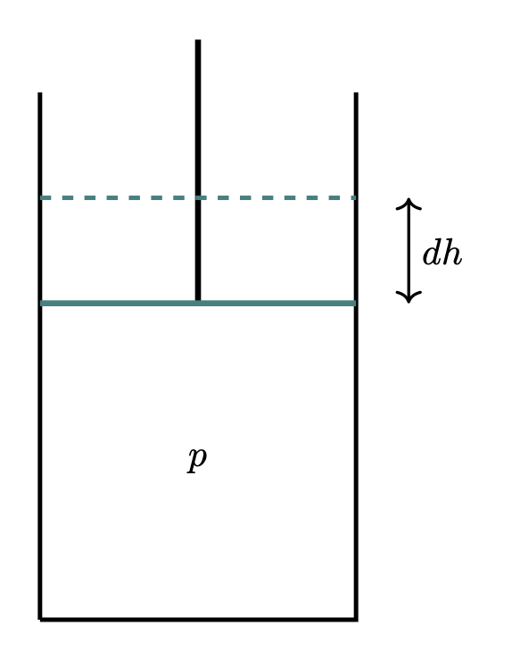
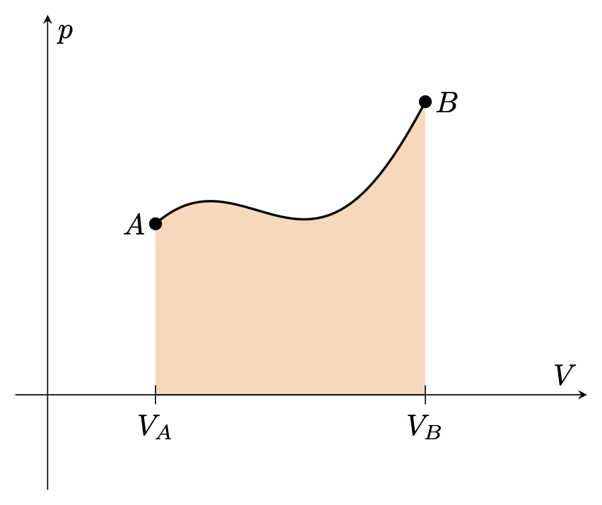
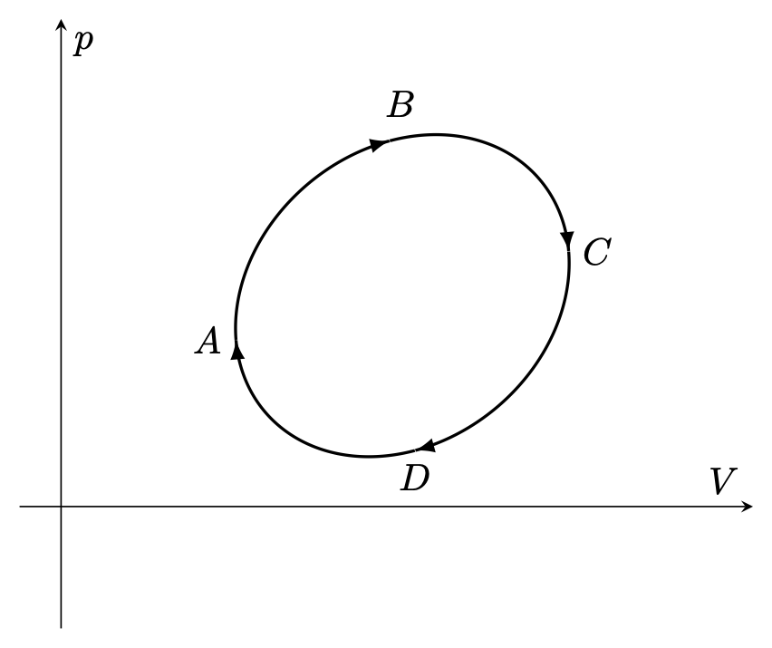
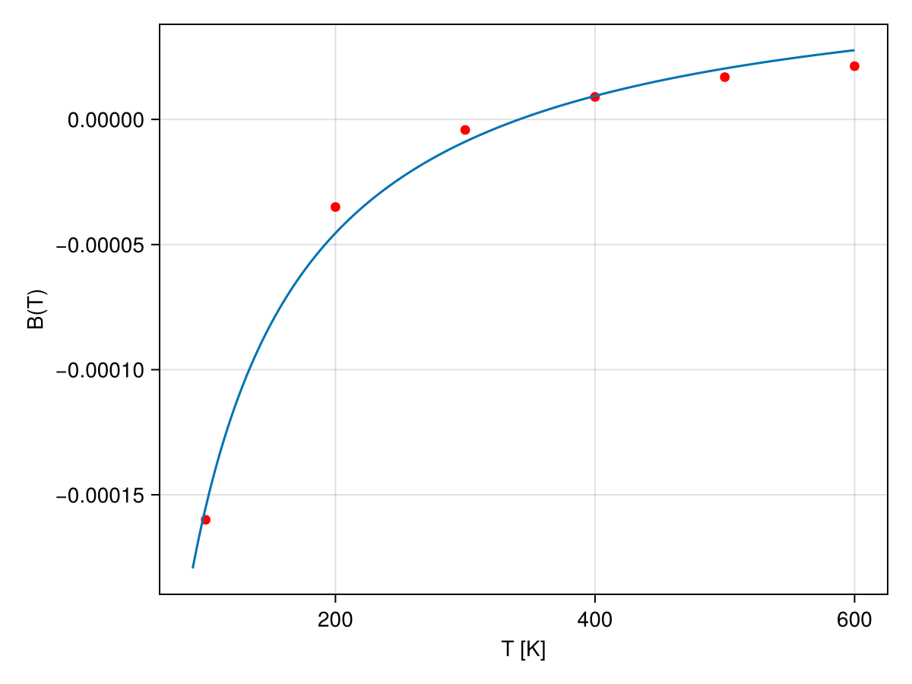
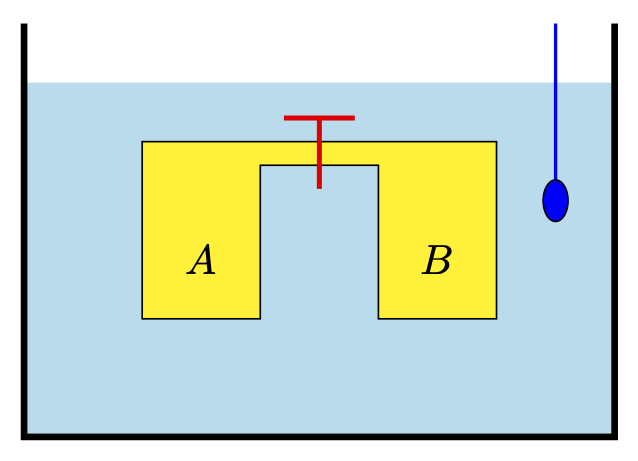
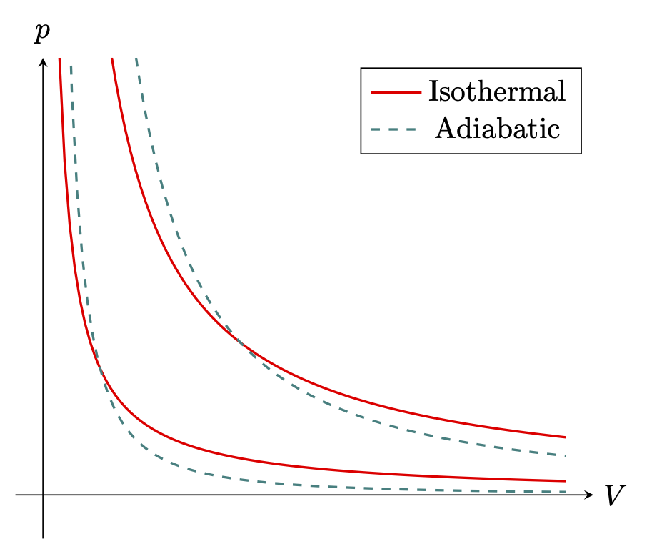



## 열평형 {#sec-TD_thermal_equillibrium_schroeder}

### 열평형과 이완 시간 {#sec-TD_thermal_equillibrium_and_relaxation_time}

- 두 물체가 충분히 오랜 시간 열적으로 접촉한다면 **열평형 (thermal equillibrium)** 에 도달한다.
- 계가 열평형에 도달하는데 걸리는 시간을 **이완 시간 (relaxation time)** 이라고 한다.

### 평형 
 - 열평형
 - 역학적 평형
 - 확산 평형 (diffusive equillibrium) : 충분히 섞인 상태

## 계의 상태와 변환 {#sec-TD_state_and_transform_of_system_fermi}

### 역학적 계와 열열학적 계 {#sec-TD_mechanical_system_and_thermodynamic_system_fermi}

- 특정 시점에서의 역학계의 **상태 (state)** 는 각각의 입자의 위치와 속도에 의해 완벽하게 특정된다. 즉 $N$ 입자계는 $6N$ 변수에 의해 기술된다. 
- 그러나 열역학에서는 $N\approx 10^{23}$ 개의 입자로 이루어진 계를 다루며 $6N$ 개의 변수를 특정하는 것은 실질적으로 불가능하다.
- 더우기 열역학에서 다루는 양은 이 계의 평균적인 특성이며, 각각의 입자에 대한 정보는 불필요하다. 

### 열역학적 계 {#sec-TD_exmaples_of_thermodynamic_system_fermi}

#### **화학적으로 정의된 동일한 종류의 유체로 구성된 계**

- 온도 $T$, 부피 $V$, 압력 $p$ 에 의해 상태가 결정된다.
- 이 계의 기하학은 부피 뿐만 아니라 형태에 의해 결정된다. 대부분의 경우 기하학적 모양은 열역학적 특성에 영향을 끼치지 않지만 표면적이 부피에 비해 매우 클때는 표면이 고려되어야 한다.
- 물질이 주어졌을 때 온도, 부피, 압력은 서로 독립적이지 않으며 **상태방정식 (equation of state)** 이라고 불리는 아래와 같은 형태의 방정식으로 관련된다.
  $$
  f(p, V, T) = 0.
  $$ {#eq-TD_form_of_equation_of_state}
- 상태방정식의 구체적인 형태는 물질에 따라 다르다. 또한 세 변수중 한 변수는 다른 두 변수의 함수로 기술할 수 있다. 즉 세 변수가운데 두 값을 안다면 상태를 결정 할 수 있다.

#### **화학적으로 정의된 동일한 종류의 고체로 구성된 계**

- 유체와는 다르게 압력의 방향이 특정되어야 하지만 많은 경우 등방적인 압력을 가정한다. 

#### **여러 화합물이 균일하게 섞여있는 계**

- 온도, 부피, 압력 이외에 농도가 고려되어야 한다.

#### **불균일한 계**

- 불균일한 계를 다수의 균일한 부분으로 분할한다. 부분적인 균일성이 연속적으로 변할 때는 균일한 부분의 갯수가 무한일 수 있다.
- 이 경우 상태는 각각의 균일한 부분의 질량, 화학 조성, 뭉친 정도, 압력, 부피, 온도 에 의해 결정된다.

#### **움직이는 부분을 가진 계**

- 대부분의 열역학적 계는 계의 각각의 부분이 정지해 있거나, 매우 느리게 움직여 부분의 운동에너지를 무시할 수 있다고 간주된다. 이 가정이 적용되지 않는다면 계의 각각의 부분의 속도를 특정해야 한다.

### 앙상블과 평형상태 {#sec-TD_enssemble_of_state_and_equillibrium_fermi}

- 열역학적 상태를 아는것은 동역학적 상태를 결정하기에는 부족하다. 예를 들어 균일한 유체로 이루어진 계에서 주어진 온도와 부피에 대해 (압력도 따라서 정해진다) 무한에 가까운 분자 운동 상태가 존재한다. 시간이 흐름에 따라 계는 이 가능한 무한한 상태를 순회한다. 이 관점으로는 열역학적 상태는 분자 운동의 결과로 이 계가 순회하는 모든 동역학적 상태의 **앙상블 (enssemble)** 이라고 볼 수 있다.
- **평형상태 (states of equillibrium)** 는 외부의 조건이 변화하지 않았을 때 계의 성질이 변화하지 않는 상태를 의미한다.
- 많은 경우 우리는 계가 초기상테애서 최종상태까지 중간의 무수한 상태를 거쳐 연속적으로 전행되는 것을 생각한다. 이것을 **열역학적 과정(thermondynamic process)** 혹은 줄여서 **과정 (process)** 이라고 한다. 만약 상태가 $(V,\,p)$ 도식에 의해 표현 될 수 있다면 이 변환은 초기상태를 의미하는 점과 최종상태를 의미하는 점을 잇는 곡선으로 표현된다.
- 이 변환에서 거치는 모든 상태가 평형상태와 단지 아주 조금의 차이밖에 없다면 이 과정을 **가역과정(reversible process)** 이라고 한다. 따라서 가역과정의 초기상태와 최종상태는 평형상태 이어야 한다.
- 가역과정은 실제적으로 외부 조건을 매우 느리게 변화시켜 계가 각각의 단계에서 변화된 조건에 적응하게 하여 구현한다.
- 초기상태 $A$ 에서 최종상태 $B$ 까지 가역변환 되었다면 이 과정을 역으로 수행하면 $B$ 에서 $A$ 까지 변환될 수 있다. 

### 일 {#sec-TD_work}

{#fig-TD_simple_system width=200}

- 열역학적 과정에서 계가 외부에 일을 하거나(음의 일) 외부가 계에 일을 할 수 있다(양의 일)$^1$. [$^1$ 교재나 학자에 따라 일의 부호가 바뀐다. @Fermi1956ThermodynamicsDover 는 계가 외부에 한 일을 양으로 놓았지만 @feynman2010feynman 이나 @Schroeder2000introduction 는 여기에 쓰인대로 정의했으며 근래의 교재들도 이 표기법을 따른다.]{.aside} 

- 위의 그림과 같은 실린더-피스톤 시스템을 생각하자. 실린더의 면적을 $A$ 라고 내부에서 압력 $p$ 가 작용한다고 하면 피스톤에 가해지는 힘은 $pA$ 이다. 피스톤이 $dh$ 만큼 들렸다면 이 시스템이 외부에 한 미소 일(infinitesimla work) $dW = -pA\,dh$ 이며 $A\,dh$ 는 부피의 변화 $dV$ 이므로 미소 일은 다음과 같다.
$$
dW = -p\,dV 
$$ {#eq-TD_infinitesimal_work_done_by_system}

- 유한한 과정에서 이 시스템이 한 일은 위 식을 적분한 것이다. 
$$
W = -\int_A^B  p \,dV
$$ {#eq-TD_finite_work_done_by_system}

{#fig-TD_simple_system_work_done width=350}

### 사이클 {#sec-TD_cycle}

#### **싸이클**

{#fig-TD_simple_cycle width=350}

- 과정에서 초기상태와 최종상태가 동일할 때 이 과정을 **순환 (cycle)** 혹은 영어 그대로 **사이클** 이라고 한다. $(V,\,p)$ 도식으로 보인다면 @fig-TD_simple_cycle 와 같은 닫힌 곡선으로 표현된다.
- 이 계가 한 일은 $(V,\,p)$ 도상에서의 닫힌 곡선의 면적이다.
- 과정이 그림에서와 같이 $A\to B\to C\to D$ 라면 이 순환에서 계는 외부에 일을 하게 된다.

#### **중요한 과정 (process)**

- 외부에 일을 하거나 받지 않는 과정을 **등적 과정(isochoric process)** 이라고 한다. 등적 과정의 경우 과정 전체에 걸쳐 부피가 변하지 않는다.  

- 과정 전체에서 압력이 변하지 않는 과정을 **등압 과정(isobaric process)** 라고 한다.

- 과정 전체에서 온도가 변하지 않는 과정을 **등온 과정(isothermal process)** 라고 한다.

## 이상 기체 {#sec_TD_perfect_gas_0}

### 이상 기체 {#sec-TD_perfect_gas_fermi}

- 온도 $T$, 압력 $p$, 부피 $T$ 일 때의 기체의 상태 방정식은 근사적으로 아래의 간단한 식으로 나타 낼 수 있다. 여기서 $T$ 는 절대 온도이다. 기체의 질량이 $m$ 이고 분쟈량이 $M$ 일 때의 방정식은 아래와 같으며 이 식을 **이상 기체 상태 방정식 (equation of state of an ideal gas or a perfect gas)** 라고 한다.

$$
pV = \dfrac{m}{M}RT = \nu RT = Nk_BT.
$$ {#eq-TD_equation_of_state_for_perfect_gas}

- 여기서 $R$ 은 **기체 상수 (gas constant)** 혹은 **이상 기체 상수** 혹은 **기체상수 (gas constant)** 라고 하며 그 값은 아래와 같다.
  $$
  R=8.314 \, \text{J}\cdot \text{mol}^{−1}\cdot \text{K}^{−1}
  $$

- $\nu = m/M$ 은 기체의 몰수 이며 $N$ 은 기체 분자의 개수이다. $k_B$ 를 **볼츠만 상수 (Boltzmann constant)**라고 하며 그 값은 아래와 같다.
  $$
  k_B = 1.380649 \times 10^{-23}\, \text{J/K}.
  $$

- 이상기체의 밀도 $\rho$ 는 아래와 같다.
  $$
  \rho = \dfrac{m}{V} = \dfrac{pM}{RT}
  $$

- 등온과정에서 $pV=\text{constant}$ 이다. 또한 등온과정에서 부피가 $V_1$ 에서 $V_2$ 로 변할 때 계가 외부에 한 일은 다음과 같다.
$$
W = -\int_{V_1}^{V_2} p\,dV = -\dfrac{m}{M}RT\int_{V_1}^{V_2}\dfrac{dV}{V} = \dfrac{mRT}{M}\ln \left(\dfrac{V_1}{V_2}\right) = \dfrac{mRT}{M}\ln \left(\dfrac{p_2}{p_1}\right) 
$$

### 부분압 {#sec-TD_partial_pressure_fermi}

- 여러 종류 기체의 혼합물은 화학적으로 동일한 종류의 그것과 비슷한 법칙의 지배를 받는다. 여러 기체의 혼합물이 있을 때 그중 한 종류의 혼합물이 같은 온도에서 같은 부피를 채우고 있을 때의 압력을 **부분압 (partial pressure)** 라고 한다. 돌텅의 법칙은 혼합기체의 경우 전체 얍력은 부분압의 합과 같다는 것을 말한다.

### 이상기체의 미시적 모델 {#sec-TD_microscopic_model_of_ideal_gas}

- [파인만 물리학 강의 분자운동론](https://julia-kaeri.github.io/FeynmanLecturesOnPhysics/src/vol1/vol1_6.html#sec-FLP_1_39) 을 참고하라.

### 이상기체와 등분배 정리 {#sec-TD_ideal_gas_and_equipartition_theorem}

- 아래에 서술되는 **등분배 정리 (equipartition theorem)** 는 다음에 증명한다.

- **온도 $T$ 에서 평행상태인 고전역학적 시스템의 에너지가 $f$ 개의 제곱항으로 기술되면, 이 시스템의 평균에너지는 $\displaystyle \dfrac{fk_BT}{2}$ 이다.**

- 단원자 분자의 경우 3차원 병진운동만 가능하므로 $f=3$ 이다. 이원자 분자 기체의 경우 두 원자 사이의 거리가 일정해야 하므로 $300\,\text{K}$ 근처에서 $f=5$ 이다.

- 1차원 용수철의 경우 $E=\dfrac{1}{2}mv^2 + \dfrac{1}{2}kx^2$ 이므로 $n=2$ 이다.

### 연습문제 {.unnumbered}

::: {#exr-TD_schroeder_1_17}

#### Schroeder 1.17

낮은 밀도에서도 실제 기체는 이상기체와 다른 행동을 한다. 이 차이를 체계적으로 설명하기 위한 방법이 **비리얼 전개 (virial expansion)** 를 사용하는 방법으로 아래와 같다.

$$
pV = \nu RT \left(1 + \dfrac{B(T)}{(V/\nu)} + \dfrac{C(T)}{(V/\nu)^2} + \cdots \right),
$$

여기서 $B(T),\,C(T), \ldots$ 를 **비리얼 계수 (virial coefficients)** 라고 한다. 기체의 밀도가 낮다면 $(V/\nu)$ 가 커서 뒤의 항이 앞의 항보다 작다. 많은 경우 두번째 항 까지만 사용해도 충분하다. 여기서 $B(T)$ 를 2차 비리얼 계수라고 하며 1차 비리얼 계수는 항상 1 이다. 질소 N2 의 2차 비리얼 계수는 다음과 같다.

| $T\,(\text{K})$  | $B\,(\text{cm}^3/\text{mol})$ |
|:----------:|:----------:|
| 100 | -160 |
| 200 | -35 |
| 300 | -4.2 |
| 400 | 9.0 |
| 500 | 16.9 |
| 600 | 21.3 |

 

($a$) 각각의 온도에서 이차 비리얼 항 $B/(V/\nu)$ 를 계산하라. 이 때 압력은 1기압이다. 

($b$) 분자 사이의 힘을 고려하여 저온에서 $B(T)<0$ 이며 높은 온도에서 $B(T)>0$ 인 이유를 설명하라.

($c$) 이상기체와 같이 $p,\,V,\,T$ 의 관계가 주어졌을 때 이를 **상태 방정식 (equation of state)** 라고 한다. 밀도가 높은 유체에도 정성적으로 정확한 유명한 상태방정식에는 반데르 발스 방정식이 있다.

$$
\left(p + \dfrac{a\nu^2}{V^2}\right)\left(V-\nu b\right) = \nu RT.
$$

여기서 $a,\,b$ 는 기체에 따라 정해지는 상수이다. 이로부터 2차와 3차 비리얼 계수를 $a,\,b$ 로 표현하라.

($d$) $a,\,b$ 값을 질소의 경우에 맞추어 정하여 반데르 발스로부터 $B(T)$ 의 그래프를 그려라. 이 조건의 범위로부터 반데르 발스 상태방정식의 정확도에 대해 논하라.

:::

::: {.solution}

($a$) $B(T)P/RT$

($b$) 이상기체와 비교했을 때 $B(T)<0$ 은 분자들 사이에 인력이, $B(T)>0$ 은 분자들 사이에 척력이 작용하는 것이다. 낮은 온도에서는 분자들의 운동이 크지 않고 분자들 사이의 인력이 작용하지만 높은 온도에서는 분자들의 운동이 커 충돌을 자주 하기 때문에 척력이 작용하는 것처럼 느끼게 된다.

($c$) 주어진 식을 변형하면

$$
\begin{aligned}
\left(p + \dfrac{a\nu^2}{V^2}\right)V &= \dfrac{\nu RT}{\left(1-\nu b/V\right)} \\[0.3em]
&= \nu RT \left(1 + \dfrac{b}{V/\nu} + \dfrac{b^2}{(V/\nu)^2} + \cdots \right)
\end{aligned}
$$

이므로

$$
pV = \nu RT \left( 1 + \dfrac{b- {a/RT}}{V/\nu}  + \dfrac{b^2}{(V/\nu)^2} + \cdots \right)
$$

이다. 따라서 $B(T) = b-a/RT,\, C(T) = b^2$.

($d$) Least square fit 을 통해 계산하면 $b=6.42\times 10^{-5} (\text{m}^3/\text{mol})$, $a=0.1823 \, \text{J}\cdot\text{m}^3\cdot \text{mol}^2$

{#fig-TD_schroeder_prob_1_17 width=400}
:::

## 열역학 제 1 법칙 {#sec-TD_the_1st_law_of_thermodynamics_fermi}

- 열역학 제 1 법칙은 열역학 계에서의 에너지 보존 법칙이다. 계의 에너지의 변화량과 외부에서 받은 에너지의 합은 항상 $0$ 이다.

- 위의 서술에서 *계의 에너지* 와 *외부에서 받은 에너지* 에 대해 명확히 정의해야 한다.

### 계의 에너지와 에너지 보존 {#sec-TD_energy_of_system_and_conservation_of_energy}

- 역학적 보존계에서 에너지는 포텐셜 에너지와 운동에너지의 합이며 따라서 계의 동력학 변수의 함수이다. 따라서 외부에서 힘이작용하지 않으면 이 계의 에너지는 일정하다. 즉 이 계가 고립계이고 $A,\,B$ 가 이 계의 연속적인 상태이며 $U_A,\,U_B$ 가 각각의 상태에서의 에너지라면 $U_A=U_B$ 이다.

- 이 계가 고립계가 아니며 외부에서 $W$ 만큼이 전달되었다면 ($-W$ 는 이 계가 외부에 한 일) 다음이 성립한다.
  $$
  U_B-U_A = W.
  $$ {#eq-TD_work_and_internal_energy}

- 이 계의 수많은 입자들 사이의 상호작용에 대해 우리가 알지 못한다면, 우리는 주어진 동역학적 상태의 에너지를 계산 할 수 없다. 그러나 @eq-TD_work_and_internal_energy 을 이용하여 계의 에너지에 대한 실험적 정의를 할 수 있다.

- 계의 임의의 상태 $O$ 를 정한 후 그 에너지를 $0$ 으로 놓는다. 즉 $U_O=0$. 앞으로 이 상태를 *표준 상태(standard state)* 라고 한다. 이제 외부에서 힘을 가하여 상태를 $A$ 로 변환하였다고 하자. 이 때 외부에서 이 시스템에 해준 일을 $W_A$ 라고 하자. 그렇다면 $A$ 상태의 에너지 $U_A = W_A$ 이며 이 값이 $A$ 상태에 대한 실험적 정의값이라고 할 수 있다.

- 이제 두 상태 $A$, $B$ 를 생각하자. $A\to B$ 과정은 $A\to O \to B$ 과정으로 생각할 수 있으며 $W=W_B - W_A$ 이므로 $U_B-U_A = W$ 이다. 이제 우리는 @eq-TD_work_and_internal_energy 를 얻었다.

- 실험적으로 정의된 내부 에너지는 표준상태 $O$ 에 따라 다르다는 것은 자명하다. 

### 에너지 보존과 열 {#sec-TD_heat_the_another_form_of_energy}

- 위의 실험적 정의가 의미가 있으려면 $W_A$ 가 단지 상태 $O$ 와 상태 $A$ 에만 의존하며 $O\to A$ 변환의 경로에 의존하면 안된다. 경로에 의존하지 않는 성질은 @eq-TD_work_and_internal_energy 으로부터 온다. 즉 만약 이 경로 독립성이 성립하지 않는다면 우리 계에서는 (지금까지의) 에너지 보존이 성립하지 않는다는 의미이며, 에너지 보존을 포기하지 않으려면 역학적 일 이외의 에너지 전달 수단을 인정해야 한다는 의미이다.

- 예를 들면 ($1$) 외부에서 열을 가한다면 계의 온도는 올라가지만 이 계가 일을 하거나 받지 않을 수 있다. ($2$) [줄의 실험](https://en.wikipedia.org/wiki/Mechanical_equivalent_of_heat) 은 명백히 역학적 일($V$ 가 변하는) 없이도 내부의 온도를 상승시킬 수 있음을 보여준다.

- 이로부터 우리는 열(heat) 이라는 비 역학적인(non mechanical) 형태로 에너지가 전달되는 것을 인정 할 수 밖에 없다. 즉 열은 에너지이다. 

### 열역학 제 1 법칙 {#sec-TD_the_first_law_of_thermodynamics}

- 계 와 환경이 열적으로 분리된 경우, 즉 계가 단열체로 둘러쌓인 경우를 생각해보자. 이 경우 계와 환경 사이에 열교환은 없으며 서로 역학적 일을 주고받을수 있을 뿐이다. 이 경우 계가 해준 혹은 받은 일은 초기상태와 최종상태에 의해 결정된다. 또한 계의 에너지 변화 역시 초기상태와 나중상태에 의해 결정된다.

- 계가 $A\to B$ 과정을 겪었을 때 에너지 변화 $\Delta U = U_B-U_A$ 라고 하자. 계가 단열되었으므로 $\Delta U = W$ 이다.

- 이제 계가 환경과 단열되지 않았다고 하자. 그렇다면 $\Delta U \ne W$ 이며 열의 형태로 에너지가 전달될 수 있다. 즉 더 일반적인 형태로 아래와 같이 쓸 수 있다. 이를 열역학 제 1 법칙 이라고 한다.
$$
\Delta U = Q + W.
$$ {#eq-TD_energy_conservation_including_heat}

- 위 식에서 $Q$ 는 역학적 에너지($dV\ne 0$) 의 형태가 아닌 다른 형태로 전달되는 에너지 전체이다.

- 순환 과정일 경우 $\Delta U = 0$ 이므로 $W=-Q$ 이다. 

## 이상기체와 열역학 제 1 법칙 {#sec-TD_ideal_gas_and_the_1st_law_of_thermodynamics}

### 상태가 $(V,\,p)$ 도식으로 표현되는 계에서의 열역학 제 1 법칙 {#sec-TD_the_first_law_of_thermocynaics_in_Vp_diagram}

- 동일한 유체로 이루어진 계와 같이 상태가 $V,\,p,\,T$ 가운데 두개로 정의 될 수 있는 계를 생각하자. 여기서 독립변수가 무엇인지를 정하기 위해 예를들어 아래와 같은 표기는 $V$ 가 일정한 상태에서의 $\partial U/\partial T$ 는 아래와 같이 표기한다.

$$
\left(\dfrac{\partial U}{\partial T}\right)_V.
$$

- 내부에너지 $U$, 일 $W$, 열 $Q$ 의 미소 변화를 보자. 여기서 주의할것은 $U$ 는 물질의 상태에만 의존하는 **상태 함수(state function)** 이지만 일이나 열은 상태에 도달하기까지의 과정에 의존하는 **경로 함수(path function)** 이라는 것이다. 이를 구분하기 위해 $dU$ 나 $\dbar W$ 와 같이 다른 기호를 사용한다. 열역학 제 1 법칙에 의해 다음이 성립한다.

$$
dU = \dbar Q + \dbar W .
$$ {#eq-TD_fermi_20}

- $\dbar W = -p\,dV$ 이므로 다음과 같다.
  
  $$
  dU  = \dbar Q - p\,dV
  $$ {#eq-TD_fermi_21}

### 열용량과 비열 {#sec-TD_heat_capapcity}

- $T,\,V$ 를 독립변수로 정하면

  $$
  dU = \left(\dfrac{\partial U}{\partial T}\right)_V\,dT + \left(\dfrac{\partial U}{\partial V}\right)_T\, dV
  $$
  
  이며 @eq-TD_fermi_21 는 아래와 같이 쓸 수 있다.
  $$
  \left(\dfrac{\partial U}{\partial T}\right)_V\,dT + \left[p + \left(\dfrac{\partial U}{\partial V}\right)_T\right] \,dV = \dbar Q.
  $$ {#eq-TD_fermi_22}

- $T,\,p$ 를 독립변수로 정하면 아래와 같은 식을 얻는다.
  $$
  \left[\left(\dfrac{\partial U}{\partial T}\right)_p + p\left(\dfrac{\partial V}{\partial T}\right)_V\right]\,dT + \left[\left(\dfrac{\partial U}{\partial p}\right)_T + p\left(\dfrac{\partial V}{\partial p}\right)_T\right]\,dp = \dbar Q.
  $${#eq-TD_fermi_23}
- $V,\,p$ 를 독립변수로 정하면 아래와 같은 식을 얻는다.
  $$
  \left(\dfrac{\partial U}{\partial p}\right)_V\,dp + \left[p + \left(\dfrac{\partial U}{\partial V}\right)_p\right] \,dV = \dbar Q.
  $$ {#eq-TD_fermi_24}

::: {.callout-note icon="false"}

#### **정적열용량과 정압열용량**

::: {#def-CM_specific_heat}

부피가 일정할 때 단위 온도만큼 온도를 올리기 위해 필요한 열량 $C_V$ 를 **정적 열용량 (heat capacity at constant volumn)** 이라고 하고 압력이 일정할 때 단위 온도만큼 온도를 올리기 위해 필요한 열량 $C_p$ 를 **정압 열용량 (heat capacity at constant pressure)** 이라고 한다. 즉

$$
C_V := \left(\dfrac{\dbar Q}{dT}\right)_V,\qquad   C_p := \left(\dfrac{\dbar Q}{dT}\right)_p
$$ {#eq-TD_fermi_25}

이다.
:::
:::

- @eq-TD_fermi_22 로부터 정적열용량과 정압열용량은 다음과 같다.
  $$
  \begin{aligned}
  C_V &= \left(\dfrac{\dbar Q}{dT}\right)_V = \left(\dfrac{\partial U}{\partial T}\right)_V, \\[0.3em]
  C_p &= \left(\dfrac{\dbar Q}{dT}\right)_p = \left(\dfrac{\partial U}{\partial T}\right)_p + p\left(\dfrac{\partial V}{\partial T}\right)_V,
  \end{aligned}
  $$

- 단위 질량당의 열용량을 **비열 (specific heat capacity)** 이라고 한다. 정적 비열 $c_V$ 와 정압 비열 $c_p$ 는 $C_V,\,C_p$ 를 각각 질량으로 나눈 값이다.

### 이상기체의 열용량 {#sec-TD_the_heat_capacity_of_ideal_gas}

독립변수로 $T,\,V$ 를 선택할 때 이상기체의 에너지 $U=U(T)$ 이며 $V$ 와는 독립적임이라는 것은 우선 Joule 에 의해 실험적으로 확인되었으며, 이론적으로는 열역학 제 2 법칙을 통해 보일 수 있다. Joule 의 실험은 아래와 같은 장치에서 이루어졌다.

{#fig-TD_joule_exp width=300}

두개의 챔버 $A,\,B$ 로 이루어진 콘테이너가 그림과 같이 열량계 속에 잠겨 있다. $A,\,B$ 는 벨브로 연결되어 있다. $A$ 는 가스로 차 있고 $B$ 는 진공상태에서 밸브는 잠겨 있다. 열평형 상태에 도달한 후 온도 $T_1$ 을 재고 밸브를 열고 나서 평형상태에 도달한 후 온도 $T_2$ 를 쟀을 때 Joule 은 $T_1$ 과 $T_2$ 가 거의 차이가 없음을 확인하였다. 이상기체의 경우 $T_1=T_2$ 일 것이다.

$T_1=T_2$ 이므로 외부로부터의 열 전달이 없고 따라서 $\Delta U = W$ 인데 $A$ 와 $B$ 로 이루어진 계의 부피는 변화가 없으므로 $W=0$ 이다. 따라서 $\Delta U=0$ 이다. 즉 $U_A = U_{A+B}$ 이므로 우리는 이상기체의 에너지가 온도에만 관계가 있으며 부피와는 무관하다는 것을 알 수 있다. 즉 이상기체의 에너지 $U=U(T)$ 이다. 

이제 이 함수를 알아보자. 우리는 실험적으로 이상기체의 정적 열용량 $C_V$ 는 온도에만 약간 의존한다는 것을 안다. 여기서는 이상기체의 정적 열용량이 우리가 관심있는 온도 영역에서 상수라고 가정하자. $U= U(T)$ 이므로

$$
C_V = \dfrac{dU}{dT}
$$ {#eq-TD_heat_capacity_at_constant_volume_for_ideal_gas}

이며, 따라서

$$
U = C_V T + U_0
$${#eq-TD_integration_of_heat_capacity_at_constant_volume_for_ideal_gas}

이다. 여기서 $U_0$ 는 $0\,K$ 에서의 이상기체의 에너지이다. @eq-TD_fermi_21 로부터

$$
C_V\,dT + p\,dV = \dbar Q
$$ {#eq-TD_fermi_30}

임을 안다. 이상기체 상태 방정식 @eq-TD_equation_of_state_for_perfect_gas 에서 $\nu = m/M$ 라 놓으면 ($\nu$ 는 기체의 몰수가 된다)

$$
p\,dV + v\,dp = \nu R\,dT 
$$

을 얻는다. 이로부터

$$
(C_V + \nu R)dT  - v\,dp= \dbar Q
$$

이므로 이상기체의 정압 열용량을 아래와 같이 얻을 수 있다.

$$
C_p = \left(\dfrac{\dbar Q}{dT}\right)_p = C_V + \nu R.
$$ {#eq-TD_heat_capacity_at_constant_pressure_for_ideal_gas}

::: {#exm-TD_properties_of_ideal_gas}

우리는 이상기체에 대해 다음이 성립함을 보일 수 있다.
$$
\left(\dfrac{\partial U}{\partial T}\right)_p = \dfrac{dU}{dT} = C_V, \qquad \left(\dfrac{\partial V}{\partial T}\right)_p = \dfrac{\nu R}{p}
$$ {#eq-TD_partial_U_partial_T_at_constant_p}

@eq-TD_integration_of_heat_capacity_at_constant_volume_for_ideal_gas 으로부터

$$
\left(\dfrac{\partial U}{\partial T}\right)_p = C_V + \left(\dfrac{\partial U_0}{\partial T}\right)_p = C_V = \dfrac{dU}{dT}
$$

임을 안다. 또한 이상기체 상태방정식 @eq-TD_equation_of_state_for_perfect_gas 으로부터 $V=\nu RT/p$ 이므로

$$
\left(\dfrac{\partial V}{\partial T}\right)_p = \left(\dfrac{\partial (\nu RT/p)}{\partial T}\right)_p = \dfrac{\nu R}{p}.
$$

::: 

이후에 계산하겠지만 하나의 원자로 이루어진 기체 분자의 경우 $C_V=\frac{3}{2}R$, $C_p = \frac{5}{2}R$ 이며 두개의 원자로 이루어진 기체 분자의 경우 $C_V=\frac{5}{2}R$, $C_p = \frac{7}{2}R$ 이다.

여기서 

$$
\gamma := \dfrac{C_p}{C_V}
$$ {#eq-TD_definition_of_specific_heat_ratio}

를 **비열비 (specific heat ratio)** 혹은 **adiabatic index** 라고 한다. 이상기체의 경우 아래와 같다.

$$
\gamma = \dfrac{C_p}{C_V}=1+ \dfrac{\nu R}{C_V}.
$$

단원자 분자 이상기체는 $\gamma=5/3$, 이원자 분자 이상기체는 $7/5$ 이다.

### 이상기체의 단열 가역 과정 {#sec-TD_adiabatic_reversible_process_of_ideal_gas}

**단열과정 (adiabatic process)** 는 $\dbar Q=0$ 인 과정을 말한다. @fig-TD_simple_system 에서 실린더 벽과 피스톤이 모두 열을 전달하지 않는 재질로 되어 있으며 피스톤이 매우 느리게 움직이는 경우가 해당된다. 피스톤이 위로(혹은 실린더 바깥쪽으로) 움직이면 $\dbar W < 0$ 이며 아래로(혹은 실린더 안쪽으로) 움직이면 $\dbar W>0$ 이다. $\dbar Q=0$ 이므로 $dU=\dbar W$ 이다.

$$
C_V\,dT =- p\,dV \implies C_V\,dT = - \dfrac{\nu RT}{V}\,dV
$$

이므로

$$
\dfrac{dT}{T} = -  \dfrac{\nu R}{C_V}\dfrac{dV}{V}
$$

이며, 이로부터 다음 관계를 얻는다.

$$
TV^{\nu R/C_V}= TV^{\gamma -1} =\text{constant.}
$$ {#eq-TD_relations_1_in_adiabatic_revirsible_process_of_ideal_gas}

또한 이상기체 상태방정식을 통해 아래 관계를 얻을 수 있다.

$$
pV^\gamma= \text{constant.},\qquad Tp^{(1-\gamma)/\gamma}=\text{constant.}
$${#eq-TD_relations_2_in_adiabatic_revirsible_process_of_ideal_gas}

단열 가역과정이 아닌 등온과정에서는 $pV=\text{constant}$ 가 성립한다는 것을 안다. 

{#fig-TD_adiabatic_and_isothermal_process width=350}

### 잠열 

특별한 경우 열을 가해도 온도가 올라가지 않는 경우가 있다. 보통 물의 끓음이나 녹음 같은 상전이가 발생할 때 이며 이 경우 비열은 무한대가 된다. 단위 질량당 상전이에 필요한 열을 **잠열 (latent heat)** 이라고 한다. 하지만 이 정의는 모호한데 상전이 과정에서 어떤 일을 할수도 있기 때문이다. 일반적으로 압력이 일정한 상태를 가정하고, 등압 팽창 혹은 수축 과정 이외에 필요한 열을 잠열이라고 한다.

### 연습문제 {.unnumbered}

::: {#exr-TD_blundell_12_2}

#### Blundell 12.2

이상기체의 경우 $pV=\phi(T)$ 로 주어진다. 이것은 다음을 의미함을 보여라.

$$
\left(\dfrac{\partial p}{\partial T}\right)_V = \dfrac{1}{V}\dfrac{d\phi}{dT},\qquad \left(\dfrac{\partial V}{\partial T}\right)_p = \dfrac{1}{p}\dfrac{d\phi}{dT}.
$${#eq-exr-TD_blundell_12_2_1}

또한 다음이 성립함을 보여라.

$$
\left(\dfrac{\partial Q}{\partial V}\right)_p = C_p \left(\dfrac{\partial T}{\partial V}\right)_p,\qquad \left(\dfrac{\partial Q}{\partial p}\right)_V = C_V \left(\dfrac{\partial T}{\partial p}\right)_V.
$${#eq-exr-TD_blundell_12_2_2}

단열 과정에서 다음이 성립함한다.

$$
\dbar Q = \left(\dfrac{\partial Q}{\partial p}\right)_V \, dp + \left(\dfrac{\partial Q}{\partial V}\right)_p \, dV = 0.
$${#eq-exr-TD_blundell_12_2_3}

이 때 $pV^\gamma$ 가 상수임을 보여라.

:::

::: {.solution}
@eq-exr-TD_blundell_12_2_1 는 자명하다. Blundell 에서는 일단 $U=U(T,\,V)$ 임을 가정한다. 

$$
dU = \left(\dfrac{\partial U}{\partial T}\right)_V dT + \left(\dfrac{\partial U}{\partial V}\right)_T \, dV
$$ {#eq-exr-TD_blundell_12_2_4}

이므로

$$
\begin{aligned}
dQ &= dU + p\,dV = \left(\dfrac{\partial U}{\partial T}\right)_V \,dT + \left[\left(\dfrac{\partial U}{\partial V}\right)_T + p \right] \, dV
\end{aligned}
$$

이다. 이로부터,

$$
\begin{aligned}
C_p &= \left(\dfrac{\partial Q}{\partial T}\right)_p = \left(\dfrac{\partial U}{\partial T}\right)_V +  \left[\left(\dfrac{\partial U}{\partial V}\right)_T + p \right] \, \left(\dfrac{\partial V}{\partial T}\right)_p, \\[0.3em]
\left(\dfrac{\partial Q}{\partial V}\right)_p &= \left(\dfrac{\partial U}{\partial T}\right)_V \left(\dfrac{\partial T}{\partial V}\right)_p + \left(\dfrac{\partial U}{\partial V}\right)_T + p 
\end{aligned}
$$

@cor-TD_reciprocity_relation_of_partial_derivative 에 따라 

$$
\left(\dfrac{\partial V}{\partial T}\right)_p \left(\dfrac{\partial T}{\partial V}\right)_p =1
$$

이므로 

$$
\left(\dfrac{\partial Q}{\partial V}\right)_p = C_p\left(\dfrac{\partial T}{\partial V}\right)_p 
$$

이다. 또한 @eq-exr-TD_blundell_12_2_4 로부터 

$$
\left(\dfrac{\partial Q}{\partial p}\right)_V = \left(\dfrac{\partial U}{\partial T}\right)_V \left(\dfrac{\partial T}{\partial p}\right)_V 
$$

이며

$$
C_V = \left(\dfrac{\partial Q}{\partial T}\right)_V= \left(\dfrac{\partial U}{\partial T}\right)_V
$$

이므로

$$
\left(\dfrac{\partial Q}{\partial p}\right)_V = C_V \left(\dfrac{\partial T}{\partial p}\right)_V
$$

이다. 단열 과정에서 @eq-exr-TD_blundell_12_2_3 이 성림하므로

$$
\begin{aligned}
0 = \dbar Q &= C_V \left(\dfrac{\partial T}{\partial p}\right)_V dp + C_p \left(\dfrac{\partial T}{\partial V}\right)_p dV
\end{aligned}
$$

이다. @cor-TD_reciprocity_relation_of_partial_derivative 와 @eq-exr-TD_blundell_12_2_1 로부터

$$
\left(\dfrac{\partial T}{\partial p}\right)_V =\dfrac{V}{df/dT}, \quad \left(\dfrac{\partial T}{\partial V}\right)_p = \dfrac{p}{df/dT}
$$

임을 안다. 또한 $C_p = \gamma C_V$ 이므로

$$
\begin{aligned}
&0 = \dfrac{V}{df/dT} dp + \dfrac{\gamma p}{df/dT} dV \\[0.3em]
\implies &\gamma \dfrac{dV}{V} + \dfrac{dp}{p} = 0 \\[0.3em]
\implies & pV^\gamma = \text{constant.}
\end{aligned}
$$

:::

 

::: {#exr-TD_blundell_12_3}

#### Blundell 12.3

상수 $A,\,B$ 에 대해 다음과 같이 쓸 수 있는 이유를 설명하라.

$$
\begin{aligned}
\dbar Q &= C_p dT + A\,dp \\[0.3em]
\dbar Q &= C_V dT + B\,dV.
\end{aligned}
$$ {#eq-exr-TD_blundell_12_3_1}

위 두식을 빼서 다음이 성립함을 보여라.

$$
(C_p-C_V)\,dT = B dV - Adp.
$$ {#eq-exr-TD_blundell_12_3_2}

또한 온도가 일정할 때 다음이 성립함을 보여라.

$$
\left(\dfrac{\partial p}{\partial V}\right)_T = \dfrac{B}{A}.
$${#eq-exr-TD_blundell_12_3_3}

단열 과정에서 다음이 성립함을 보여라.

$$
\begin{aligned}
dp &= -(C_p/A)\,dT,\\[0.3em]
dV &= -(C_V/B) \,dT.
\end{aligned}
$${#eq-exr-TD_blundell_12_3_4}

이로부터 단열 과정에서 다음이 성립함을 보여라.

$$
\begin{aligned}
\left(\dfrac{\partial p}{\partial V}\right)_\text{adiabatic} &= \gamma \left(\dfrac{\partial p}{\partial V}\right)_T, \\[0.3em]
\left(\dfrac{\partial V}{\partial T}\right)_\text{adiabatic} &= \dfrac{1}{1-\gamma} \left(\dfrac{\partial V}{\partial T}\right)_p,\\[0.3em]
\left(\dfrac{\partial p}{\partial T}\right)_\text{adiabatic} &= \dfrac{\gamma}{\gamma -1}\left(\dfrac{\partial p}{\partial T}\right)_V.
\end{aligned}
$${#eq-exr-TD_blundell_12_3_5}

:::

::: {.solution}

이상기체에서 $p,\,T,\,V$ 가운데 두 변수로 $dU,\, \dbar Q,\, \dbar W$ 를 기술 할 수 있다는 것을 안다. @eq-exr-TD_blundell_12_3_1 에서 첫번째 식은 $(T,\,p)$, 두번째 식은 $(T,\,V)$ 로 기술한 것이다. 두 식을 빼면 @eq-exr-TD_blundell_12_3_2 를 얻으며 $dT=0$ 에 대해 @eq-exr-TD_blundell_12_3_3 을 얻는다. 단열과정은 $\dbar Q=0$ 이므로 @eq-exr-TD_blundell_12_3_4 를 얻는다. 

@eq-exr-TD_blundell_12_3_4 으로부터

$$
dp = -\left(\dfrac{C_p}{A}\right)dT = \left(\dfrac{C_p}{A}\right)\left(\dfrac{B}{C_V}\right)dV
$$

이므로

$$
\left(\dfrac{\partial p}{\partial V}\right)_\text{adiabatic} = \dfrac{C_p}{C_V}\dfrac{B}{A} = \gamma \left(\dfrac{\partial p}{\partial V}\right)_T
$$

이며, @eq-exr-TD_blundell_12_3_2 에서 $dp=0$ 일 때 $\dfrac{1}{B} = \dfrac{1}{C_p-C_V}\left(\dfrac{\partial V}{\partial T} \right)_p$ 이므로 

$$
\left(\dfrac{\partial V}{\partial T}\right)_\text{adiabatic} = - \dfrac{C_V}{B} = - \dfrac{C_V}{C_p-C_V}\left(\dfrac{dV}{dT}\right)_p = \dfrac{1}{1-\gamma}\left(\dfrac{dV}{dT}\right)_p 
$$

이다. 또한 @eq-exr-TD_blundell_12_3_2 에서 $dV=0$ 일 때 $\dfrac{1}{A} = - \dfrac{1}{C_p-C_V} \left(\dfrac{\partial p}{\partial T}\right)_V$ 이므로 

$$
\left(\dfrac{\partial p}{\partial T}\right)_\text{adiabatic} = - \dfrac{C_p}{A} = \dfrac{C_p}{C_p-C_V} \left(\dfrac{\partial p}{\partial T}\right)_V = \dfrac{\gamma}{\gamma-1} \left(\dfrac{\partial p}{\partial T}\right)_V 
$$

이다. 

:::

 

::: {#exr-TD_schroeder_1_36}

#### Schroeder 1.36

자전거 타이어에 공기를 주입할 1기압에서 1 리터의 공기를 단열 압축하여 7 기압으로 압축하였다. 공기는 대부분 질소와 산소 같은 이원자 분자이다.

($a$) 압축 후 최종 부피는 얼마인가?

($b$) 공기를 압축하며 수행한 일은 얼마인가?

($c$) 최초의 온도가 $300\,\text{K}$ 였다면 압축 후 온도는 얼마인가?

:::

::: {.solution}

($a$) 이원자 분자 이상기체의 경우 $\gamma=7/5$ 이다. @eq-TD_relations_2_in_adiabatic_revirsible_process_of_ideal_gas 의 첫번째 식으로부터 $1=7V^{7/5}$ 이므로 $V=0.25\,\text{liter}$.

($b$) $pV^\gamma=pV^{7/5}=1\,\text{liter}\cdot\text{atm}^{7/5}$ 이므로

$$
W = -\int_1^{0.25} p\,dV = -\int_1^{0.25} \dfrac{dV}{V^{7/5}} = 1.85\, \text{atm}\cdot \text{liter} = 188\, \text{J}
$$

($c$) @eq-TD_relations_2_in_adiabatic_revirsible_process_of_ideal_gas 의 두번째 식으로부터 $523\,\text{K}$ 임을 알 수 있다.

:::

 

::: {#exr-TD_schroeder_1_39}

#### Schroeder 1.39

연속적인 매질의 진동에 뉴턴의 법칙을 적용하여 소기의 속도 $c_s$ 가 다음과 같다는 것을 보일 수 있다.

$$
c_s = \sqrt{B/\rho}.
$$

여기서 $\rho$ 는 매질의 밀도이고 $B$ 는 물질의 강도의 척도인 부피탄성계수(bulk modulus) 이다. 정확히는 다음과 같이 정의된다.

$$
B := - V \dfrac{dp}{dV}
$$

이 압축이 등온인지 단연일지 혹은 다른 방법에 의한건지 아직 정하지 않았으므로 위의 정의는 아직 모호하다.

($a$) 이상기체의 부피탄성계수를 등온과 단열 압축에 대해 각각 계산하라.

($b$) 음파의 속도를 계산하는데 있어 단열 압축을 하용하여야 하는 이유를 논하라.

($c$) 주어진 온도와 평균 분자 질량에 대해 이상기체에서의 음속을 계산하라. 이 결과를 기체에서의 분자의평균제곱근 속도 식과 비교하라.

($d$) 스코틀랜드의 배틀필드 밴드가 유타에서 연주할 때 한 연주가가 고도로 인해 백파이프의 음정이 나갔다는 것을 발견했다. 고도가 음속에 미치는 영향, 즉 파이프에서의 정상파의 진동수에 미치는 영향을 예상 할 수 있는가? 그렇다면 어느 방향으로? 그렇지 않다면 왜?

:::

::: {.solution}

($a$) 등온 압축이라면 $pV=A=\text{constant}$ 이므로 $B = p$. 단열 압축시 $pV^\gamma = \text{constant}=C$ 로부터 $B = \gamma p$.

($b$) 

($c$) 공기분자의 경우 이원자 분자가 지배적이므로 $\gamma = 7/5$ 로 놓을 수 있다. $p=1\,\text{atm} = 101,325 \text{N/m}^2$, $\rho = 1.225\,\text{kg/m}^3$ 이므로 $c_s = \sqrt{B/\rho}=340.3\,\text{m/sec}$

($d$) $B\propto p$ 이며 $\rho \propto p$ 이므로 $c_s$ 는 온도가 일정할 때 차이가 없다. 그렇다면 아마 온도차이일 것이다. 

:::

 

::: {#exr-TD_schroeder_1_46}

#### Schroeder 1.46

고체나 액체의 열용량은 대부분 일정한 압력 상태에서 측정된다. 왜인지 보이기 위해 여기서는 $T$ 의 변화에 따른 $V$ 의 변화를 없에기 위한 압력값을 구해보자.

($a$) 물질의 **열팽창 계수 (thermal expansion coefficient)** $\beta$ 는 다음과 같이 정의된다.

$$
\beta := \dfrac {1}{V}\left(\dfrac{\partial V}{\partial T}\right)_p.
$$ {#eq-TD_definition_of_thermal_expansion_coefficient}

압력을 일정하게 유지하면서 물질을 압축시킬 때 물질의 부피의 변화 $dV_1$ 을 $dT$ 와 $\beta$ 를 이용하여 기술하라.

($b$) **등온 압축률 (isothermal compressibility)** $\kappa_T$ 는 다음과 같이 정의된다.

$$
\kappa_T = - \dfrac{1}{V}\left(\dfrac{\partial V}{\partial p}\right)_T.
$${#eq-TD_definition_of_isothermal_compressibility}

온도를 일정하게 유지하면서 물질을 약간 압축시킬 때의 부피 변화 $V_2$ 를 $dp$ 에 대해 표현하라.

($c$) ($b$) 에 의한 압축에 의해 $(a)$ 에 의한 팽창이 상쇄되도록 합축했다고 하자. 그렇다면 이 경우 $(dp)/(dT)=\left(\partial p/\partial T\right)_V$ 이다. 이 편미분을 $\beta,\,\kappa_T$ 로 표현하라. 이 경우 

$$
\left(\dfrac{\partial p}{\partial T}\right)_V = - \dfrac{\left(\partial V/\partial T\right)_p}{\left(\partial V/\partial p\right)_T}
$$ {#eq-TD_cyclic_relation_of_partial_derivatives}

를 얻어야 한다(편미분의 삼중곱 규칙 혹은 순환 규칙이라고 한다). 위 관계는 순전히 수학적인 관계이다.

($d$) 이상기체에 대해 $\beta,\,\kappa_T,\,(\partial p/\partial T)_V$ 를 얻고 @eq-TD_cyclic_relation_of_partial_derivatives 가 성립하는지 비교하라.

:::

::: {.solution}

$T,\,p$ 를 독립변수로 할 때
$$
dV = \left(\dfrac{\partial V}{\partial T}\right)_p\,\,dT + \left(\dfrac{\partial V}{\partial p}\right)_T\,dp
$$

임을 이용한다.

($a$) $dV_1 = \beta V\,dT$

($b$) $dV_2 = -\kappa_T V dp$

($c$) $\left(\dfrac{\partial p}{\partial T}\right)_V = \dfrac{\beta}{\kappa_T} = - \dfrac{\left(\partial V/\partial T\right)_p}{\left(\partial V\partial p\right)_T}.$

($d$) 이상기체의 경우 이상기체 상태방정식 $pV=\nu k_BT$ 로부터,

$$
\begin{aligned}
\beta &=\dfrac{1}{V}\left(\dfrac{\partial V}{\partial T}\right)_p = \dfrac{1}{T}, \\[0.3em]
\kappa_T &= - \dfrac{1}{V}\left(\dfrac{\partial V}{\partial p}\right)_T = \dfrac{1}{p}, \\[0.3em]
\left(\dfrac{\partial p}{\partial T}\right)_V &= \dfrac{p}{T}= \dfrac{\beta}{\kappa_T}.
\end{aligned}
$$
:::

 

