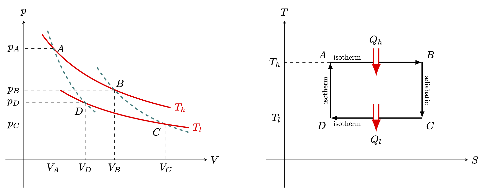
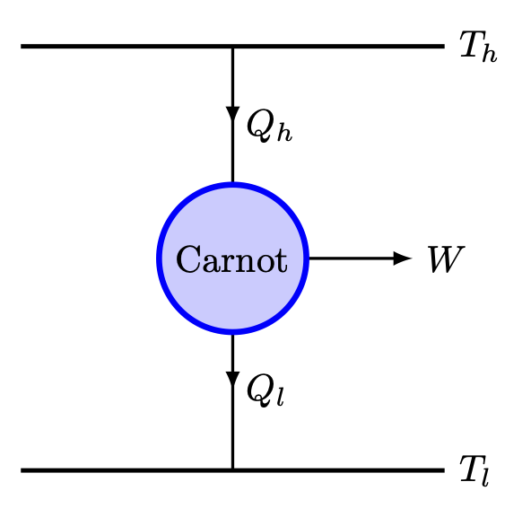
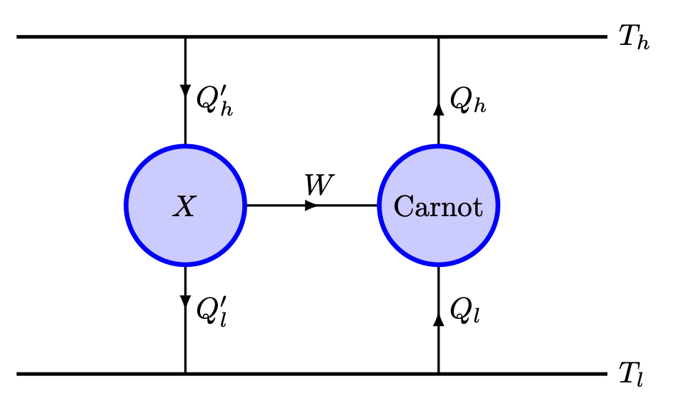
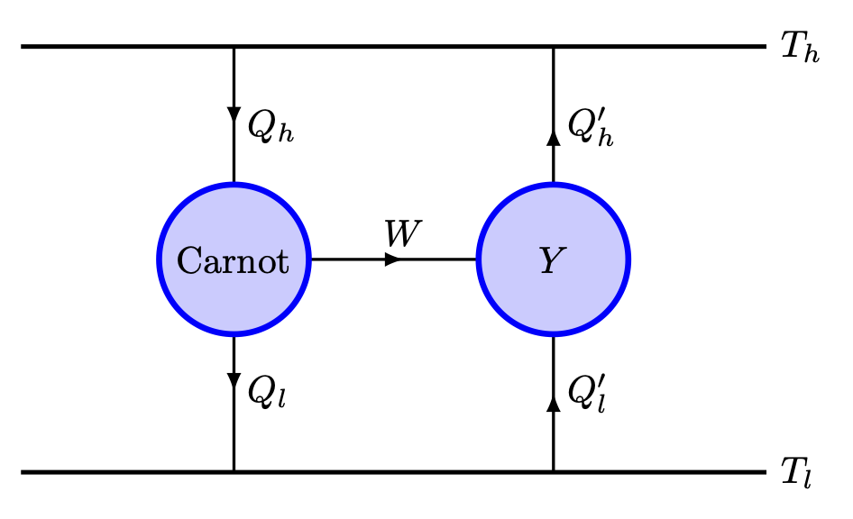
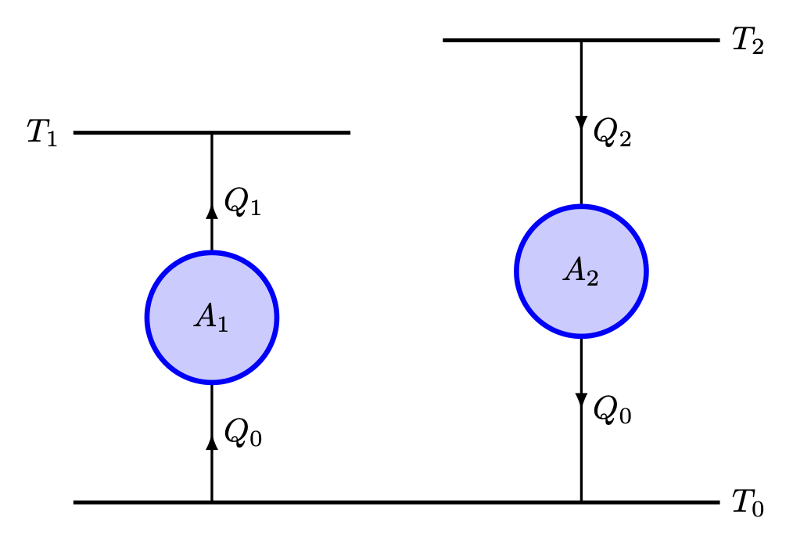
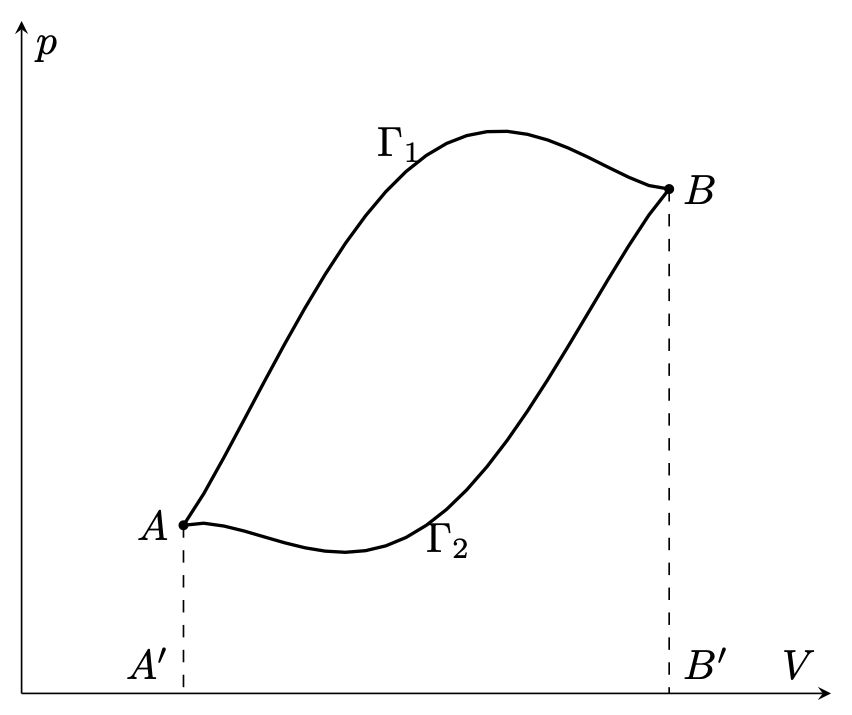
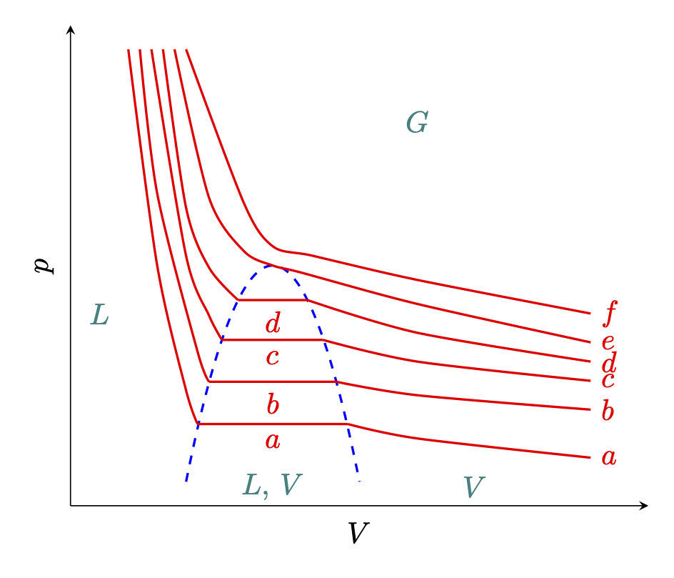
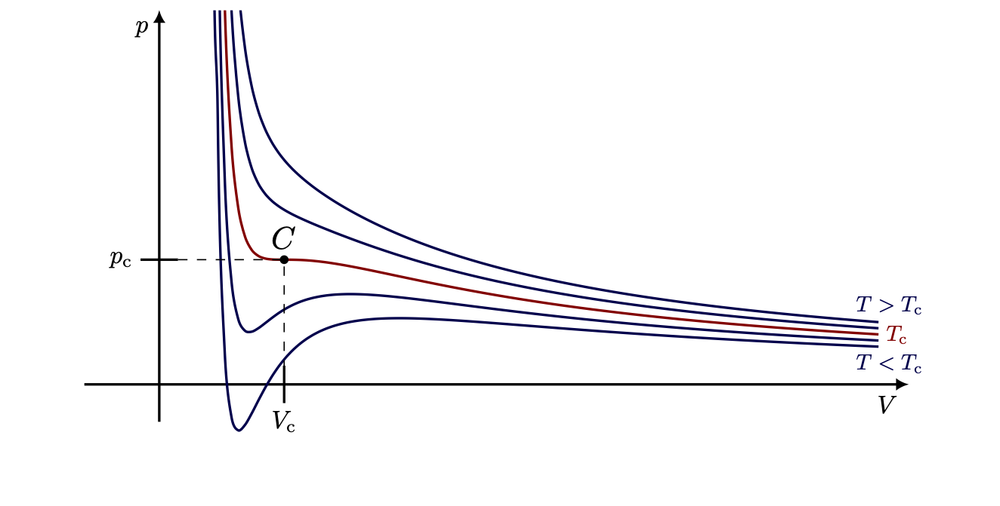
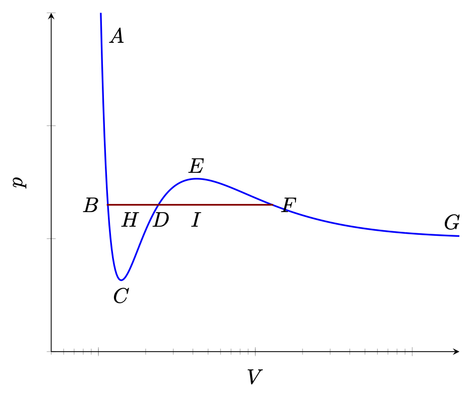



## 열역학 제 2 법칙 {#sec-TD0_the_second_raw_of_thermodynamics}

### 열원과 기관 {#sec-TD_heat_source_and_engine}

열역학 제 1 법칙은 에너지를 생산하는 기계를 만들 수 없으며 단지 에너지를 변환할 뿐이라는 것을 한다.그러나 제 1 법칙은 에너지 사이의 변환에 대해서는 어떤 제약도 말하지 않는다. 따라서 이 법칙에 따르면 열은 일로, 일은 열로 자유롭게 변환 될 수 있다.

일을 열로 변환시키는 경우는 항상 가능한 듯이 보인다. 마찰, 혹은 전기 저항을 통해 역학적/전기적 에너지를 열로 변환시킬수 있다는 것을 안다. 그러나 반대의 경우, 즉 열을 일로 바꾸는 것에는 명확한 제한이 존재한다. 만약 제한이 존재하지 않는다면 우리는 환경이 아무리 온도가 낮더라도 이 환경의 온도를 더 낮추어 일로 바꿀 수 있게 된다. 그리고 열역학 제 2 법칙에 의하면 이것은 불가능하다.

이것을 살펴보기 위해 우리는 우선 **열원 (heat source)** 과 **기관 (engine)** 을 정의하자. 주변과 열만을 주고받으며 일은 주고받지 않으면서 정해진 온도 $T$ 를 유지하는 물리적 대상을 **온도 $T$ 의 열원** 이라고 한다. 또한 순환 과정을 통해 열을 일로 바꾸는 계(system)를 **열기관(heat engine)** 혹은 **기관** 이라고 한다. 

 

### 열역학 제 2 법칙 {#sec-TD_the_second_law_of_thermodynamics}

열역학 제 2 법칙은 아래와 같이 두가지로 표현 될 수 있다.

::: {.callout-important icon="false"}

#### **캘빈의 열역학 제 2 법칙**

온도 $T$ 상태에서 같은 온도의 열원으로부터 추출한 열을 일로 변환시키는 유일한 최종결과를 갖는 과정은 불가능하다. 

:::

::: {.callout-important icon="false"}

#### **클라우시우스의 열역학 제 2 법칙**

낮은 온도의 물체의 열을 높은 온도를 가진 물체로 전달하는 유일한 최종결과를 갖는 과정은 불가능하다 

:::

열역학 제 2 법칙에 대한 두가지 명제는 동일하다는 것을 보일 수 있다. 

::: {#lem-TD_equivallence_of_two_second_laws_of_thermodynamics_1}

클라우시우스의 법칙이 참이면 캘빈의 법칙도 참이다.

:::

::: {.proof}

우선 캘빈의 명제가 틀리다고 가정하자. 즉 온도 $T$ 인 열원으로부터 추출한 열을 일 $W$ 로 변환시켰다고 하자. 마찰을 통해 우리는 이 $W$ 를 열로 변환할 수 있고 이를 통해 다른 물체의 온도를 높일 수 있다. 이 때 다른 물체의 온도가 $T$ 보다 높은지 낮은지와는 무관하므로 캘빈경의 명제가 틀리다면 클라우시우스의 명제도 틀리다. $\square$

:::

반대로 클라우시우스의 명제가 틀렸을 때 캘빈경의 명제가 틀리다는 것을 보이기 위해서는 조금 해야할 것이 있다.

## 카르노 순환

### 두가지 열역학 제 2 법칙의 동등성 {#sec-TD_equivalence_of_two_versions_of_2nd_principle_of_thermodynamics}

{#fig-TD_carnot_cycle width=600}

$T_h$ 과 $T_l$ $(T_h>T_l)$ 의 두 열원이 있다고 하자. 그리고 위의 그림과 같은 $ABCDA$ 과정을 생각하자. 여기서 $AB$ 과정과 $CD$ 과정은 등온과정이고 $BC$, $DA$ 과정은 단열 과정이다. 이 이 전체 과정이 가역과정일 때 **카르노 순환 (Carnot cycle)** 이라고 한다. 

- $AB$ 과정은 등온과정이며 부피가 증가하므로 $W_{AB}>0$ 의 일을 외부에 해 주게 되며, 따라서 $Q_{h}=W_{AB}$ 만큼의 열을 흡수한다. 
- $BC$ 과정은 단열과정이고 $W_{BC}$ 만큼의 일을 하므로 내부에너지는 $W_{BC}$ 만큼 감소한다.
- $CD$ 과정은 등온과정이며 부피가 감소하므로 $-W_{CD}<0$ 의 일을 외부로부터 받게 되며 따라서 $Q_{l}=-W_{CD}$ 만큼의 열을 외부로 방출한다.
- $DA$ 과정은 단열과정으로 $-W_{DA}$ 만큼의 일을 외부에서 하므로 내부에너지는 $W_{DA}$ 만큼 증가한다.

이 과정에서 외부에 한 일 $W >0$ 는 $ABCD$ 로 닫힌 곡선의 면적이다. 순환이므로 순환을 한 번 거쳤을 때 내부에너지는 변화가 없다. 따라서

$$
W = Q_{h}- Q_{l}
$$

이다. 두개의 열원, 열과 일의 흐름을 아래와 같이 도식화 시킬 수 있다.

{#fig-TD_carnot_engine width=250}

위의 방정식과 그림은 높은 온도의 열원으로부터 받은 열 $Q_h$ 의 일부만 일로 변환되며 $Q_l$ 만큼의 열은 낮은 에너지의 열원으로 방출된다는 것을 보여준다. 여기서 우리는 카르노 순환의 효율을 $\eta$ 를 다음과 같이 정의 할 수 있다.

$$
\eta := \dfrac{W}{Q_{h}}= \dfrac{Q_{h}-Q_{l}}{Q_{h}}= 1- \dfrac{Q_{h}}{Q_{l}}.
$$ {#eq-TD_definition_of_efficiency_of_carnot_engine}

이 과정은 가역과정이므로 역순인 $A\to D\to C\to B \to A$ 의 과정을 생각 할 수 있다. 즉 이 과정은 $W$ 만큼의 일을 받으면서 온도 $T_l$ 일 때 $Q_{l}$ 의 열을 받고 $T_h$ 일 때 $Q_{h}$ 의 열을 방출 할 수 있으며 이를 통해 최종 결과는 외부로부터 $-W$ 만큼의 일을 받는 것이다.

::: {#lem-TD_equivallence_of_two_second_laws_of_thermodynamics_2}

열역학 제 2 법칙에 대한 캘빈의 명제가 참이면 클라우시우스의 명제도 참이다.

:::

::: {.proof}
클라우시우스의 제 2 법칙을 부정하면 온도가 $T_l$ 인 열원으로부터 $Q_l$ 의 열을 받아 이것을 같은 상태에서 $T_h(>T_l)$ 의 열원에 전달하며 최종적으로 계의 상태에 변화가 없는 장치가 가능하다. 이것을 카르노 기관에 연결한다.두 장치를 합친 전체 시스템을 보면, 저온 열원($T_l$)은 주고받은 열이 상쇄되어 변화가 없고, 고온 열원에서는 순수하게 $Q_h - Q_l$ 만큼의 열만 소모되었다.시스템이 한 일 $W = Q_h - Q_l$ 이므로, 단일 고온 열원(저장소)에서 열을 받아 전부 일로 바꾼 셈이 되며 이는 켈빈의 제 2 법칙 위반이다.$\square$

:::

이로부터 우리는 다음 결과를 얻는다.

::: {#thm-TD_equivallence_of_two_second_laws_of_thermodynamics}

열역학 제 2 법칙에 대한 캘빈과 클라시우스의 진술은 동등하다.

:::

### 카르노의 정리 {#sec-TD_carnot_theorem}

::: {#thm-TD_carnot_theorem}

주어진 두 열원에서 작동하는 기관가운데 카르노 기관보다 효율이 높은 기관은 존재하지 않는다.

:::

::: {.proof}

카르노 기관보다 효율이 높은 기관 $X$ 를 생각하자. 카르노 기관의 열효율을 $\eta_C$ 라고 하고 이 기관 $X$ 의 열효율을 $\eta_X$ 라고 하자. 카르노 기관은 가역이므로 아래 그림과 같이 $X$ 와 카르노 기관을 연결할 수 있다.

{#fig-TD_more_efficient_engine width=350}

$\eta_X > \eta_C$ 이므로

$$
\dfrac{W}{Q'_h} > \dfrac{W}{Q_h}
$$

이며 따라서 $Q_h > Q'_h$ 이다. 열역학 제 1 법칙에 의해 

$$
W = Q_h'-Q_l' = Q_h-Q_l
$$

이므로 $Q_l > Q_l'$ 이다. 열원 $T_h$ 과 $T_l$ 을 보면 $T_l$ 에서 열을 빼서 $T_h$ 에 열을 공급하게 되며 이는 클라우시우스의 열역학 제 2 법칙에 위배된다. 따라서 카르노 열기관보다 더 효율이 높은 열기관은 존재하지 않는다. $\square$

:::

 

::: {#cor-TD_carnot_theorem}

두 온도의 열원에 대해 작동하는 모든 가역 기관은 카르노 기관과 같은 효율을 가진다.

:::

::: {.proof}

가역 기관 $Y$ 의 효율 $\eta_Y \le \eta_C$ 이다. 아래 그림과 같이 카르노 기관과 $Y$ 를 연결했다고 하자.

{#fig-TD_revisible_efficient_engine width=350}

클라우시우스의 열역학 제 2 법칙에 의해 $Q_h'-Q_h > Q_l'-Q_l$  이어야 한다. 그런데 에너지 보존에 의해 $Q_h-Q_l = W = Q'_h - Q'_l$ 이므로 $Q_h'-Q_h = Q_l'-Q_l$ 이다. 

:::

 

### 카르노 기관과 이상기체

@fig-TD_carnot_cycle 을 보자. 이상기체가 열을 주거나 받으며 일을 한다고 하자. 

**1. $A\to B$ 과정** : 등온과정이므로 $dU=0$ 이며 따라서 $\dbar Q=\dbar W$ 이다. 다음이 성립한다.

$$
Q_h = \int_{V_A}^{V_B} p\,dV = \nu RT_h \ln \left(\dfrac{V_B}{V_A}\right).
$$ {#eq-TD_carnot_cycle_of_ideal_gas_AB_process}

**2. $B\to C$ 과정** : 단열과정이며 @eq-TD_relations_1_in_adiabatic_revirsible_process_of_ideal_gas 에 의해 다음이 성립한다.

$$
\left(\dfrac{T_h}{T_l}\right) = \left(\dfrac{V_C}{V_B}\right)^{\gamma -1}.
$${#eq-TD_carnot_cycle_of_ideal_gas_BC_process}

**3. $C\to D$ 과정** : $Q_l$ 은 방출하는 열량임을 고려하자. 등온과정이므로 $A\to B$ 과정과 같이 다음이 성립한다. 

$$
Q_l = -\int_{V_C}^{V_D} p\,dV = -\nu RT_l \ln \left(\dfrac{V_D}{V_C}\right).
$$ {#eq-TD_carnot_cycle_of_ideal_gas_CD_process}

**4. $D\to A$ 과정** : 단열과정이므로 $A\to B$ 과정과 비슷하게 아래가 성립한다.
$$
\left(\dfrac{T_l}{T_h}\right) = \left(\dfrac{V_A}{V_D}\right)^{\gamma -1}.
$${#eq-TD_carnot_cycle_of_ideal_gas_DA_process}

 

@eq-TD_carnot_cycle_of_ideal_gas_BC_process 와 @eq-TD_carnot_cycle_of_ideal_gas_DA_process 로부터 $V_C/V_B = V_D/V_A$ 임을 안다. 즉 $V_B/V_A=V_C/V_D$ 이다. 그렇다면

$$
\dfrac{Q_h}{Q_l}= -\dfrac{T_h \ln (V_B/V_A)}{T_l \ln (V_D/V_C)}= \dfrac{T_h}{T_l}
$${#eq-TD_relation_of_heat_and_temperature_of_carnot_engine_using_ideal_gas}

이다. 즉 이상기체를 사용한 카르노 기관의 효율 $\eta_C$ 는 아래와 같다.

$$
\eta_C = \dfrac{Q_h-Q_l}{Q_h}= 1- \dfrac{T_l}{T_h}
$$ {#eq-TD_efficiency_of_carnot_engine_using_ideal_gas}

 

### 열역학적 절대온도 {#sec-TD_absolute_thermodynamic_temperature}

#### **미리 짚고 넘어가는 것들**

두 열원 $T_h,\,T_l$ 에서 각 사이클당 $Q_h,\,Q_l$ 만큼의 열을 주고 받으며 $W=Q_h-Q_l$ 만큼의 일을 하는 기관을 생각하자. @fig-TD_carnot_engine 와 같은 카르노 기관일 필요는 없지만, 순환이어야 한다. 즉 과정의 끝이 초기상태이어야 한다.

 

::: {#lem-TD_absolute_thermodynamic_temperature_1}

$Q_l \ge 0$ 이다.

:::

::: {.proof}

$Q_l \le 0$ 이라고 하자. 저온 열원이 $|Q_l|$ 만큼의 열을 방출하고 고온 열원과 열적으로 연결되어 방출한 만큼의 열을 받았다고 하자. 그렇다면 저온 열원은 변화가 없고 기관 자체는 초기상태로 돌하오게 되며 최종 결과는 고온 열원으로 부터 얻은 열 만큼 일을 한 것이 된다. 이는 캘빈의 원리에 위반되므로 $Q_l > 0$ 이다. $\square$

:::

 

::: {#lem-TD_absolute_thermodynamic_temperature_2}

$Q_h \ge 0$ 이다.

:::

::: {.proof}

$W=Q_2-Q_1>0$ 이며 $Q_1>0$ 이므로 $Q_2>0$ 이다. $\square$

:::

 

#### **가역기관의 공통값**

정해진 온도 $T_h,\,T_l$ 에서 동작하는 가역기관에 대해 @cor-TD_carnot_theorem 로 부터 우리는 $Q_h/Q_l$ 이 동일하다는 것을 알 수 있다. 즉 이 값은 가역기관의 세부적인 특징과 무관하다. 따라서

$$
\Theta(T_l,\,T_h) := \dfrac{Q_h}{Q_l}
$$ {#eq-TD_universal_fuction_of_reversible_engine}

는 두 온도 $T_1,\,T_2$ 에 대한 보편함수이다.

 

::: {#thm-TD_properties_of_thermodynamic_universial_function_1}

@eq-TD_universal_fuction_of_reversible_engine 의 $\Theta$ 는 다음을 만족한다.

$$
\Theta(T_1,\,T_2) = \dfrac{\Theta (T_0,\,T_2)}{\Theta (T_0,\,T_1)}.
$$ {#eq-TD_properties_of_thermodynamic_universial_function_1}

:::

::: {.proof}

$A_1$ 이 각각 $T_0,\,T_1$ 에서 작동하는 가역기관이며 $A_2$ 가 $T_0,\,T_2$ 에서 작동하는 가역기관이라고 하자. $A_1$ 이 $T_1$ 열원에서 $Q_1$ 만큼의 열을 받아 일을 하고 $T_0$ 열원에 $Q_0$ 만큼의 열을 반납한다고 하자. $A_2$ 는 $T_2$ 열원에서 $Q_2$ 만큼의 열을 받아 일을 하고 $T_0$ 열원에 역시 $Q_0$ 만큼의 열을 반납한다고 하자. 계산을 간단하게 하기 위해 두 기관이 $T_0$ 의 열원에 같은 만큼의 열을 반납하는 것으로 정할 수 있다. 그렇다면

$$
\dfrac{\Theta(T_0,\,T_2)}{\Theta(T_0,\,T_1)}= \dfrac{Q_2/Q_0}{Q_1/Q_0} =\dfrac{Q_2}{Q_1} 
$$

이다. 이제 $A_2$ 의 역과정과 $A_1$ 과정을 연결한다. 그렇다면 아래 그림과 같다.

{#fig-TD_universal_function_1 width=400}

이 과정은 가역과정이며 이 열기관은 $T_1,\,T_2$ 에서 가동되는 가역기관이므로

$$
\Theta(T_1,\,T_2)= \dfrac{Q_2}{Q_1}
$$

이다. 따라서 @eq-TD_properties_of_thermodynamic_universial_function_1 이 성립한다. $\square$

:::

@thm-TD_properties_of_thermodynamic_universial_function_1 에서의 $T_0$ 는 임의의 온도이므로 우리가 임의로 고정시키고 $\Theta (T_0,\,T)$ 를 $T$ 의 함수로 생각 할 수 있다. 즉

$$
\theta (T) := K \cdot \Theta(T_0,\,T).
$$ {#eq-TD_thermodynamic_universal_function_for_T_1}

이 때 $K$ 는 우리가 앞으로 유용하게 정할 상수이다. 그렇다면

$$
\Theta(T_1,\,T_2) = \dfrac{\theta(T_1)}{\theta(T_2)}
$$ {#eq-TD_thermodynamic_universal_function_for_T_2}

이다. 

#### **열역학적 절대 온도**

지금까지 실제 물질적인 온도 $T$ 를 사용했기 때문에 $\theta(T)$ 함수의 형태를 알 수 없다. 그러나 온도의 스케일은 임의적이기 때문에 아예 $\theta(T)$ 를 온도의 스케일로 사용 할 수 있다. 여기서 @eq-TD_thermodynamic_universal_function_for_T_1 의 상수 $K$ 역시 우리가 임의로 정할 수 있다. 보통은 1 기압에서의 물의 어는점과 끓는 점의 차이를 100 도로 삼는다$^2$.[$^2$ 이것은 @Fermi1956ThermodynamicsDover 의 구절이다. 이 책은 1936년의 책을 그대로 낸 것으로 1936년 당시에는 옳았지만 이후 절대 온도 스케일의 정의가 변화하였으므로 현재는 맞지 않는다.]{.aside}

이렇게 정의된 온도 스케일을 **온도에 대한 열역학적 절대 스케일 (absolute thermodynamic scale of temperature)** 라고 하며 이 스케일에서의 온도를 **열역학적 절대 온도 (absolute thermodynamic temperature)** 라고 한다. 앞으로의 온도는 모두 열역학적 절대 온도이다. 

#### **열역학적 절대온도와 측정 온도의 일치**

@fig-TD_carnot_cycle 에서 기술된 카르노 순환을 다시 생각하자. 카르노 순환 과정에서 일이 이상기체에 의해 수행된다고 하자. 그리고 $T_h,\,T_l$ 를 카르노 순환의 두 온도라고 하자. 이 온도는 온도계로 측정되었다. 그렇다면 @eq-TD_relation_of_heat_and_temperature_of_carnot_engine_using_ideal_gas 로 부터

$$
\dfrac{T_h}{T_l} = \dfrac{Q_h}{Q_l} = \dfrac{\theta(T_h)}{\theta(T_l)}
$$

를 얻는다. 두 온도 $T$ 와 $\theta(T)$ 스케일을 동일하게 놓는다면

$$
\theta (T)=T
$$ {#eq-TD_equivalence_of_absolute_and_thermometer_scale}

을 얻는다. 그리고 **이제부터 $T$ 는 열역학적 절대온도이다.** 

## 열기관 {#sec-TD_thermal_engines}

카르노 열기관의 효율은 @eq-TD_efficiency_of_carnot_engine_using_ideal_gas 로 주어진다. 그리고 모든 가역기관에서 $Q_h/Q_l = T_h/T_l$ 이다. 따라서 @eq-TD_efficiency_of_carnot_engine_using_ideal_gas 는 카르노 기관 뿐만 아니라 가역기관의 효율이 된다. 즉

$$
\eta_R = 1-\dfrac{Q_h}{Q_l} = 1-\dfrac{T_h}{T_l}.
$$ {#eq-TD_efficiency_of_reversible_engine}

이며 이 값은 두 온도 $T_l,\,T_h$ 에서 작동하는 기관이 가질 수 있는 최대 효율이다.

일반적으로 기관에서 $T_l$ 은 환경의 온도로 제어 할 수 없으며 따라서 $T_h$ 를 높일 수록 높은 효율을 얻게 된다. 물론 일반적으로 기관은 가역기관과 차이거 커서 실제 효율은 $\eta_R$ 과 차이가 많이 난다.

가역기관을 거꾸로 작동시키면 (가역)냉동기가 된다. $W+Q_l = Q_h$ 와 $Q_h/Q_l = T_h/T_l$ 로부터 가역 냉동기에 대해 다음 식을 얻는다.

$$
Q_l = W \dfrac{T_l}{T_h-T_l}.
$$ {#eq-TD_Ql_for_refregerator}

이 경우는 $T_h$ 가 주변의 온도이다. 

## 순환에서의 특성 {#sec-TD_some_properties_of_cycles_fermi}

$n$ 개의 온도가 $T_i$ ($i=1,\ldots,\,n$) 인 열원을 생각하자. 그리고 $T_i$ 열원에서 주고받는 열을 각각 $Q_i$ 라고 하자. $Q_i>0$ 이면 열원으로 부터 열을 받으며, $Q_i<0$ 이면 열을 방출한고 하자. 그리고 전체 과정이 순환이라고 하자. 우리는 다음을 보일 것이다.

$$
\sum_{i=1}^n \dfrac{Q_i}{T_i} \le 0.
$$ {#eq-TD_primitive_form_of_entropy}

이 때 등호는 전체 과정, 즉 순환이 가역일 때 성립한다. 이 계를 $\Sigma$ 라고 하자.

$\Sigma$ 의 $n$ 개의 열원 이외에 임의의 정해진 $T_0$ 의 온도를 갖는 $T_0$ 열원을 추가한다. 그리고 $T_i$ 의 온도와 $T_0$ 의 온도에서 작동하는 카르노 기관 $C_i$ 를 생각하자. $C_i$ 는 $T_i$ 열원으로부터 $Q_i$ 만큼의 열을 배출한다고 하자. $T_0$ 열원으로부터 흡수하는 열 $Q_{i,\,0}$ 는  @eq-TD_relation_of_heat_and_temperature_of_carnot_engine_using_ideal_gas 로 부터 

$$
Q_{i,\,0}= \dfrac{T_0}{T_i} Q_i
$${#eq-TD_eq_for_entropy_1}

임을 안다. 이렇게 $\Sigma$ 와 $n$ 개의 카르노 기관으로 이루어진 계를 $\Sigma'$ 라고 하자.

이제 $\Sigma$ 의 한 순환과 각각의 카르노 기관의 한 사이클씩으로 이루어진 복잡한 사이클을 생각하자. $T_i$ 의 열원에서 $\Sigma$ 로 주는 열과 $C_i$ 로부터 받는 열이 $Q_i$ 로 같기 때문에 $T_i$ 에서의 순 열교환은 $0$ 이다. $T_0$ 열원이 잃는 열을 $Q_0$ 라고 하면

$$
Q_0 = \sum_{i=0}^n Q_{i,0} = T_0 \sum_{i=1}^n \dfrac{Q_i}{T_i}.
$$ {#eq-TD_eq_for_entropy_2}

$\Sigma'$ 의 한 순환에서 $T_0$ 열원으로 부터 받는 열은 $Q_{0}$ 이다. 그런데 우리는 순환에서 수행된 일은 계로부터 받는 열과 같다는 것을 안다. $\Sigma'$ 의 한 사이클에서 $S,\,C_1,\ldots,\,C_n$ 은 초기상태로 돌아 왔다. 만약 $Q_0\ge 0$ 이라면 켈밴의 열역학 제 2 법칙을 위배하므로 $Q_0\le 0$ 이다. $T_0\ge 0$ 이므로 우리는 @eq-TD_primitive_form_of_entropy 를 얻게 된다. $S$ 가 가역이라면 우리는 이 과정을 모두 역으로 돌릴 수 있고 $\sum_{i=1}Q_i /T_i \ge 0$ 이어야 한다. 따라서 $S$ 가 가역이라면

$$
\sum_{i=1}^n \dfrac{Q_i}{T_i} = 0,\qquad (\text{for reversivble system})
$$ {#eq-TD_eq_for_entropy_3}

이다. 이 식을 적분 형태로 표현하면 [$^1$ 여기서 $T$ 는 열원의 온도로 $dQ$ 만큼의 열을 시스템으로 보내며 $dQ$ 만큼의 열을 받는 시스템의 온도 $T'$ 과 같을 필요는 없다. 비가역 순환에서 $T'\le T$ 이면 $dQ \ge 0$ 이며 $T' \ge T$ 이면 $dQ \le 0$ 이다. 가역 순환에서는 항상 $T'=T$ 이다.]{.aside}

$$
\oint \dfrac{dQ}{T}\le 0,
$$ {#eq-TD_eq_for_entropy_4}

이며 가역과졍일 때는

$$
\oint\dfrac{dQ}{T}=0
$$ {#eq-TD_eq_for_entropy_5}

이다$^1$.

## 엔트로피 {#sec-TD_entropy-fermi}

### 엔트로피 

가역과정에 대한 @eq-TD_eq_for_entropy_5 로부터 우리는 시스템 $\Sigma$ 의 두 평형상태 $A,\,B$ 에 대해 $A$ 에서 $B$ 로의 모든 가역과정에 대해

$$
\int_A^B \dfrac{dQ}{T}=\text{constant}
$$ {#eq-TD_eq_for_entropy_6}

임을 알 수 있다. 우리가 임의로 어떤 기준이 되는 평형 상태 $\mathcal{O}$ 를 정한다면 $\mathcal{O}$ 에서 다른 평형상태 $A$ 까지의 가역 과정에 대해 함수 $S(A)$ 를 아래와 같이 정의 할 수 있다.

$$
\boxed{S(A) := \int_\mathcal{O}^A \dfrac{dQ}{T}.}
$${#eq-TD_eq_for_entropy_7}

은 $A$ 에 대한 함수가 된다. 우리는 이로부터 다음의 성질을 보일 수 있다.

**1.** 임의의 평형 상태 $B$ 에 대해

$$
S(B)-S(A) = \int_A^B \dfrac{dQ}{T}.
$$ {#eq-TD_eq_for_entropy_8}

**2.** 반대 경로에 대해

$$
\int_A^{\mathcal{O}}\dfrac{dQ}{T} = - \int_\mathcal{O}^A \dfrac{dQ}{T}.
$${#eq-TD_eq_for_entropy_9}

**3.** 기준 상태를 $\mathcal{O}$ 에서 $\mathcal{O}'$ 으로 변경하고 $S'(A) := \int_{\mathcal{O}'}^A dQ/T$ 로 정하면,

$$
S'(A) = S(A)-S(\mathcal{O}').
$${#eq-TD_eq_for_entropy_10}

@eq-TD_eq_for_entropy_7 와 같이 정의된 $S(A)$ 를 기준 상태 $\mathcal{O}$ 에 대한 **엔트로피(entropy)** 라고 한다.
엔트로피는 정해진 기준점에 의한 상수를 제외하면 잘 정의된다. 보통은 엔트로피의 차이가 중요하므로 상수가 중요하지는 않지만 몇몇 문제에서는 이 상수가 중요해진다. 뒤에 열역학 제 3 법칙을 다룰 때 이 상수를 고정시킬 수 있음을 보일 것이다.

### 엔트로피의 미소변화

@eq-TD_eq_for_entropy_7 과 @eq-TD_eq_for_entropy_8 로부터 미소 엔트로피 변환 $dS$ 를 다음과 같이 정의할 수 있다는 것을 알 수 있다.

$$
dS = \dfrac{dQ}{T}.
$$ {#eq-TD_eq_for_entropy_11}

이것은 열원 $T$ 로부터 $dQ$ 만큼의 미소 열을 받는 미소 가역변환에 의한 시스템의 엔트로피 변화이다. 

### 엔트로피의 부분합

복수의 부분으로 이루어진 계의 엔트로피가 각 부분의 엔트로피의 합이려면 다음 두 조건을 만족해야 한다.

&emsp;($1$) 계의 에너지가 부분의 에너지의 합이며, 

&emsp;($2$) 계가 하는 일이 각 부분의 하는 일의 합이다.

예를 들어 각각 균질의 물질로 이루어진 두 시스템 $\Sigma_1,\,\Sigma_2$ 을 생각하자. 그리고 $\Sigma$ 는 이 두 시스템의 합이라고 하자. $\Sigma$ 의 에너지가 $\Sigma_1$ 과 $\Sigma_2$ 의 에너지의 합이려면 둘 사이의 접촉면에서의 표면 에너지를 무시할 수 있어야 만 한다. 그런데 이 에너지가 무시할 수 있을만큼 작으려면 두 물질이 매우 잘 분리되지 않는 경우여야만 한다. 그렇지 않으면 표면 에너지의 크기가 무시할 만큼 작을 수 없다.

$\Sigma,\,\Sigma_1,\,\Sigma_2$ 의 에너지를 각각 $U,\,U_1,\,U_2$ 라고 하고 계가 한 일을 $W,\,W_1,\,W_2$ 라고 하며 받는 열을 $Q,\,Q_1,\,Q_2$ 라고 하자. 앞의 두 조건을 만족한다면

$$
U=U_1+U_2,\qquad W=W_1+W_2
$$

이다. 이로부터

$$
Q=U-L = (U_1-W_1) + (U_2-W_2) = Q_1+Q_2
$$

이므로 $dQ = dQ_1 + dQ_2$ 이다. 따라서 $\Sigma$ 의 기준상태 $\mathcal{O}$ 와 평형상태 $A$ 가 $\Sigma_1$ 과 $\Sigma_2$ 각각의 $\mathcal{O}_1,\,A_1$, $\mathcal{O}_2,\,A_2$ 에 상응한다면

$$
S(A)=\int_\mathcal{O}^A \dfrac{dQ}{T} = \int_{\mathcal{O}_1}^{A_1} \dfrac{dQ_1}{T} + \int_{\mathcal{O}_2}^{A_2}\dfrac{dQ_2}{T} = S_1(A_1) + S_2(A_2)
$$

이다. 

이를 이용하면 전체적으로는 비평형상태이지만 부분으로 나누었을 때 각각의 부분이 모두 평형상태 일 경우에 전체 시스템의 엔트로피를 계산 할 수 있다. 

## 엔트로피의 특성 {#sec-TD_some_further_properties_of_the_entropy_fermi}

### 비가역 과정에서의 엔트로피 변화

평형상태 $A$ 에서 $B$ 로의 가역변환에 대한 엔트로피 변화가

$$
S(B)-S(A) = \int_A^B\dfrac{dQ}{T}
$$

임을 안다. 

::: {#thm-TD_entropy_difference_for_irreversible_process}

평형상태 $A$ 에서 $B$ 로의 비가역 변환에 대한 엔트로피 변화는 다음을 만족한다.

$$
S(B)-S(A) \ge \int_A^B \dfrac{dQ}{T}.
$$ {#eq-TD_entropy_difference_for_irreversible_process}

:::

::: {.proof}

$A$ 에서 $B$ 로의 가역 과정 $\Gamma_R$ 와 비가역 과졍 $\Gamma_I$ 를 생각하자. 비가역 과정을 통해 $A\to B$ 변환을 수행한 후 가역 과정을 통해 $B\to A$ 로 변환한 경로를 $\Gamma_I-\Gamma_R$ 로 표기하면 이 경로는 순환이므로 @eq-TD_eq_for_entropy_4 로부터

$$
0 \ge \int_{\Gamma_I - \Gamma_R} \dfrac{dQ}{dT} = \int_{\Gamma_I}\dfrac{dQ}{T} - \int_{\Gamma_R} \dfrac{dQ}{T} =  \int_{\Gamma_I}\dfrac{dQ}{T} - (S(B)-S(A)).\quad \square
$$

:::

### 고립계에서의 엔트로피 변화

시스템이 고립계라고 하자. 그렇다면 $dQ=0$ 이며 @eq-TD_entropy_difference_for_irreversible_process 로 부터

$$
S(B) \ge S(A)
$$ {#eq-TD_entropy_for_isolated_system}

이다. 즉 **고립계에서 일어나는 상태 변화에서 최종 상태의 엔트로피는 초기 상태의 엔트로피보다 항상 크거나 같다.** 또한 상태 변화가 가역이면 엔트로피는 동일하다. 또한 이로부터 **고립계에서 가장 안정된 상태는 최대 엔트로피 상태** 라는 결론을 내릴 수 있다. 여기에 대한 몇가지 예를 들어 보자.

::: {#exm-TD_entropy_change_in_isolated_system_1}

#### 열교환과 엔트로피

각각 온도가 $T_1,\,T_2$ 인 계 $\Sigma_1,\,\Sigma_2$ 가 열 접촉을 하고 있다고 하자. $T_2>T_1$ 이며 $\Sigma_2$ 으로 부터 $\Sigma_1$ 로 $Q$ 만큼의 열이 전달되었다면 엔트로피 변화는

$$
\dfrac{Q}{T_1}-\dfrac{Q}{T_2} >0
$$

이다.

:::

 

::: {#exm-TD_entropy_change_in_isolated_system_2}

#### 마찰과 엔트로피

마찰에 의해 열이 발생할 경우 이는 비가역 과정이다. 마찰에 의해 열을 받는 쪽에서는 엔트로피가 증가한다. 열은 계의 다른 부분이 아닌 일로부터 왔으므로 증가한 다른 엔트로피는 계의 다른 부분의 엔트로피 감소로 보상되지 않는다. 즉 계의 엔트로피는 증가했다.

:::

### 동력학적 엔트로피

우리는 이미 계의 동역학적 상태와 열역학적 상태를 구분하여 이야기했었다. 동역학적 상태를 정의하기 위해서는 계를 이루는 모든 분자들의 위치와 운동에 대해 알아야 한다. 그러나 열역학적 상태는 소수의 변수-온도, 압력 등등-만으로 정의 할 수 있다. 따라서 하나의 열역학적 상태에 상응하는 다수의 동역학적 상태가 존재 할 수 있다. 통계역학에서는 정해진 열역학적 상태에 상응하는 동역학적 상태의 개수 $\Omega$ 를 부여하는 기준이 존재한다. 그렇다면 주어진 열역학적 상태에 존재할 확률은 $\Omega$ 를 모든 가능한 동역학적 상태의 개수로 나눈 값이 될 것이다.

우리는 이제부터 고립계에서 자발적 변환(spontaenous transformation) 은 확률이 더 높은 상태로 일어난다고 가정한다. 그렇다면 계의 가장 안정된 상태는 계에 주어진 에너지에 맞는 상태 가운데 가장 확률이 높은 상태가 된다. 볼츠만은 이로부터 계의 엔트로피가 다음과 같이 정의될 수 있다는 것을 증명했다. 

$$
\boxed{S := k_B \ln \Omega.}
$$ {#eq-TD_definition_of_dynamical_entropy}

여기서 $k_B$ 는 기체 상수 $R$ 을 아보가드로 수 $N_A$ 로 나눈 수로 **볼츠만 상수 (Boltznamn constant)** 라고 한다.

@eq-TD_definition_of_dynamical_entropy 를 증명하지 않아도 $\Omega$ 와 $S$ 사이의 관계로부터 엔트로피가 $\ln \Omega$ 에 비례한다는 것을 증명 할 수 있다.

::: {#exm-TD_dynamical_entropy_and_number_of_states}

#### 동역학적 엔트로피

동역학적 엔트로피가 동역학적 상태의 개수의 함수라고 하자. 즉 $S=f(\Omega)$ 인 관계가 성립한다고 하자. 두 시스템 $\Sigma_1,\,\Sigma_2$ 의 엔트로피 $S_1,\,S_2$ 와 상태의 개수 $\Omega_1,\,\Omega_2$ 를 생각하자. 그렇다면

$$
S_1 = f(\Omega_1),\qquad S_2 = f(\Omega_2)
$$

이다. 두 시스템의 엔트로피의 합 $S=S_1+S_2$ 이며 상태의 개수는 $\Omega = \Omega_1\Omega_2$ 이다. 따라서

$$
f(\Omega_1 \Omega_2) = f(\Omega_1) + f(\Omega_2)
$$

을 만족한다. 우리는 이것을 만족하는 미분가능한 함수가 상수 $k,\,C$ 에 대해 $f(x) = k\cdot \ln +C$ 임을 보일 수 있다. 엔트로피에 더해지는 상수에 대해 우리가 임의로 선택 할 수 있으므로 $C=0$ 으로 놓으면 우리는 $S=k\ln \Omega$ 를 얻는다.
 

:::

## 상태가 $(V,p)$ 도상에 표현될 수 있는 시스템의 엔트로피 {#sec-TD_the-entropy_of_systems_whose_states_can_be_represented_on_a_Vp_diagram_fermi}

### 상태함수와 전미분

상태가 $p,\,V,\,T$ 가운데 두개로 정의 될 수 있는 시스템을 생각하자. 우선 $T,\,V$ 가 독립변수라면

$$
\dbar Q = dU - dW = \left(\dfrac{\partial U}{\partial T}\right)_V dT + \left[\left(\dfrac{\partial U}{\partial V}\right)_T - p\right] dV
$$ {#eq-TD_fermi_79}

이며 이로부터

$$
dS = \dfrac{\dbar Q}{T} =  \dfrac{1}{T}\left(\dfrac{\partial U}{\partial T}\right)_V dT + \dfrac{1}{T} \left[\left(\dfrac{\partial U}{\partial V}\right)_T - p\right] dV
$$ {#eq-TD_fermi_80}

이다. 위의 $\dbar Q$ 와 $dS$ 는 큰 차이가 있는데 $dQ$ 는 경로 의존적이며 $dS$ 는 경로 독립적이라는 것이다. $dS$ 는 전미분이며 즉 $S$ 는 $T,\,P$ 의 함수이다. 

$$
S=S(T,\,V).
$$ {#eq-TD_fermi_81}

반면 @eq-TD_fermi_79 의 $dQ$ 는 전미분이 아닌데 이는 열역학 제 1 법칙으로 부터 쉽게 보일 수 있다. 

{#fig-TD_fermi_12 width=300}

위의 그림과 같이 두 평형상태 $A,\, B$ 에 대해 $A\to B$ 가역 경로 $\Gamma_1,\,\Gamma_2$를 생각하자. $U,\,S$ 는 상태함수이므로 $\Gamma_1,\,\Gamma_2$ 경로에서 각각 얻는 열 $Q_1,\,Q_2$ 과 얻는 일 $W_1,\,W_2$ 에 대해 다음이 성립한다.

$$
\begin{aligned}
Q_1 &= U(B)-U(A) - W_1, \\[0.3em]
Q_2 &= U(B)-U(A) - W_2  
\end{aligned}
$$

그렇다면

$$
Q_1-Q_2 = -(W_1-W_2)
$$

인데 $W_1\ne W_2$ 이므로 $Q_1 \ne Q_2$ 이다. 따라서 @eq-TD_fermi_79 는 전미분이 아니며 $Q$ 는 상태함수가 아니다. 

### 이상기체의 경우

@eq-TD_fermi_30 와 이상기체 상태방정식 $pV=\nu RT$ 로부터

$$
\dbar Q = C_V \, dT - \dfrac{\nu RT}{V}\,dV
$$ {#eq-TD_fermi_84}

이다. $\dbar Q$ 가 전미분이려면 

$$
\left(\dfrac{\partial C_V}{\partial V}\right)_T = \left(\dfrac{\partial (\nu R T/V)}{\partial T}\right)_V
$$

이어야 한다. 이상기체의 경우 $C_V$ 는 부피와 무관한 $\frac{5}{2}\nu R$ 이므로 좌변은 $0$ 이지만 우변은 $nuR/V \ne 0$ 이므로 $dQ$ 는 전미분이 아니라는 것을 확인 할 수 있다. 이제 엔트로피의 경우를 보자

$$
dS = \dfrac{\dbar Q}{T}= \dfrac{C_V}{T}dT + \dfrac{\nu R}{V}dV
$$

이며 같은 방법으로 전미분임을 확인 할 수 있다. 이제 $dS$ 를 적분하면

$$
S = C_V \ln T + \nu R \ln V + a
$$ {#eq-TD_fermi_86}

를 얻는다. 여기서 $a$ 는 적분상수이다. @eq-TD_fermi_86 을 $T,\,V$ 대신 $T,\,p$ 로 표현하면 $V=\nu RT/p$ 이며 $C_p = C_V + \nu R$ 이므로 다음 식을 얻는다.

$$
S= C_p\ln T - \nu R \ln p + a + \nu R \ln \nu R.
$$ {#eq-TD_fermi_87}

### **열역학적 관계들**

이제 @eq-TD_fermi_80 으로 돌아가서 $dS$ 가 전미분이므로

$$
\dfrac{\partial }{\partial V}\left(\dfrac{1}{T}\dfrac{\partial U}{\partial T}\right) = \dfrac{\partial }{\partial T}\left[\dfrac{1}{T} \left(\dfrac{\partial U}{\partial V} + p\right)\right]
$$

이어야 한다. $T,\,V$ 가 독립변수이므로 @eq-TD_fermi_80 의 아래첨자 $T,\,V$ 가 생략되었다.

$$
\begin{aligned}
\dfrac{\partial }{\partial V}\left(\dfrac{1}{T}\dfrac{\partial U}{\partial T}\right) &= \dfrac{1}{T} \dfrac{\partial^2 U}{\partial V \partial T}, \\[0.3em]
\dfrac{\partial }{\partial T}\left[\dfrac{1}{T} \left(\dfrac{\partial U}{\partial V} + p\right)\right] &= -\dfrac{1}{T^2}\left(\dfrac{\partial U}{\partial V} + p\right) + \dfrac{1}{T}\dfrac{\partial^2 U}{\partial T \partial V} + \dfrac{1}{T} \dfrac{\partial p}{\partial T}
\end{aligned}
$$

이므로 우리는 다음 식을 얻는다.

$$
\left(\dfrac{\partial U}{\partial V}\right)_T = T\left(\dfrac{\partial p}{\partial T}\right)_V -p.
$$ {#eq-TD_fermi_88}

이상기체의 경우 $pV=\nu RT$ 이며 @eq-TD_fermi_88 에 적용하면

$$
\left(\dfrac{\partial U}{\partial V}\right)_T = 0
$$

이다. 즉 이상기체의 내부 에너지는 부피와 무관하다.

$T,\,V$ 대신에 $T,\,p$ 나 $p,\,V$ 를 독립변수로 사용하면 @eq-TD_fermi_88 과 본질적으로 동등한 식을 얻게 된다. @eq-TD_fermi_23 에서 주어진 $\dbar Q$ 에 대해 $dS=\dbar Q/dT$ 를 취하면

$$
\begin{aligned}
dS =   \left[\dfrac{1}{T}\left(\dfrac{\partial U}{\partial T}\right)_p + \dfrac{p}{T}\left(\dfrac{\partial V}{\partial T}\right)_V\right]\,dT + \left[\dfrac{1}{T}\left(\dfrac{\partial U}{\partial p}\right)_T + \dfrac{p}{T}\left(\dfrac{\partial V}{\partial p}\right)_T\right]\,dp
\end{aligned}
$$

이며 $dS$ 는 전미분이므로

$$
\dfrac{\partial }{\partial p}\left[\dfrac{1}{T}\left(\dfrac{\partial U}{\partial T}\right)_p + \dfrac{p}{T}\left(\dfrac{\partial V}{\partial T}\right)_V\right] = \dfrac{\partial }{\partial T}\left[\dfrac{1}{T}\left(\dfrac{\partial U}{\partial p}\right)_T + \dfrac{p}{T}\left(\dfrac{\partial V}{\partial p}\right)_T\right]
$$

이어야 한다. 이로부터 다음 관계를 얻는다.

$$
\left(\dfrac{\partial U}{\partial p}\right)_T = - p \left(\dfrac{\partial V}{\partial p}\right)_T - T\left(\dfrac{\partial V}{\partial T}\right)_p.
$$ {#eq-TD_fermi_89}

마찬가지로 $p,\,V$ 를 독립변수로 취하면 @eq-TD_fermi_24 의 $\dbar Q$ 로부터 아래의 관계를 얻는다.

$$
T = \left[\dfrac{\partial U}{\partial V}_p + p\right] \left(\dfrac{\partial T}{\partial p}\right)_V - \left(\dfrac{\partial U}{\partial p}\right)_V \left(\dfrac{\partial T}{\partial V}\right)_p .
$$ {#eq-TD_fermi_90}

## 클라우지우스-클라페롱 공식 {#sec-TD_the_Clapeyron_equation}

### 임계

이 장에서는 @eq-TD_fermi_88 를 포화 증기 상태, 즉 액체와 증기가 평형을 이루는 시스템에 적용한다. 실린더에 갇힌 액체를 생각하자. 액체 표면에서 실린더 까지의 공간은 포화된 기체로 차 있다고 하자. 이때의 압력 $p$ 는 온도에만 의존하며 부피에는 무관하다. 정해진 온도에 대한 $(V,\,p)$ 곡선은 다음과 같이 얻을 수 있다.

1. 온도를 일정하게 유지하면서 피스톤을 올려 증기의 부피를 증가시킨다.
2. 증기압을 일정하게 유지시키기 위해 액체의 일부가 기화된다.
3. 충분한 기체가 남에 있는 한, 즉 액체와 기체가 평형을 이룬다면 압력은 일정하게 유지된다. (@fig-TD_fermi_13)
4. 모든 증기가 기화된 상태에서는 부피를 증가시키면 압력이 감소한다. 
5. 기체상태에서 피스톤을 온도를 유지시키는 상태에서 천천히 내리면 반대의 현상이 나타난다.
   
{#fig-TD_fermi_13 width=350}

@fig-TD_fermi_13 에서 $e$ 곡선은 액체와 증기가 평행을 이루는 구간, 즉 부피의 변화에 대해 압력이 변하지 않는 구간이 $0$ 이 되기 시작하는 온도를 나타낸다. 이 때의 온도를 **임계 온도 (critical temperature)** 라고 하고 $T_c$ 로 표기한다. 그리고 이 때의 부피와 압력을 각각 **임계 부피 (critical volume)**, **임계 압력 (critical pressure)** 라고 쓰고 $V_c,\,p_c$ 라고 표기한다. $V_c,\,p_c,\,T_c$ 에 해당하는 상태를 **임계 상태 (critical state)** 혹은 **임계점 (critical point)** 라고 한다. 온도가 $T_c$ 보다 높다면 액체상태가 존재하지 않는 기체 상태가 된다. @fig-TD_fermi_13 에서 $G$ 는 기체상태, $L$ 은 액체상태, $V$ 는 증기 상태를 의미한다. 

### 잠열

액체와 증기의 질량을 각각 $m_l,\,m_v$ 라고 하자. $m=m_l+m_v$ 는 유지된다. 임계온도보다 낮은 온도의 $T<T_c$ 는 고정되어 있다. $u_l,\,u_v$ 를 단위 질량에서의 에너지라고 하고 $v_l,\,v_v$ 를 단위질량당 부피, 즉 밀도의 역수라고 하자. 이 때 $u_l,\,u_v,\,v_l,\,v_v,\,p$ 는 온도의 함수이다. 총 부피 $V$ 와 총 에너지 $U$ 는 다음과 같다.

$$
\begin{aligned}
V &= m_l v_l(T) + m_v v_v (T), \\[0.3em]
U &= m_l u_l (T) + m_v u_v (T).
\end{aligned}
$$

이제 $dm$ 만큼의 질량이 기화되었다고 하자. 그렇다면 액체의 질량은 $m_l-dm$ 이 되고 증기의 질량은 $m_v+dm$ 이 되며 이에 따라 부피는

$$
\begin{aligned}
V + dV &= (m_l-dm)v_l(T) + (m_v + dm)v_v (T) = V+ [v_v(T)-v_l(T)]\,dm
\end{aligned}
$$

이 된다. 즉 부피의 변화 $dV$ 는

$$
dV = [v_v(T)-v_l(T)]\,dm.
$$ {#eq-TD_fermi_91}

같은 방식으로 에너지의 변화 $dU$ 는

$$
dU = [u_v(T)-u_l(T)]\,dm.
$$ {#eq-TD_fermi_92}

이로부터

$$
\dbar Q = dU + pdV = dm [u_v - u_l - p(v_l-v_v)]
$$

이므로

$$
\dfrac{\dbar Q}{dm} = u_v - u_l - p(v_l-v_v) = L
$$ {#eq-TD_fermi_93}

이다. 이 때 $L=\dbar Q/dm$ 은 정해진 온도에서 단위질량의 액체를 기화시킬 때 필요한 열로 **잠열 (latent heat)** 이라 부른다. 잠열은 물질에 따라 다르며 온도에 따라서도 다르다. 예를 들어 1 기압의 물의 끓는점에서 $L_{\text{H}_2\text{O}}= 2,257 \,\text{kJ/kg}$ 이다. 

### 클라우시우스-클라페이롱 공식

@eq-TD_fermi_91 과 @eq-TD_fermi_92 는 등온 변환에서 성립하므로

$$
\left(\dfrac{dU}{dV} \right)_T = \dfrac{u_v(T)-u_l(T)}{v_v(T)-v_l(T)} = \dfrac{L}{v_v-v_l} - p
$$

이다. 이 식을 @eq-TD_fermi_88 과 비교해보자. @eq-TD_fermi_88 의 $(\partial p/\partial T)_V$ 는 우리가 다루는 상황, 액체-증기 가 공존하는 상황에서는 $dp/dT$ 가 된다. 따라서

$$
\boxed{\dfrac{dp}{dT} = \dfrac{L}{T(v_v-v_l)}}
$$ {#eq-TD_fermi_94}

이 성립하며 이 식을 **클라우시우스-클라페이롱 공식 (Clausius-Clapeyron equation)** 이라고 한다.

H2O 의 경우 끓는점 $T=373.1\,\text{K}$ 에서 $v_g=1.677 \,\text{m}^3\text{/kg}$, $v_l = 1.04 \times 10^{-3}  \,\text{m}^3\text{/kg}$ 이며 따라서

$$
\dfrac{dp}{dT} = 3603\,\text{Pa/degree}.
$$

증기상태에서 이상기체 방정식을 따른다고 하면 증기의 부피 $M$ 에 대해

$$
pv_v = \dfrac{\nu RT}{M}
$$

이다. 일반적으로 $v_v \gg v_l$ 이므로 @eq-TD_fermi_94 에 대입하면

$$
\dfrac{dp}{dT} = \dfrac{L M}{\nu RT^2}p
$$ {#eq-TD_fermi_96}

을 얻는다. 이로부터

$$
p = p_0 e^{LM/RT}
$$ {#eq-TD_fermi_98}

을 얻는다. 이 식은 대략적으로 증기압이 온도에 어떻게 의존하는지를 보여준다.

우리는 액체-증기 시스템에서 클라우시우스-클라페이롱 공식을 유도했지만 같은 방법을 물질의 상태 변화, 예를 들면 고체-액체 상전이에 응용 할 수 있다.

## 반데르발스 공식 {#sec-TD_the_Van_der_Waals_equation}

이상기체 상태방정식은 고온, 저압 상태의 기체를 잘 기술하지만 끓음 근처의 온도와 압력에서는 잘 맞지 않는다. 실제 기체를 기술하기 위한 여려 벙장식이 제안되었지만 이 가운데 반데르발스(Wan der Waals) 은 비교적 간단하면서서도 넓은 영역에서의 온도와 압력 범위에서 많은 기체를 비교적 잘 설명할 수 있어서 널리 사용된다. 반다르벨스는 기체운동론, 분자의 크기, 분자들 사이의 인력을 고려하여 아래와 같은 공식을 유도하였다.

$$
\boxed{(p+a/V^2)(V-b) = RT.}
$$ {#eq-TD_fermi_99}

여기서 $a,\,b$ 는 물질의 특성에 의해 정해지는 상수이다. $a=b=0$ 일 경우 이상기체 상태방정식이 된다. $b$ 는 분자의 크기에 의한 효과를 표현하며 $a/V^2$ 는 분자들 사이의 인력을 표현한다.

{#fig-TD_fermi_14 width=450}

@fig-TD_fermi_14 는 반데르 발스 공식에 대한 몇몇 등온 곡선을 보여준다. @fig-TD_fermi_13 과 비교해 보면 몇가지 공통점이 존재한다. 

- 정체점(수학적으로 1차 와 2차 미분이 모두 0 인 점) $C$ 가 존재하며 이 때의 온도가 임계온도이다.
- 임계온도보다 높은 온도에서의 등온곡선은 거의 유사하다.

임계온도보다 낮은 온도에서의 등온곡선은, 반데르발스의 경우 최대값과 최소값을 가지지만 @fig-TD_fermi_13 의 $L,\,V$ 상태의 경우는 직선이다. 이 상태는 균일한 상태가 아니라 액체와 증기가 섞여 있는, 그리고 증기압이 최대가 되는 포화상태이다. 이 포화상태는 불

{#fig-TD_fermi_15 width=350}
