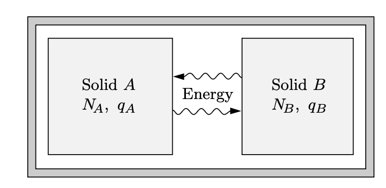
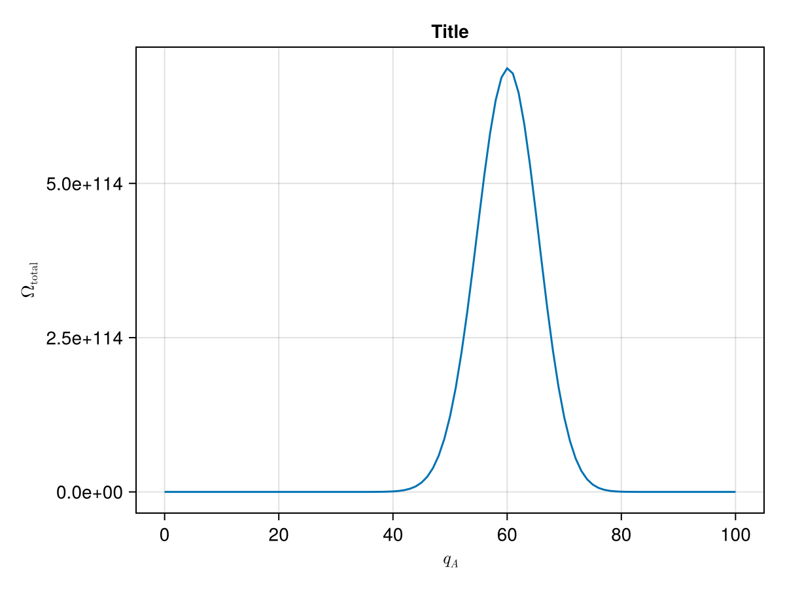



## 아인슈타인 고체 모델 {#sec-TD_einstein_solid_model}

### 작은 아인슈타인 고체 시스템 {#sec-TD_small_einstein_solid_model}

특성진동수가 $\omega$ 인 1차원 양자 진동자의 경우 $n$ 번째 준위 에서의 에너지 $E_n$ 은

$$
E_n = \hbar \omega \left(n + \dfrac{1}{2}\right),\qquad n=0,\,1,\,2,\ldots
$$

임을 안다. 아인슈타인은 고체를 양자 진동자로 모델링 했으며 앞으로 이를 **아인슈타인 고체 (Einstein solid)** 라고 하자.

$N$ 개의 1차원 진동자로 이루어진 시스템을 생각하자. $i$ 번째 진동자의 준위를 $n_i$ 라고 하자. $n=n_1+\cdots + n_N$ 이라고 하면 가능한 경우의 수 $\Omega(N,\,n)$ 은

$$
\Omega (N,\,n) = \begin{pmatrix} n+N-1 \\ n \end{pmatrix} = \dfrac{(n+N-1)!}{n! (N-1)!}.
$$ {#eq-TD_schroeder_2_9}

이 때 $n$ 을 $n$ 개의 에너지 단위로 간주 할 수 있다.

다음과 같이 두 아인슈타인 고체가 에너지를 주고 받을 수 있다고 하자. 각각을 $A,\,B$ 라고 부르자(@fig-TD_schroeder_2_3). 우선 $A$ 와 $B$ 사이의 에너지 교환이 $A,\,B$ 내부에서의 에너지 교환보다 매우 느리다고 가정하며 이를 **약한 결합(weakly coupled) 조건** 이라고 한다. 그렇다만 $A$ 와 $B$ 의 에너지 $U_A,\,U_B$ 는 매우 느리게 변하며 충분히 작은 시간 스케일에서 $U_A,\,U_B$ 는 고정되어 있다고 볼 수 있다. 그리고 (일시적으로 고정된) $U_A$ 와 $U_B$ 에 의해 정해지는 이 두 고체의 결합된 상태를 **거시상태 (macrostate)** 라고 부르기로 하자. 그러나 충분히 큰 시간 스케일에서는 $U_A,\,U_B$ 는 변하며 $U_A,\,U_B$ 각각에 허용된 값에 대한 모든 가능한 거시항태를 따져야 한다. 물론  $U_\text{total} = U_A+U_B$ 는 고정되어 있다.

{#fig-TD_schroeder_2_3 width=400}

$A$ 와 $B$ 가 각각 $N_A,\,N_B$ 개의, 특성 진동수 $\omega$ 인 진동자로 이루어진 아인슈타인 고체라고 하자. $A$ 의 에너지 단위를 $q_A$, $B$ 의 에너지 단위를 $q_B$ 라고 하자. 그렇다면 $A$ 와 $B$ 각각에 가능한 경우의 수 $\Omega_A,\,\Omega_B$ 를 @eq-TD_schroeder_2_9 를 이용하여 계산 할 수 있다. $U_A,\,U_B$ 는 $q_A,\,q_B$ 로 정해지며 두 아인슈타인 고체로 이루어진 전체 시스템의 거시상태의 개수 $\Omega_\text{total} = \Omega_A \Omega_B$ 이다. 예를 들어 $N_A=N_B=3$, $q_A+q_B=6$ 이라면 $\Omega_\text{total} = 462$ 이다. 

| $q_A$ | $\Omega_A$ | $q_B$ | $\Omega_B$ | $\Omega_\text{total} = \Omega_A \Omega_B$ |
|:---:|:---:|:---:|:---:|:----------:|
| 0 | 1 | 6 | 28 | 28 |
| 1 | 3 | 5 | 21 | 63 |
| 2 | 6 | 4 | 15 | 90 |
| 3 | 10 | 3 | 10 | 100 |
| 4 | 15 | 2 | 5 | 90 |
| 5 | 21 | 1 | 3 | 63 |
| 6 | 28 | 0 | 1 | 28 |
: 에너지 단위에 대한 상태의 개수 {#tbl-TD_number_of_states_for_2_solids_of_3_quanta .striped .sm}

그리고 여기서 우리는 중대한 가정 혹은 공리를 도입해야 한다.

::: {.callout-important icon="false"}

#### **통계역학의 기본원리**

열평형 상태의 고립게에서, 모든 가능한 미시 상태(microstate) 각각에 대해 그 상태일 확률은 동일하다.

:::

통계역학의 기본원리에 따르면 앞에서 다룬 아인슈타인 고체의 가능한 462 개의 미시 상태 각각은 동일한 확률을 가진다. 하지만 거시상태에 각각에 대한 확률은 다른데 이는 @tbl-TD_number_of_states_for_2_solids_of_3_quanta 에서 확인 할 수 있다.

$N_A, N_B, q_A+q_B$ 값이 클 경우 컴퓨터를 이용하여 계산 할 수 있다. 예를 들어

$$
N_A=300,\quad N_B=200,\quad q_A+q_B=100
$$

인 경우 $q_A=0,\,q_B=100$ 일 때 최소값 $\Omega_\text{total}=2.8\times 10^{81}$ 을 가지며 $q_A=60,\,q_B=40$ 일 때 $\Omega_\text{total}=6.9\times 10^{114}$ 인 최대값을 가진다. 최소값과 최대값으 비율은 $10^{33}$ 정도로 매우 크다. $q_A$ 에 대한 $\Omega_\text{total}$ 을 그리면 아래와 같다. 정규분포곡선과 유사하며 $q_A$ 가 56 에서 64 까지의 합이 전체의 60 % 정도를 차지한다. 통계역학의 기본원리에 의하면 이 시스템은 전체 시간의 60 % 정도를 $56 \le q_A \le 64$ 인 미시상태에 존재한다.

{#fig-TD_schroeder_2_5 width=450}

이제 이 시스템이 초기에 $q_A \ll 60$ 인 상태에서 시작했다고 하자. 충분한 시간이 흐른다면 어느 정도의 에너지가 $B$ 에서 $A$ 로 이동하는 것을 발견 할 수 있을 것이다. 그리고 대부분의 시간을 $q_A$ 가 60 근처인 미시상태에 머무르게 된다. 이것은 비가역적인 변화이다. 우리는 여기서 열에 대한 어떤 설명을 얻을 수 있다. **이것은 확률적인 현상이다. 절대적이지는 않지만 대단히 그러한 경향이 있다.** 에너지의 자발적 흐름은 시스템이 가장 확률이 높은 상태에 있을 때 멈추게 된다. 이것은 열역학 제 2 법칙의 한가지 버젼이다.

거시적인 계는 대략 $10^{23}$ 개 혹은 그 이상의 입자를 다룬다. 컴퓨터로도 다루기 힘들지만 우리에게는 잠시 후 다룰 유용한 수학적인 도구가 있다. 

### 거대 시스템 {#sec-TD_large_system}

[스털링 근사](0A_mathematics.qmd#sec-TD_Appendix_stiring_approximation) 는 큰 $N$ 에 대해 다음이 성립한다는 것을 알려준다.

$$
N! \approx N^N e^{-N}\sqrt{2\pi N},\qquad \text{where }N \gg 1
$$ {#eq-TD_stirling_approximation}

통계역학에서는 $\ln (N!)$ 을 많이 사용하며

$$
\ln N! \approx N\ln N - N + \dfrac{1}{2}\ln (2\pi N)
$$ {#eq-TD_stirling_approximation_0}

인데 여기서 세번째 $\ln (2\pi N)$ 은 나머지 두 항에 비해 매우 작기때문에 실제 많이 사용되는 근사는 

$$
\ln N! \approx N \ln N - N
$${#eq-TD_stirling_approximation_in_log}

이다. 

이제 스털링 근사를 사용하여 많은 진동자와 에너지 단위를 가진 아인슈타인 고체 모델을 알아보자. 즉 $N\gg 1,\,q \gg 1$. 우선 $q\gg N$ 인 경우, 즉 에너지 단위가 진동자의 수보다 매우 큰 경우를 알아보자. 이것은 온도가 매우 높은 경우에 타당하다. 그렇다면 

$$
\Omega (N,\,q) = \dfrac{(q+N-1)!}{q! (N-1)!} \approx \dfrac{(q+N)!}{q!N!}
$$ {#eq-TD_schroeder_2_17}

이며, 스털링 근사를 이용하면

$$
\ln \Omega \approx (q+N)\ln (q+N) - q \ln q -N \ln N 
$$ {#eq-TD_schroeder_2_18}

이며, 여기서 $0<\delta \ll 1$ 에 대해 $\ln(1+\delta) \approx \delta$ 임을 이용하면

$$
\ln (q+N) = \ln q(1+N/q) = \ln q + \ln (1+N/q) = \ln q + \dfrac{N}{q} 
$$

이다. 이로부터

$$
\ln \Omega \approx N \ln \dfrac{q}{N} + N + \dfrac{N^2}{q}
$$ {#eq-TD_schroeder_2_20}

이다. $q\gg N$ 근사에서 $N^2/q \ll 1$ 이므로 마지막 항을 무시 할 수 있다. 이로부터

$$
\Omega(N,\,q) \approx e^{N \ln (q/N) + N} = \left(\dfrac{eq}{N}\right)^N.
$$ {#eq-TD_schroeder_2_21}

이것은 매우 큰 수이다.

### 분포의 뾰족함

이제 두 거대한 아인슈타인 고체가 열적으로 접촉하고 있는 경우에 대해 알아보자. 문제를 간단하게 하기 위해 두 아인슈타인 고체가 각각 $N$ 개의 진동자로 이루어졌다고 하고 두 고체의 에너지 단위를 $q_A,\, q_B$, 전체 에너지 단위를 $q=q_A+q_B$ 라고 하자. 앞서와 같이 $q\gg N$ 이라고 가정한다. 그렇다면 @eq-TD_schroeder_2_21 로 부터 전체 미시상태의 개수

$$
\Omega = \left(\dfrac{eq_A}{N}\right)^N\left(\dfrac{eq_B}{N}\right)^N = \left(\dfrac{e}{2N}\right)^N(q_A q_B)^{N}
$$ {#eq-TD_schroeder_2_22}

이다. $\Omega$ 의 최대값은 $q_A=q_B$, 즉 $q=q_A/2=q_B/2$ 일 때 이며 이 경우

$$
\Omega_\text{max} = \left(\dfrac{e}{N}\right)^{2N} \left(\dfrac{q}{2} \right)^{2N}
$$ {#eq-TD_schroeder_2_23}

이다. 우리는 주로 이 값 근처에서 관심이 있으므로 $q_A=q/2+x,\, q_B=q/2-x$ 로 놓을 수 있다. 그렇다면 @eq-TD_schroeder_2_22 는
$$
\Omega =  \left(\dfrac{e}{2N}\right)^N \left[\left(\dfrac{q}{2}\right)^2-x\right]^N
$$ {#eq-TD_schroeder_2_34}

이다. 이 때 $q\gg 2|x|$ 조건에서, 그리고 $|\delta| \ll 1$ 조건에서 $\ln (1-\delta) \approx -\delta$ 근사를 사용하면 

$$
\begin{aligned}
\ln\left[\left(\dfrac{q}{2}\right)^2-x\right]^N &= N \ln \left[\left(\dfrac{q}{2}\right)^2-x\right] = N \ln \left[\left(\dfrac{q}{2}\right)^2\left(1-\left(\dfrac{2x}{q}\right)^2 \right)\right] \\[0.3em]
&= N \ln \left(\dfrac{q}{2}\right)^2 + N \ln \left(1-\left(\dfrac{2x}{q}\right)^2 \right) \\[0.3em]
&\approx N \left[\ln \left(\dfrac{q}{2}\right)^2 -  \left(\dfrac{2x}{q}\right)^2\right]
\end{aligned}
$$

이다. 이를 @eq-TD_schroeder_2_34 에 대입하면

$$
\Omega \approx  \left(\dfrac{e}{2N}\right)^N e^{N \ln (q/2)^2} e^{-N (2x/q)^2} =\Omega_\text{max} e^{-(2x/q)^2}
$$ {#eq-TD_schroeder_2_27}

으로 우리는 $x=0$ 을 중심으로 하는 가우시안 함수를 얻는다. 이 때 $\Omega = \Omega_\text{max}/e$ 가 되는 $x$ 값은

$$
x=\pm \dfrac{q}{2\sqrt{N}}
$$

이다. 우리는 이 분포의 폭 $\Delta$ 를 위 $x$ 값의 두배 

$$
\Delta = \dfrac{q}{\sqrt{N}}
$$

으로 정할 수 있다. 우리의 가정에서 $q\gg N \gg 1$ 이며 이는 정해진 $q$ 값에 대해 $\Delta \ll q$ 임을 말한다. 일반적으로 다루는 열역학 시스템에서 $N\approx 10^{23}$ 이며 이는 미시상태의 분포가 최대값 근처의 좁은 영역에 몰려 있으며 가장 확률이 높은 거시상태로부터 멀리 떨어진 상태에 있을 확률이 지극기 작다는 것을 의미한다. 즉 모든 미시상태에 대한 확률이 동일한 열평형 상태에서 시스템은 가장 확률이 높은 거시상태에 존재한다. 시스템이 매우 크다면 가장 확률이 높은 거시상태로부터의 측정 가능한 fluctuation 은 거의 존재할 수 없다. 이것을 **열역학적 극한** 이라고 한다. 

### 연습문제 {.unnumbered}

::: {#exr-TD_schroeder_2_17}

#### Schroeder 2.17

$q \ll N$ 인 근사를 사용하여 @eq-TD_schroeder_2_21 과 유사한 식을 구하라. 이것은 온도가 매우 낮은 경우에 타당하다.

:::

::: {.solution}

@eq-TD_schroeder_2_18 까지는 $q \ll N$ 이어도 성립한다. 여기서

$$
\ln (q+N) = \ln N + \ln (1+q/N) \approx \ln N + q/N
$$

이며 이로부터

$$
\ln \Omega \approx q \ln \left(\dfrac{N}{q}\right) +q 
$$

이며, 따라서

$$
\Omega (N,\,q) \approx \left(\dfrac{eN}{q}\right)^q
$$

:::

 

::: {#exr-TD_schroeder_2_18}

#### Schroeder 2.18

스털링 근사를 사용하여 큰 $N$ 과 $q$ 에 대해 다음이 성립함을 보여라.

$$
\Omega (N,\,q) \approx \dfrac{\left(\dfrac{q+N}{q}\right)^q\left(\dfrac{q+N}{N}\right)^N}{\sqrt{2\pi q (q+N)/N}}
$$ {#eq-TD_exr_schroeder_2_18}

일반적으로 분모는 무시되지만 그렇지 않을 때도 있다.

:::

::: {.solution}

@eq-TD_schroeder_2_17 에서 

$$
\begin{aligned}
\Omega (N,\,q) &= \dfrac{(q+N-1)!}{q! (N-1)!} = \dfrac{N}{q+N}\dfrac{(q+N)!}{q! N!} \\[0.3em]
\end{aligned}
$$

이므로 @eq-TD_stirling_approximation_0 을 이용하면

$$
\begin{aligned}
\ln \Omega (N,\,q) &= \ln \left(\dfrac{N}{q+N}\right) + \ln (q+N)! - \ln q! - \ln n! \\[0.3em]
&\approx \ln \left(\dfrac{N}{q+N}\right) + q\ln \left(\dfrac{q+N}{q}\right) + N \ln \left(\dfrac{q+N}{N}\right) + \dfrac{1}{2}\ln \left(\dfrac{q+N}{2\pi qN}\right) \\[0.3em]
&= q\ln \left(\dfrac{q+N}{q}\right) + N \ln \left(\dfrac{q+N}{N}\right) + \dfrac{1}{2}\ln \left(\dfrac{N}{2\pi q (q+N)}\right)
\end{aligned}
$$

이며 이것을 정리하면 @eq-TD_exr_schroeder_2_18 을 얻는다.

:::

::: {#exr-TD_schroeder_2_22}

#### Schroeder 2.22

아인슈타인 고체 모델에서 $q\gg N$ 근사를 사용하지 않는다.

($a$) $N$ 개의 진동자를 가진 두 아인슈타인 고체가 열적으로 접촉하고 있다. 에너지 단위의 합이 $2N$ 일 때 얼마나 많은 거시상태가 가능한가?

($b$) @exr-TD_schroeder_2_18 의 결과를 이용하여 이 시스템의 미시시상태의 개수를 구하라. 전체를 $2N$ 개의 진동잘르 가진 하나의 시스템으로 간주하라.

($c$) 가장 확률이 높은 거시상태는 두 고체의 에너지가 같을 때이다. @exr-TD_schroeder_2_18 의 결과를 이용하여 이 거시상태에 해당하는 미시상태의 수를 구하라.

($d$) ($b$) 와 ($c$) 의 결과를 비교하여 $\Omega (N,\,q)$ 의 뾰족함에 대한 대략적인 아이디어를 얻을 수 있다. ($c$) 는 분포의 최대값을, ($b$) 는 총 넓이를 준다. 매우 엉성한 근사로서 분포가 직사각형이라고 하면 그 폭은 얼마나 되는가? 모든 거시상태에서 얼마나 많은 비율이 높은 확률을 가지는가? 이 비율을 $N=10^{23}$ 의 경우에서 평가하라. 

:::

::: {.solution}

($a$) $q_A$ 는 $0$ 부터 $2N$ 까지의 값을 가질 수 있으므로 $2N+1$ 개의 거시상태가 가능하다.

($b$) @eq-TD_schroeder_2_17 로부터, 그리고 스털링 근사 @eq-TD_stirling_approximation 를 이용하면

$$
\begin{aligned}
\Omega_\text{total} &= \dfrac{(4N-1)!}{(2N)!(2N-1)!} = \dfrac{1}{2} \dfrac{(4N)!}{(2N)!(2N)!} \\[0.3em]
&\approx \dfrac{1}{2}\dfrac{(4N)^{4N}e^{-4N}\sqrt{2\pi (4N)}}{(2N)^{4N} e^{-4N}(2\pi 2N)} \\[0.3em]
&= \dfrac{2^{4N}}{\sqrt{8\pi N}}
\end{aligned}
$$

($c$) $q_A=q_B=N$, 

$$
\Omega_\text{max} = \Omega_{A,\text{max}}\Omega_{B,\text{max}}= \left(\dfrac{2^N 2^N}{\sqrt{2\pi (2N)}}\right)^2 = \dfrac{2^{4N}}{4\pi N}
$$

($d$) 폭을 $\Delta$ 라고 하면 $\Delta = \Omega_\text{total}/\Omega_\text{max} = \sqrt{\pi N/2}$ 이다. 전체 상태 수는 $2N+1$ 이므로 전채 상태 수에서 높은 확률을 가지는 비율은 $\dfrac{\sqrt{\pi N/2}}{2N+1}$ 이며 $N=10^{23}$ 일 경우 $2.0 \times 10^{-12}$ 정도이다.

:::

 

## 이상기체 {#sec-TD_ideal_gas_in_statistical_mechanics}

우리는 앞서 큰 수의 진동자를 가진, 열적으로 연결된 두 아인슈타인 고체의 경우 가능한 전체 거시상태의 개수 가운데 매우 작은 비율만 어느정도로 나타날 수 있는 확률을 가진다는 것을 확인했다. 이것은 비단 아인슈타인 고체 뿐만 아니라 거의 모든 상호작용하는 다수의 입자로 이루어진 시스템에도 성립한다. 여기서는 이상기체에 적용하여 다루어 보도록 한다. 

부피 $V$ 안의 $N$ 개의 입자가 가질 수 있는 미시상태의 개수는 주어진 조건(예를 들면 총 에너지의 합) 에서 이 계가 접근 가능한 위상공간(phase space)의 부피를 플랑크 상수 $h^{3N}$ 로 나눈 값에, 구분불가능 할 경우 양자역학에서와 같이 $1/N!$ 을 곱해줘야 한다. 예를 들어 입자의 총 에너지가 $(E,\,E + \Delta E)$ 범위라면

$$
\Omega(N,\,E) = \dfrac{1}{N!}\dfrac{1}{h^{3N}}\int_{E<U<E+\Delta E} d^3r\,d^3p ,\qquad \text{(동일한 입자의 경우)}
$$

이다. 단원자 분자 이상기체의 경우 에너지는 위치에 무관하므로 $\int d^3r=V^N$ 이며, $\Delta E$ 가 작을 경우

$$
\int_{E<U<E+\Delta E}\,d^3p = \text{[Area of momentum space]} \times \Delta E
$$

이다. 우리는 $3N$ 차원 공간에서의 구의 표면적이

$$
\text{반지름이 }r\text{ 인 }d\text{ 차원 공간의 구의 표면적} = \dfrac{2\pi^{d/2}}{\left(\dfrac{d}{2}-1\right)!} r^{d-1}
$$ {#eq-TD_schroeder_2_39}

임을 이용한다. 그렇다면 부피 $V$ 안의 $N$ 개의 단원자 이상기체의 총 에너지가 $U$ 일 때 가질 수 있는 미시상태의 수

$$
\Omega (N, V, U) = \dfrac{1}{N!} \dfrac{V^{N}}{h^{3N}} \dfrac{2\pi^{3N/2}}{(3N/2-1)!} \left(\sqrt{2mU}\right)^{3N-1}
$$

이다. 운동량 공간에서의 반지름은 총 에너지 $\sum_{i=1}^N \|\bf{p}_i\|^2 = 2mU$ 로부터 구한다. 