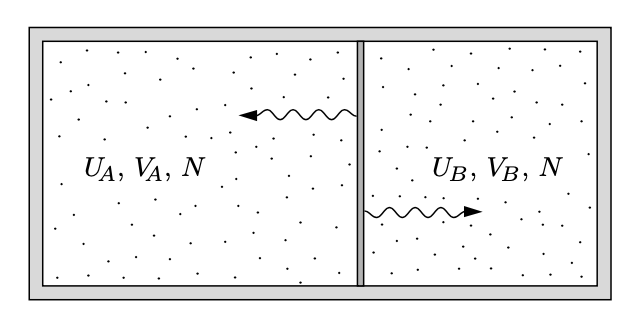



## 아인슈타인 고체 모델 {#sec-TD_einstein_solid_model}

### 작은 아인슈타인 고체 시스템 {#sec-TD_small_einstein_solid_model}

특성진동수가 $\omega$ 인 1차원 양자 진동자의 경우 $n$ 번째 준위 에서의 에너지 $E_n$ 은

$$
E_n = \hbar \omega \left(n + \dfrac{1}{2}\right),\qquad n=0,\,1,\,2,\ldots
$$

임을 안다. 아인슈타인은 고체를 양자 진동자로 모델링 했으며 앞으로 이를 **아인슈타인 고체 (Einstein solid)** 라고 하자.

$N$ 개의 1차원 진동자로 이루어진 시스템을 생각하자. $i$ 번째 진동자의 준위를 $n_i$ 라고 하자. $n=n_1+\cdots + n_N$ 이라고 하면 가능한 경우의 수 $\Omega(N,\,n)$ 은

$$
\Omega (N,\,n) = \begin{pmatrix} n+N-1 \\ n \end{pmatrix} = \dfrac{(n+N-1)!}{n! (N-1)!}.
$$ {#eq-TD_schroeder_2_9}

이 때 $n$ 을 $n$ 개의 에너지 단위로 간주 할 수 있다.

다음과 같이 두 아인슈타인 고체가 에너지를 주고 받을 수 있다고 하자. 각각을 $A,\,B$ 라고 부르자(@fig-TD_schroeder_2_3). 우선 $A$ 와 $B$ 사이의 에너지 교환이 $A,\,B$ 내부에서의 에너지 교환보다 매우 느리다고 가정하며 이를 **약한 결합(weakly coupled) 조건** 이라고 한다. 그렇다만 $A$ 와 $B$ 의 에너지 $U_A,\,U_B$ 는 매우 느리게 변하며 충분히 작은 시간 스케일에서 $U_A,\,U_B$ 는 고정되어 있다고 볼 수 있다. 그리고 (일시적으로 고정된) $U_A$ 와 $U_B$ 에 의해 정해지는 이 두 고체의 결합된 상태를 **거시상태 (macrostate)** 라고 부르기로 하자. 그러나 충분히 큰 시간 스케일에서는 $U_A,\,U_B$ 는 변하며 $U_A,\,U_B$ 각각에 허용된 값에 대한 모든 가능한 거시항태를 따져야 한다. 물론  $U_\text{total} = U_A+U_B$ 는 고정되어 있다.

{#fig-TD_schroeder_2_3 width=400}

$A$ 와 $B$ 가 각각 $N_A,\,N_B$ 개의, 특성 진동수 $\omega$ 인 진동자로 이루어진 아인슈타인 고체라고 하자. $A$ 의 에너지 단위를 $q_A$, $B$ 의 에너지 단위를 $q_B$ 라고 하자. 그렇다면 $A$ 와 $B$ 각각에 가능한 경우의 수 $\Omega_A,\,\Omega_B$ 를 @eq-TD_schroeder_2_9 를 이용하여 계산 할 수 있다. $U_A,\,U_B$ 는 $q_A,\,q_B$ 로 정해지며 두 아인슈타인 고체로 이루어진 전체 시스템의 거시상태의 개수 $\Omega_\text{total} = \Omega_A \Omega_B$ 이다. 예를 들어 $N_A=N_B=3$, $q_A+q_B=6$ 이라면 $\Omega_\text{total} = 462$ 이다. 

| $q_A$ | $\Omega_A$ | $q_B$ | $\Omega_B$ | $\Omega_\text{total} = \Omega_A \Omega_B$ |
|:---:|:---:|:---:|:---:|:----------:|
| 0 | 1 | 6 | 28 | 28 |
| 1 | 3 | 5 | 21 | 63 |
| 2 | 6 | 4 | 15 | 90 |
| 3 | 10 | 3 | 10 | 100 |
| 4 | 15 | 2 | 5 | 90 |
| 5 | 21 | 1 | 3 | 63 |
| 6 | 28 | 0 | 1 | 28 |
: 에너지 단위에 대한 상태의 개수 {#tbl-TD_number_of_states_for_2_solids_of_3_quanta .striped .sm}

그리고 여기서 우리는 중대한 가정 혹은 공리를 도입해야 한다.

::: {.callout-important icon="false"}

#### **통계역학의 기본원리**

열평형 상태의 고립게에서, 모든 가능한 미시 상태(microstate) 각각에 대해 그 상태일 확률은 동일하다.

:::

통계역학의 기본원리에 따르면 앞에서 다룬 아인슈타인 고체의 가능한 462 개의 미시 상태 각각은 동일한 확률을 가진다. 하지만 거시상태에 각각에 대한 확률은 다른데 이는 @tbl-TD_number_of_states_for_2_solids_of_3_quanta 에서 확인 할 수 있다.

$N_A, N_B, q_A+q_B$ 값이 클 경우 컴퓨터를 이용하여 계산 할 수 있다. 예를 들어

$$
N_A=300,\quad N_B=200,\quad q_A+q_B=100
$$

인 경우 $q_A=0,\,q_B=100$ 일 때 최소값 $\Omega_\text{total}=2.8\times 10^{81}$ 을 가지며 $q_A=60,\,q_B=40$ 일 때 $\Omega_\text{total}=6.9\times 10^{114}$ 인 최대값을 가진다. 최소값과 최대값으 비율은 $10^{33}$ 정도로 매우 크다. $q_A$ 에 대한 $\Omega_\text{total}$ 을 그리면 아래와 같다. 정규분포곡선과 유사하며 $q_A$ 가 56 에서 64 까지의 합이 전체의 60 % 정도를 차지한다. 통계역학의 기본원리에 의하면 이 시스템은 전체 시간의 60 % 정도를 $56 \le q_A \le 64$ 인 미시상태에 존재한다.

{#fig-TD_schroeder_2_5 width=450}

이제 이 시스템이 초기에 $q_A \ll 60$ 인 상태에서 시작했다고 하자. 충분한 시간이 흐른다면 어느 정도의 에너지가 $B$ 에서 $A$ 로 이동하는 것을 발견 할 수 있을 것이다. 그리고 대부분의 시간을 $q_A$ 가 60 근처인 미시상태에 머무르게 된다. 이것은 비가역적인 변화이다. 우리는 여기서 열에 대한 어떤 설명을 얻을 수 있다. **이것은 확률적인 현상이다. 절대적이지는 않지만 대단히 그러한 경향이 있다.** 에너지의 자발적 흐름은 시스템이 가장 확률이 높은 상태에 있을 때 멈추게 된다. 이것은 열역학 제 2 법칙의 한가지 버젼이다.

거시적인 계는 대략 $10^{23}$ 개 혹은 그 이상의 입자를 다룬다. 컴퓨터로도 다루기 힘들지만 우리에게는 잠시 후 다룰 유용한 수학적인 도구가 있다. 

### 거대 시스템 {#sec-TD_large_system}

[스털링 근사](0A_mathematics.qmd#sec-TD_Appendix_stiring_approximation) 는 큰 $N$ 에 대해 다음이 성립한다는 것을 알려준다.

$$
N! \approx N^N e^{-N}\sqrt{2\pi N},\qquad \text{where }N \gg 1
$$ {#eq-TD_stirling_approximation}

통계역학에서는 $\ln (N!)$ 을 많이 사용하며

$$
\ln N! \approx N\ln N - N + \dfrac{1}{2}\ln (2\pi N)
$$ {#eq-TD_stirling_approximation_0}

인데 여기서 세번째 $\ln (2\pi N)$ 은 나머지 두 항에 비해 매우 작기때문에 실제 많이 사용되는 근사는 

$$
\ln N! \approx N \ln N - N
$${#eq-TD_stirling_approximation_in_log}

이다. 

이제 스털링 근사를 사용하여 많은 진동자와 에너지 단위를 가진 아인슈타인 고체 모델을 알아보자. 즉 $N\gg 1,\,q \gg 1$. 우선 $q\gg N$ 인 경우, 즉 에너지 단위가 진동자의 수보다 매우 큰 경우를 알아보자. 이것은 온도가 매우 높은 경우에 타당하다. 그렇다면 

$$
\Omega (N,\,q) = \dfrac{(q+N-1)!}{q! (N-1)!} \approx \dfrac{(q+N)!}{q!N!}
$$ {#eq-TD_schroeder_2_17}

이며, 스털링 근사를 이용하면

$$
\ln \Omega \approx (q+N)\ln (q+N) - q \ln q -N \ln N 
$$ {#eq-TD_schroeder_2_18}

이며, 여기서 $0<\delta \ll 1$ 에 대해 $\ln(1+\delta) \approx \delta$ 임을 이용하면

$$
\ln (q+N) = \ln q(1+N/q) = \ln q + \ln (1+N/q) = \ln q + \dfrac{N}{q} 
$$

이다. 이로부터

$$
\ln \Omega \approx N \ln \dfrac{q}{N} + N + \dfrac{N^2}{q}
$$ {#eq-TD_schroeder_2_20}

이다. $q\gg N$ 근사에서 $N^2/q \ll 1$ 이므로 마지막 항을 무시 할 수 있다. 이로부터

$$
\Omega(N,\,q) \approx e^{N \ln (q/N) + N} = \left(\dfrac{eq}{N}\right)^N.
$$ {#eq-TD_schroeder_2_21}

이것은 매우 큰 수이다.

### 분포의 뾰족함

이제 두 거대한 아인슈타인 고체가 열적으로 접촉하고 있는 경우에 대해 알아보자. 문제를 간단하게 하기 위해 두 아인슈타인 고체가 각각 $N$ 개의 진동자로 이루어졌다고 하고 두 고체의 에너지 단위를 $q_A,\, q_B$, 전체 에너지 단위를 $q=q_A+q_B$ 라고 하자. 앞서와 같이 $q\gg N$ 이라고 가정한다. 그렇다면 @eq-TD_schroeder_2_21 로 부터 전체 미시상태의 개수

$$
\Omega = \left(\dfrac{eq_A}{N}\right)^N\left(\dfrac{eq_B}{N}\right)^N = \left(\dfrac{e}{2N}\right)^N(q_A q_B)^{N}
$$ {#eq-TD_schroeder_2_22}

이다. $\Omega$ 의 최대값은 $q_A=q_B$, 즉 $q=q_A/2=q_B/2$ 일 때 이며 이 경우

$$
\Omega_\text{max} = \left(\dfrac{e}{N}\right)^{2N} \left(\dfrac{q}{2} \right)^{2N}
$$ {#eq-TD_schroeder_2_23}

이다. 우리는 주로 이 값 근처에서 관심이 있으므로 $q_A=q/2+x,\, q_B=q/2-x$ 로 놓을 수 있다. 그렇다면 @eq-TD_schroeder_2_22 는
$$
\Omega =  \left(\dfrac{e}{2N}\right)^N \left[\left(\dfrac{q}{2}\right)^2-x\right]^N
$$ {#eq-TD_schroeder_2_34}

이다. 이 때 $q\gg 2|x|$ 조건에서, 그리고 $|\delta| \ll 1$ 조건에서 $\ln (1-\delta) \approx -\delta$ 근사를 사용하면 

$$
\begin{aligned}
\ln\left[\left(\dfrac{q}{2}\right)^2-x\right]^N &= N \ln \left[\left(\dfrac{q}{2}\right)^2-x\right] = N \ln \left[\left(\dfrac{q}{2}\right)^2\left(1-\left(\dfrac{2x}{q}\right)^2 \right)\right] \\[0.3em]
&= N \ln \left(\dfrac{q}{2}\right)^2 + N \ln \left(1-\left(\dfrac{2x}{q}\right)^2 \right) \\[0.3em]
&\approx N \left[\ln \left(\dfrac{q}{2}\right)^2 -  \left(\dfrac{2x}{q}\right)^2\right]
\end{aligned}
$$

이다. 이를 @eq-TD_schroeder_2_34 에 대입하면

$$
\Omega \approx  \left(\dfrac{e}{2N}\right)^N e^{N \ln (q/2)^2} e^{-N (2x/q)^2} =\Omega_\text{max} e^{-(2x/q)^2}
$$ {#eq-TD_schroeder_2_27}

으로 우리는 $x=0$ 을 중심으로 하는 가우시안 함수를 얻는다. 이 때 $\Omega = \Omega_\text{max}/e$ 가 되는 $x$ 값은

$$
x=\pm \dfrac{q}{2\sqrt{N}}
$$

이다. 우리는 이 분포의 폭 $\Delta$ 를 위 $x$ 값의 두배 

$$
\Delta = \dfrac{q}{\sqrt{N}}
$$

으로 정할 수 있다. 우리의 가정에서 $q\gg N \gg 1$ 이며 이는 정해진 $q$ 값에 대해 $\Delta \ll q$ 임을 말한다. 일반적으로 다루는 열역학 시스템에서 $N\approx 10^{23}$ 이며 이는 미시상태의 분포가 최대값 근처의 좁은 영역에 몰려 있으며 가장 확률이 높은 거시상태로부터 멀리 떨어진 상태에 있을 확률이 지극기 작다는 것을 의미한다. 즉 모든 미시상태에 대한 확률이 동일한 열평형 상태에서 시스템은 가장 확률이 높은 거시상태에 존재한다. 시스템이 매우 크다면 가장 확률이 높은 거시상태로부터의 측정 가능한 fluctuation 은 거의 존재할 수 없다. 이것을 **열역학적 극한** 이라고 한다. 

### 연습문제 {.unnumbered}

::: {#exr-TD_schroeder_2_17}

#### Schroeder 2.17

$q \ll N$ 인 근사를 사용하여 @eq-TD_schroeder_2_21 과 유사한 식을 구하라. 이것은 온도가 매우 낮은 경우에 타당하다.

:::

::: {.solution}

@eq-TD_schroeder_2_18 까지는 $q \ll N$ 이어도 성립한다. 여기서

$$
\ln (q+N) = \ln N + \ln (1+q/N) \approx \ln N + q/N
$$

이며 이로부터

$$
\ln \Omega \approx q \ln \left(\dfrac{N}{q}\right) +q 
$$

이며, 따라서

$$
\Omega (N,\,q) \approx \left(\dfrac{eN}{q}\right)^q
$$

:::

 

::: {#exr-TD_schroeder_2_18}

#### Schroeder 2.18

스털링 근사를 사용하여 큰 $N$ 과 $q$ 에 대해 다음이 성립함을 보여라.

$$
\Omega (N,\,q) \approx \dfrac{\left(\dfrac{q+N}{q}\right)^q\left(\dfrac{q+N}{N}\right)^N}{\sqrt{2\pi q (q+N)/N}}
$$ {#eq-TD_exr_schroeder_2_18}

일반적으로 분모는 무시되지만 그렇지 않을 때도 있다.

:::

::: {.solution}

@eq-TD_schroeder_2_17 에서 

$$
\begin{aligned}
\Omega (N,\,q) &= \dfrac{(q+N-1)!}{q! (N-1)!} = \dfrac{N}{q+N}\dfrac{(q+N)!}{q! N!} \\[0.3em]
\end{aligned}
$$

이므로 @eq-TD_stirling_approximation_0 을 이용하면

$$
\begin{aligned}
\ln \Omega (N,\,q) &= \ln \left(\dfrac{N}{q+N}\right) + \ln (q+N)! - \ln q! - \ln n! \\[0.3em]
&\approx \ln \left(\dfrac{N}{q+N}\right) + q\ln \left(\dfrac{q+N}{q}\right) + N \ln \left(\dfrac{q+N}{N}\right) + \dfrac{1}{2}\ln \left(\dfrac{q+N}{2\pi qN}\right) \\[0.3em]
&= q\ln \left(\dfrac{q+N}{q}\right) + N \ln \left(\dfrac{q+N}{N}\right) + \dfrac{1}{2}\ln \left(\dfrac{N}{2\pi q (q+N)}\right)
\end{aligned}
$$

이며 이것을 정리하면 @eq-TD_exr_schroeder_2_18 을 얻는다.

:::

::: {#exr-TD_schroeder_2_22}

#### Schroeder 2.22

아인슈타인 고체 모델에서 $q\gg N$ 근사를 사용하지 않는다.

($a$) $N$ 개의 진동자를 가진 두 아인슈타인 고체가 열적으로 접촉하고 있다. 에너지 단위의 합이 $2N$ 일 때 얼마나 많은 거시상태가 가능한가?

($b$) @exr-TD_schroeder_2_18 의 결과를 이용하여 이 시스템의 미시시상태의 개수를 구하라. 전체를 $2N$ 개의 진동잘르 가진 하나의 시스템으로 간주하라.

($c$) 가장 확률이 높은 거시상태는 두 고체의 에너지가 같을 때이다. @exr-TD_schroeder_2_18 의 결과를 이용하여 이 거시상태에 해당하는 미시상태의 수를 구하라.

($d$) ($b$) 와 ($c$) 의 결과를 비교하여 $\Omega (N,\,q)$ 의 뾰족함에 대한 대략적인 아이디어를 얻을 수 있다. ($c$) 는 분포의 최대값을, ($b$) 는 총 넓이를 준다. 매우 엉성한 근사로서 분포가 직사각형이라고 하면 그 폭은 얼마나 되는가? 모든 거시상태에서 얼마나 많은 비율이 높은 확률을 가지는가? 이 비율을 $N=10^{23}$ 의 경우에서 평가하라. 

:::

::: {.solution}

($a$) $q_A$ 는 $0$ 부터 $2N$ 까지의 값을 가질 수 있으므로 $2N+1$ 개의 거시상태가 가능하다.

($b$) @eq-TD_schroeder_2_17 로부터, 그리고 스털링 근사 @eq-TD_stirling_approximation 를 이용하면

$$
\begin{aligned}
\Omega_\text{total} &= \dfrac{(4N-1)!}{(2N)!(2N-1)!} = \dfrac{1}{2} \dfrac{(4N)!}{(2N)!(2N)!} \\[0.3em]
&\approx \dfrac{1}{2}\dfrac{(4N)^{4N}e^{-4N}\sqrt{2\pi (4N)}}{(2N)^{4N} e^{-4N}(2\pi 2N)} \\[0.3em]
&= \dfrac{2^{4N}}{\sqrt{8\pi N}}
\end{aligned}
$$

($c$) $q_A=q_B=N$, 

$$
\Omega_\text{max} = \Omega_{A,\text{max}}\Omega_{B,\text{max}}= \left(\dfrac{2^N 2^N}{\sqrt{2\pi (2N)}}\right)^2 = \dfrac{2^{4N}}{4\pi N}
$$

($d$) 폭을 $\Delta$ 라고 하면 $\Delta = \Omega_\text{total}/\Omega_\text{max} = \sqrt{\pi N/2}$ 이다. 전체 상태 수는 $2N+1$ 이므로 전채 상태 수에서 높은 확률을 가지는 비율은 $\dfrac{\sqrt{\pi N/2}}{2N+1}$ 이며 $N=10^{23}$ 일 경우 $2.0 \times 10^{-12}$ 정도이다.

:::

 

## 이상기체 {#sec-TD_ideal_gas_in_statistical_mechanics}

### 단원자 분자 이상기체의 미시상태 수

우리는 앞서 큰 수의 진동자를 가진, 열적으로 연결된 두 아인슈타인 고체의 경우 가능한 전체 거시상태의 개수 가운데 매우 작은 비율만 어느정도로 나타날 수 있는 확률을 가진다는 것을 확인했다. 이것은 비단 아인슈타인 고체 뿐만 아니라 거의 모든 상호작용하는 다수의 입자로 이루어진 시스템에도 성립한다. 여기서는 이상기체에 적용하여 다루어 보도록 한다. 

부피 $V$ 안의 $N$ 개의 입자가 가질 수 있는 미시상태의 개수는 주어진 조건(예를 들면 총 에너지의 합) 에서 이 계가 접근 가능한 위상공간(phase space)의 부피를 플랑크 상수 $h^{3N}$ 로 나눈 값에, 구분불가능 할 경우 양자역학에서와 같이 $1/N!$ 을 곱해줘야 한다. 예를 들어 입자의 총 에너지가 $E$

$$
\Omega(N,\,E) = \dfrac{1}{N!}\dfrac{1}{h^{3N}}\int_{U=E} d^{3N}r\,d^{3N}p ,\qquad \text{(동일한 입자의 경우)}
$$

이다. 단원자 분자 이상기체의 경우 에너지는 위치에 무관하므로 $\int d^{3N}r=V^N$ 이며, 

$$
\int_{U=E}\,d^{3N}p = \text{[Area of momentum space]} 
$$

이다. 우리는 $d$ 차원 공간에서의 구의 표면적이

$$
\text{반지름이 }r\text{ 인 }d\text{ 차원 공ㅋ간의 구의 표면적} = \dfrac{2\pi^{d/2}}{\left(\dfrac{d}{2}-1\right)!} r^{d-1}
$$ {#eq-TD_schroeder_2_39_0}

임을 이용한다. 그렇다면 부피 $V$ 안의 $N$ 개의 단원자 이상기체의 총 에너지가 $U$ 일 때 가질 수 있는 미시상태의 수

$$
\Omega (U,\,V,\,N) = \dfrac{1}{N!} \dfrac{V^{N}}{h^{3N}} \dfrac{2\pi^{3N/2}}{(3N/2-1)!} \left(\sqrt{2mU}\right)^{3N-1}
$${#eq-TD_schroeder_2_40_1}

이다. 운동량 공간에서의 반지름은 총 에너지 $\sum_{i=1}^N \|\bf{p}_i\|^2 = 2mU$ 로부터 구한다. 위 @eq-TD_schroeder_2_40_1 은 다음과 같이 근사시킬 수 있다$^1$.[$^1$ (본인주) @eq-TD_schroeder_2_39_0 에서 @eq-TD_schroeder_2_40_1 로의 근사는 매우 불편하지만 @eq-TD_schroeder_2_40_1 자체는 이후 정준앙상블을 배우면서 정확히 구할 수 있다.]{.aside} 

$$
\Omega (U,\,V,\,N) \approx \dfrac{1}{N!} \dfrac{V^{N}}{h^{3N}} \dfrac{\pi^{3N/2}}{(3N/2)!} \left(\sqrt{2mU}\right)^{3N}.
$$ {#eq-TD_schroeder_2_40}

위 식에서 $U,\,V,\,N$ 에 대한 의존성을 분리하면 다음과 같이 쓸 수 있다.

$$
\Omega (U,\,V,\,N) = \phi(N) V^N U^{3N/2}.
$$ {#eq-TD_schroeder_2_41}

### 상호작용하는 이상기체

{#fig-TD_schroeder_2_11 width=400}

각각 $N$ 개의 단원자 분지로 $V_A,\, V_B$ 의 부피를 갖는 이상기체가 $U_A,\,U_B$ 의 에너지를 가지고 있다고 하자. 그렇다면 이 시스템의 미시상태의 수는

$$
\Omega_\text{total} = \Omega_A \Omega_B = [\phi(N)]^2 (V_AV_B)^N (U_A U_B)^{3N/2}
$$

이다. 이 식은 아인슈타인 고체의 경우(@eq-TD_schroeder_2_22) 와 본질적으로 같다. $N$ 값이 크기 때문에 각각의 에너지가 증가함에 따라 미시상태의 수는 급격하게 증가하며 반대쪽은 급격하게 감소하므로 $\Omega_\text{total}$ 은 어떤 값을 중심으로 매우 뾰족한 값을 가진다는 것을 예측 할 수 있다. 아인슈타인 고체와 마찬가지로 중심에서의 에너지 분포의 폭 $\Delta_U$ 는 $U_\text{total} = U_A + U_B$ 에 대해 다음과 같을 것이다.

$$
\Delta_U = \dfrac{U_\text{total}}{\sqrt{3N/2}}.
$$ {#eq-TD_schroeder_2_43}

$N$ 값이 클수록 $U_A$ (혹은 $U_B$) 가 가질 수 있는 값중애 메우 일부만 어느 이상의 미시상태 수를 가지며 나머지는 매우 작은 값만 갖게 된다. 

이제 에너지 뿐만 아니라 부피도 변할 수 있다고 하자. 그렇다면 부피 변화의 폭 $\Delta_V$ 역시 $V_\text{total}=V_A+V_B$ 에 대해 다음과 같다.

$$
\Delta_V = \dfrac{V_\text{total}}{\sqrt{N}}.
$$ {#eq-TD_schroeder_2_44}

$\Omega_\text{total}$ 을 $U_A$ 와 $V_A$ 의 함수로 표현하면 어떤 값 $U_A^0,\, V_A^0$ 의 매우 가까운 근처를 제외하면 무시할 만큼 작다. 즉 평형 상태가 실질적으로 정해진다.

이제 @fig-TD_schroeder_2_11 에서 $A$, $B$ 사이에 입자가 통과할 수 있는 작은 구멍이 있다고 해 보자. 그리고 $V_A=V_B$ 로 고정되어 있다고 하자. 컨테이너에 $N$ 개의 분자들이 있을 때 모든 분자들이 $V_A$ 에 있을 미시상태의 수는 @eq-TD_schroeder_2_41 로 부터 

$$
\dfrac{\Omega(U,\, V/2,\,N)}{\Omega (U,\,V,\,N)} = 2^{-N}
$$

이며 $N$ 이 크다면 이 값은 실질적으로 $0$ 과 차이가 없게 된다. 즉 모든 분자들이 한쪽으로 몰리는 일은 일어나지 않는다.

### 엔트로피

지금까지 우리는 몇몇 시스템에서 입자와 에너지가 미시상태의 개수가 최대가 되는 거시상태가 되도록 배치된다는 것을 보았다. 이것은 충분히 많은 입자의 수와 에너지가 있을 때 항상 성립한다. 이를 위해 통계역학적 엔트로피 $S$ 를 다음과 같이 정의한다.

::: {.callout-note icon="false"}

#### **통계역학적 엔트로피**

주어진 조건을 만족하는 시스템의 미시상태의 개수를 $\Omega$ 라고 할 때 **엔트로피(entropy)** $S$ 는 다음과 같이 정의된다.

$$
\boxed{S=k_B \ln \Omega.}
$$ {#eq-TD_schroeder_2_45}

:::

즉 평형 상태에서는 엔트로피는 항상 최대값을 찾아 간다.

**우리는 열역학적으로 엔트로피와 열역학 제 2 법칙을 살펴보았다. 그리고 이제 통계역학적으로 엔트로피와 열역학 제 2 법칙을 정의하고 이 두가지고 모두 동일하다는 것을 보일 것이다.**

우선 아인슈타인 고체의 경우의 엔트로피를 계산해 보자. $N$ 개의 진동자와 $q$ 개의 에너지 단위로 이루어진 아인슈타인 고체는 $q\gg N$ 일 때 @eq-TD_schroeder_2_21 로 부터

$$
S = Nk_B\left(\ln q-\ln N +1\right)
$$ {#eq-TD_schroeder_2_46}

이며 $N=10^{22}$, $q=10^{24}$ 일 때 $S=0.774 \text{ J/K}$ 이다.

**엔트로피의 중요한 특징 가운데 하나는 전체 시스템이 여러 개의 부분적인 시스템으로 나뉠 경우 전체 엔트로피는 부분 엔트로피의 합이라는 것이다**. 그것은 경우의 수가 독립적인 부분의 곱으로 표현될 수 있다는 것으로부터 자명하다. 전체 시스템이 부분 시스템 $A,\,B$ 로 이루어졌을 경우 다음이 성립한다.

$$
S_\text{total} = k_B \ln \Omega_\text{total} = k_B \ln \Omega_A \Omega_B = k_B \ln \Omega_A + k_B \ln \Omega_B = S_A+S_B.
$$ {#eq-TD_schroeder_2_48}

자연로그함수 $\ln$ 은 엄격한 단조증가함수이며 따라서 큰 시스템의 평행상태는 가장 미시상태가 많은 거시상태라는 사실로부터 시스템의 평행상태는 엔트로피가 최대인 상태라는 것을 알 수 있다. 이것이 통계역학 버젼의 열역학 제 2 법칙이다.

::: {.callout-important icon="false"}

#### **통계역학의 열역학 제 2 법칙**

큰 시스템의 평형상태는 엔트로피가 최대인 상태이다.

:::

### 이상기체의 엔트로피

@eq-TD_schroeder_2_40 과 스털링 근사를 이용하여 이상기체의 엔트로피가 다음과 같음을 보일 수 있다(@exr-TD_schroeder_2_31). 이 방정식을 **자쿠르-테트로데 방정식(Saktur-Tetrode equation)** 이라고 한다.

$$
S = Nk_B \left[\ln \left(\dfrac{V}{N}\left(\dfrac{4\pi mU}{3Nh^2}\right)^{3/2}\right)+\dfrac{5}{2}\right].
$$ {#eq-TD_schroeder_2_49}

 

::: {#exm-TD_examples_of_entropy_of_ideal_gas}

#### 헬륨 1 몰의 엔트로피

상온($300\,\text{K}$) 과 1기압 ($101.325\,\text{kPa}$) 에서 1 몰의 헬륨은 $0.025\,\text{m}^3$ 의 부피를 차지하고, 내부 에너지는 $\frac{3}{2}nRT = 3700\,\text{J}$ 이다. 이 기체의 엔트로피 $S_{\text{He}} \approx 126\,\text{J/K}$ 이다.
:::

이상기체의 부피가 $V_i \to V_f$ 로 변하며 다른 값은 변하지 않는다면 엔트로피 변화는 다음과 같다.

$$
\Delta S = Nk_B \ln \dfrac{V_f}{V_i}\qquad (U,\,N \text{ fixed}).
$$ {#eq-TD_schroeder_2_51}

위 식은 입자의 개수가 일정한 등온과정에 적용할 수 있다. 

기체가 팽창중에 **자유 팽창 (free expansion)** 은 기체가 외부 압력이 없는 공간으로 확산되는 것을 말한다. 예를 들어 파티션으로 분리된 두 방에서 한 방에만 기체 분자가 있다가 파티션이 제거되는 경우. 자유 팽창의 경우 압력이 없으므로 기체가 하는 일은 $0$ 이다. 또한 열도 유입되지 않으며, 따라서 열역학 제 1 법칙에 따라 내부에너지 변화도 $0$ 이다.

### 혼합 엔트로피

같은 에너지, 부피, 입자수의 서로 다른 두 이상기체 $A,\,B$ 를 생각하자. 직육면체 상자와 이 상자를 반으로 가르는 파티션이 있고 양쪽에 각각 $A,\,B$ 이상기체가 차 있다. 전체 부피를 $2V$ 라고 하자. 이 파티션을 제거하면 엔트로피틑 증가한다. 당연히 자유 팽창이며 따라서 $A$ 와 $B$ 의 엔트로피 증가는 동일하며

$$
\Delta S_A = \Delta S_B = Nk_B \ln \left(\dfrac{2V}{V}\right) = Nk_B \ln 2
$$

이므로 엔트로피의 총 증가 $\Delta S_{\text{total}}$ 은

$$
\Delta S_\text{total} = \Delta S_A + \Delta S_B = 2Nk_B \ln 2.
$$ {#eq-TD_schroeder_2_54}

이다. 이렇게 서로 다른 공간을 점유하고 있던 서로 다른 기체가 섞이면서 발생하는 엔트로피 증가를 **혼합 엔트로피 (entropy of mixing)** 이라고 한다. 여기서 주의할 것은 혼합 엔트로피는 두 기체가 서로 다를 때 발생한다. 그렇다면 $A$ 와 $B$ 가 같다면 어떻게 될 것인가?

### 연습문제 {.unnumbered}

::: {#exr-TD_schroeder_2_26}

#### Schroeder 2.26

2차원 우주에서의 단원자 분자 이상기체를 생각할 수 있다. 이 경우 부피 $V$ 대신 면적 $A$ 를 생각해야 한다. 이 경우 @eq-TD_schroeder_2_40 과 같은 식을 구하라.

:::

::: {.solution}

2차원의 경우 

$$
\Omega(N,\,E) = \dfrac{1}{N!}\dfrac{1}{h^{2N}} \int_{U=E} d^{2N}r\, d^{2N}p
$$

이다 $\int d^{2N}r = A^{N}$ 이며 $\int_{U=E} d^{2N}p = 2\pi^N (\sqrt{2mU})^{2N}$ 이므로

$$
\Omega_N \approx \dfrac{1}{N!} \dfrac{A^{N}}{h^{2N}}\dfrac{\pi^N}{N!}(2mU)^N
$$ {#eq-TD_exr_schroeder_2_26}

이라고 찍을 수 있다. 실제로는 정준 앙상블을 적용하여야 제대로 구한다. 

:::

 

::: {#exr-TD_schroeder_2_28}

#### Schroeder 2.28

52 장의 카드 한벌에 가능한 배치는 얼마나 많은가? 즉 52 장의 서로 다른 카드를 순서대로 배치할 때의 가능한 경우의 수는 얼마인가? 정렬된 카드에서 시작하여 이 카드 반복해서 섞는다면 가능한 모든 배치중의 하나가 될 것이다. 이 과정에서 얼마나 많은 엔트로피를 생산했는가? 너의 답을 $k_B$ 를 무시한 숫자로 답하라. 

:::

::: {.solution}

$\Omega = 52!=8.1\times 10^{67}$, $S/k_B =\ln (\Omega)= 156.36$, $S=2.16\times 10^{-21}\,\text{J/K}$. 

$\Delta S = S-k_B\ln(1)=S=2.16\times 10^{-21}\,\text{J/K}$

:::

 

::: {#exr-TD_schroeder_2_29}

#### Schroeder 2.29

두 아인슈타인 고체로 이루어진 시스템을 생각하자. @fig-TD_schroeder_2_3 에서 $N_A=300,\, N_B=200,\,q_\text{total}=100$ 이다. 가장 확률이 높은 거시상태와 가장 확률이 낮은 거시상태의 엔트로피를 계산하라. 매우 긴 시간스케일에서 모든 미시상태에 접근가능하다고 할 때의 엔트로피를 구하라.

:::

::: {.solution}

@fig-TD_schroeder_2_5 앞부분에 가능한 상태의수가 나오며 이를 이용하면며 $S_\text{min}/k_B = 187.54$, $S_\text{max}/k_B = 264.43$ 이다. @Schroeder2000introduction 2.3 장에 나온바 모든 미시상태의 갯수는 $9.3\times 10^{115}$ 이므로 $S_\text{total}/k_B = 267.03$ 으로 $S_\text{max}$ 보다 약간 크다.

:::

 

::: {#exr-TD_schroeder_2_30}

#### Schroeder 2.30

@exr-TD_schroeder_2_22 에서 다뤘던 크고 동일한 아인슈타인 고체 시스템을 생각하자.

($a$) $N=10^{23}$ 일 때 모든 미시상태에 접근가능하다고 가정하고 시스템의 엔트로피(즉 매우 큰 시간 스케일에서의 엔트로피)를 계산하라. 

($b$) 이 시스템이 가장 확률이 높은 거시상태에 있을 때의 엔트로피(짧은 시간 스케일에서의 엔트로피)를 계산하라.

($c$) 시간 스케일이 이 시스템의 엔트로피에 영향을 주는가?

($d$) 이 시스템이 가장 확률이 높은 거시상테 근처일 때 갑자기 두 고체 사이의 에너지 교환이 불가능하게 되었다고 하자. 훨씬 긴 시간 스케일에서도 엔트로피는 ($b$) 와 같다. 이 값이 ($a$) 의 결과값보다 작기 때문에 우리는 어떤 의미에서는 열역학 제 2 법칙에 위배되는 결과를 얻게 되었다. 이 위반이 중요한가? 
:::

::: {.solution}

($a$) @exr-TD_schroeder_2_22 ($b$) 로부터 $S_\text{total}/k_B = 4N\ln 2 - 0.5*\ln (8 \pi N) = 2.77\times 10^{23}$

($b$) @exr-TD_schroeder_2_22 ($c$) 로부터 $S_\text{max}/k_B = 4N\ln 2 - \ln (4 \pi N) =2.77 \times 10^{23}$ 

($c$) $S_\text{total} > S_\text{max}$ 이어야 하지만 실제로 계산해보면 유효숫자 15개 까지 동일하다.

($d$) 파티션을 삽입하여 에너지 교환을 막는다면 당연히 이것때문에 엔트로피가 증가하겠지.. 무슨 문제가 이래?

:::

 

::: {#exr-TD_schroeder_2_31}

#### Schroeder 2.31
@eq-TD_schroeder_2_40 로부터 스털링 근사와 적절한 근사를 사용하여 이상기체의 엔트로피가 @eq-TD_schroeder_2_49 가 됨을 보여라.

:::

::: {.solution}

@eq-TD_schroeder_2_40 와 $\ln N! \approx N \ln N - N$ 을 사용하면

$$
\begin{aligned}
\dfrac{S}{k_B} &= \ln \left[\dfrac{1}{N!} \dfrac{V^{N}}{h^{3N}} \dfrac{\pi^{3N/2}}{(3N/2)!} \left(\sqrt{2mU}\right)^{3N}\right] \\[0.3em]
&= N \ln V + 3N \ln \dfrac{\sqrt{2\pi mU}}{h} - N \ln N + N - \underbrace{\dfrac{3N}{2}\ln \dfrac{3N}{2}}_{=N\ln (3N/2)^{3/2}} + \dfrac{3N}{2} \\[0.3em]
&= N \left[\ln \left(\dfrac{V}{N}\right) +  3 \ln \dfrac{\sqrt{2\pi mU}}{h} - \ln\left(\dfrac{3N}{2}\right)^{3/2} + \dfrac{5}{2}\right]\\[0.3em]
&= N\left[\ln \left(\dfrac{V}{N} \left(\dfrac{(4\pi mU)}{ 3Nh^2}\right)^{3/2}\right) + \dfrac{5}{2}\right] 
\end{aligned}
$$
:::

 

::: {#exr-TD_schroeder_2_32}

#### Schroeder 2.32

@exr-TD_schroeder_2_26 의 결과를 이용하여 2차원 이상기체의 엔트로피를 $U,\,A,\,N$ 을 이용하여 구하라.

:::

::: {.solution}

@eq-TD_exr_schroeder_2_26 으로부터

$$
\begin{aligned}
\dfrac{S}{k_B} =  \ln \Omega_N &= N\left[\ln A -  \ln N + 1 - \ln N + 1 + \ln \left(\dfrac{2\pi m U}{h^2}\right)\right] \\[0.3em]
&= N \left[\ln \left(\dfrac{A}{N} \dfrac{2\pi m U}{Nh^2} \right) + 2\right].
\end{aligned}
$$

:::

 

::: {#exr-TD_schroeder_2_33}

#### Schroeder 2.33

자쿠르-테트로테 방정식을 사용하여 1 몰의 아르곤 기체의 엔트로피를 상온 1기압에서 구하라. 아르곤의 엔트로피는 헬륨보다 더 큰가?

:::

::: {.solution}

Ar 의 원자량은 40 으로 이를 이용하여 계산하면 $S_\text{Ar}= 155\,\text{J/K}$ 이다. He 의 경우는 $S_\text{He}= 126\,\text{J/K}$ 이다. Ar 엔트로피가 더 큰것은 $\sum_i \|\bf{p}_i\|^2 = 2mU$ 에서 $U$ 는 동일하지만 $m$ 이 Ar 의 경우가 더 크기 때문에 운동량 공간상에서 차지하는 부피(혹은 표면적) 이 더 크기 때문이다.
:::

 

::: {#exr-TD_schroeder_2_34}

#### Schroeder 2.34

단원자 분자 이상기체가 준정적 등온 팽창 할 때 유입되는 열 $Q$ 에 대해 엔트로피의 변화 $\Delta S = Q/T$ 임을 보여라. 다음장에서는 이것이 모든 준정적 과정에서도 성립함을 보일 것이다. 그러나 이것은 자유 팽창에는 적용되지 않음을 보여라.

:::

::: {.solution}

이 과정에서 $V_i \to V_f$ 로 변한다고 하자. 등온 팽창이므로 $U$ 에는 변화가 없으며, $N$ 역시 그러하다. 따라서

$$
Q = -W = \int_{V_i}^{V_f} p\,dV = \int_{V_i}^{V_f} \dfrac{Nk_B T}{V}\,dV = Nk_B T \ln \left(\dfrac{V_f}{V_i}\right)
$$

이다. @eq-TD_schroeder_2_49 로부터

$$
\Delta S = Nk_B \ln \left(\dfrac{V_f}{V_i}\right) = \dfrac{Q}{T}.
$$

자유 팽창에서는 $W=0$ 이므로 $\Delta U=Q$ 이다. 따라서 $\Delta S = Q/T$ 가 적용되지 않는다.

:::

 

::: {#exr-TD_schroeder_2_35}

#### Schroeder 2.35

자쿠르-테트로데 방정식에 따르면 온도가 충분히 낮을 때(따라서 에너지가 충분히 낮을 때) 엔트로피는 음수가 될 수 있다. 그러나 이것은 말되 안되며 따라서 자쿠르-테트로데 방정식은 저온에서는 맞지 않다. 상온 1 기압의 헬륨을 밀도를 유지시키면서 냉각시킨다고 하자. 헬륨은 기체상태로 유지되어 액화되지 않는다고 하자. 자쿠르 테트로데 방정식에 따르면 몇도에서 $S$ 가 음수가 되는가?

:::

::: {.solution}

단원제 분자 이상기체의 경우 $U=\frac{3}{2}Nk_BT$ 이다. @eq-TD_schroeder_2_49 로부터 $S=0$ 인 온도 $T_0$ 는

$$
T_0 = \dfrac{h^2}{2\pi m k_B}\left(\dfrac{N}{V}\right)^{2/3} e^{-5/3}
$$

이다. 밀도가 유지되므로 $300 \, \text{K}$ 에서의 $N/V = 2.446\times 10^{25}\, \text{m}^{-3}$ 이며 이를 계산하면 $T_0 = 0.024 \, \text{K}$ 이다. 

:::

