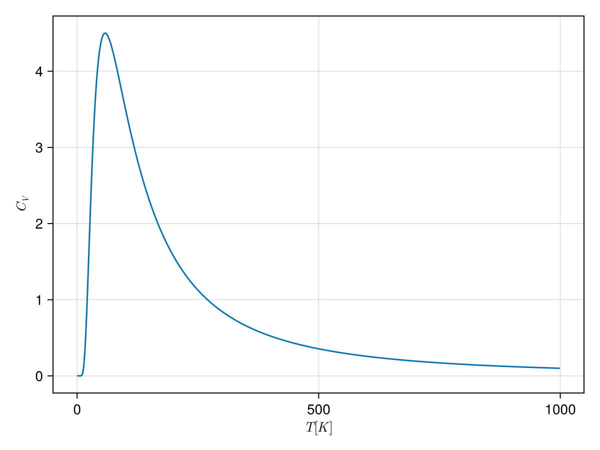
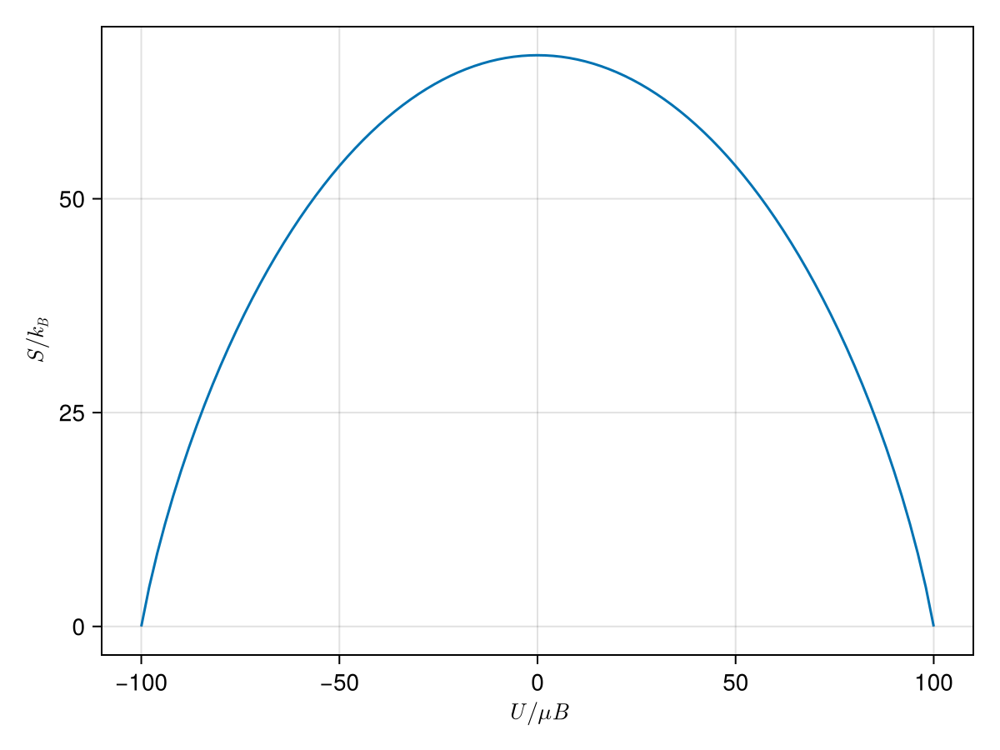
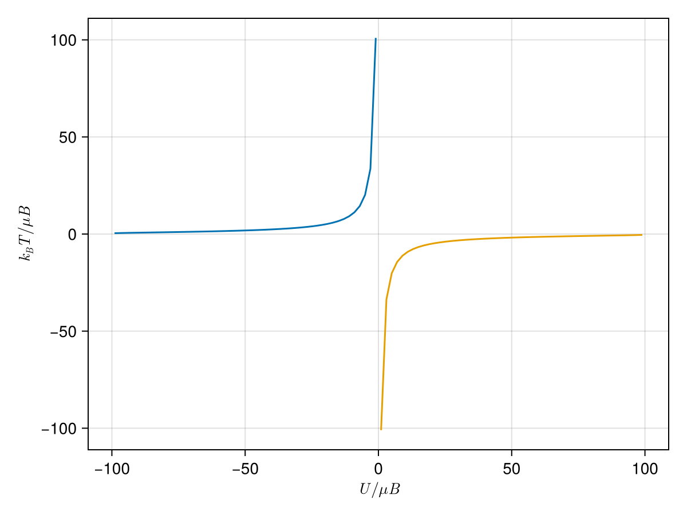



- 열역학 제 2 법칙은 자연의 근본 법칙이 아닌 확률법칙임. 그러나 큰 시스템에서 그 확률이 압도적이므로 대부분의 경우 근본법칙으로 다루고 있음.
- 이 장의 두 방향
  1. 엔트로피와 다른 변수-온도, 압력 등-와의 관계를 다룸.
  2. 두 시스템이 여려 방법으로 상호작용 할 때, 각각에 대해 필요환 관계를 유도함.

 

## 온도 {#sec-TD_temperature}

### 통계역학적 온도 {#sec-TD_definition_of_temperature_of_statistical_mechanics}

앞서 본 아인슈타인 고체의 경우와 같이 **부피와 입자의 개수가 고정되어 있으며 에너지만을 교환하는 두 시스템** $A,\,B$ 를 생각하자. 두 시스탐이 합쳐진 $[A+B]$ 는 고립계이며 따라서 $U_A+U_B=\text{constant}$ 이다. $[A+B]$ 의 엔트로피 $S_\text{total} = S_A+S_B$ 이며 평형상태에서 엔트로피가 최대가 되야 하므로

$$
\dfrac{\partial S_\text{total}}{\partial U_A} = \dfrac{\partial S_A}{\partial U_A} + \dfrac{\partial S_B}{\partial U_B}=0
$$ {#eq-TD_schroeder_3_2}

이어야 한다. 그런데 $U_A+U_B=\text{constant}$ 이므로 위 조건은 다음과 동등하다.

$$
\dfrac{\partial S_A}{\partial U_A} = \dfrac{\partial S_B}{\partial U_B}.
$$ {#eq-TD_schroeder_3_3}

우선 단위를 보자 $S=k_B\ln \Omega$ 이므로 $\text{J/K}$ 단위이다. 따라서 $(\partial S/\partial U)$ 의 단위는 $K^{-1}$ 이다. 

야기서는 부피와 입자의 개수가 고정되어 있는 시스템을 생각하므로 생각할 수 있는 변수는 온도 밖에 없다. 즉 @eq-TD_schroeder_3_3 는 온도의 역수와 모종의 관계가 있을 수 밖에 없다. 정확히는 엔트로피 $S=k_B\ln \Omega$ 로 정할 때 $\partial S/\partial U$ 가 온도의 역수가 되도록 $k_B$ 를 곱하여 정한 것이다$^1$.[$^1$ $S=k_B\ln \Omega$ 로 정한것은 볼츠만이 아니라 플랑크다.]{.aside} 

::: {.callout-note icon="false"}

#### 통계역학적 온도

온도는 다음과 같이 정의된다.
$$
\boxed{\dfrac{1}{T} := \left(\dfrac{\partial S}{\partial U}\right)_{N,\,V}.}
$$ {#eq-TD_schroeder_3_5}

:::

- 여기서 중요한 것은 열역학적 온도와 통계역학적 온도의 일치 여부이다. Schroeder 는 일단 "For most practical purpose, the two definitions are equivalent. (pp. 89)" 라고 하고 넘어간다.

::: {#exr-TD_schroeder_3_2}

#### Schroeder 3.2

온도의 정의를 이용하여 **열역학 0 법칙 (the zeroth law of thermodynamics)** 를 증명하라. 

:::

::: {.solution}

열역학 0 법칙은 아래와 같다. 

::: {.callout-important icon="false"}

#### **열역학 0 법칙**

시스템 $A$ 와 시스템 $B$ 가 열평형이고 시스템 $B$ 와 시스템 $C$ 가 열평형이면 시스템 $A$ 와 시스템 $C$ 도 열평형이다.

:::

$(\partial S_A){\partial U_A}_{N_A,\,V_A}= (\partial S_B/\partial U_B)_{N_B,\,V_B}$ 이고 $(\partial S_B){\partial U_B}_{N_B,\,V_B}= (\partial S_C/\partial U_C)_{N_C,\,V_C}$ 이면 당연히 $(\partial S_A){\partial U_A}_{N_A,\,V_A}= (\partial S_C/\partial U_C)_{N_C,\,V_C}$ 이다.   

:::

### 통계역학적 온도의 실제 예 {#sec-TD_real_world_example_of_temperature_of_statistical_mechanics}

::: {#exm-TD_examples_temperature_of_statistical_mechanics_1}

#### 아인슈타인 고체의 경우

아인슈타인 고체에서 $q\gg N$ 인 경우를 보자 여기서 $q$ 는 에너지 단위, $N$ 은 진동자의 개수이다. $U=\hbar \omega (q+1/2)$ 이며 @eq-TD_schroeder_2_46 으로 부터

$$
S =  Nk_B\left(\ln q-\ln N +1\right)
$$

이므로

$$
\dfrac{1}{T}= \left(\dfrac{\partial S}{\partial U}\right)_{N} = \dfrac{1}{\hbar\omega}\dfrac{Nk_B}{q}
$$

이며 따라서 $U_0 = \frac{1}{2}\hbar \omega$ 에 대해 $U$ 와 $T$ 아래와 같은 관계를 거잔다. 

$$
U-U_0 = Nk_B T
$$ {#eq-TD_schroeder_3_11}

:::

 

::: {#exm-TD_examples_temperature_of_statistical_mechanics_2}

#### 단원자 분자 이상기체의 경우

이상기체의 엔트로피(@eq-TD_schroeder_2_49) 는 다음과 같다. 

$$
S = Nk_B \left[\ln \left(\dfrac{V}{N}\left(\dfrac{4\pi mU}{3Nh^2}\right)^{3/2}\right)+\dfrac{5}{2}\right].
$$

이로부터 
$$
\dfrac{1}{T}= \dfrac{3Nk_B}{2U}
$$ {#eq-TD_schroeder_3_13}

이므로 다음이 성립한다.

$$
U = \dfrac{3}{2}Nk_BT.
$$ {#eq-TD_schroeder_3_13_1}

:::

 

::: {#exr-TD_schroeder_3_5}

#### Schroeder 3.5

@exr-TD_schroeder_2_17 로부터 $q \ll N$ 일 때의 아인슈타인 고체의 온도에 대한 식을 구하고 에너지를 온도에 대한 함수로 구하라.

:::

::: {.solution}

@exr-TD_schroeder_2_17 로부터 $S=k_B \ln \Omega (N,\,q) = qk_B (1+\ln N - \ln q)$ 임을 안다. 따라서

$$
\dfrac{1}{T}= \dfrac{k_B}{\hbar \omega}\left(\ln \left(\dfrac{N}{q}\right)\right)
$$

이며 이로부터 $U_0 = \frac{1}{2}\hbar \omega$ 에 대해

$$
U=U_0 + \hbar \omega Ne^{-\hbar \omega/k_B T}.
$$ 

:::

 

::: {#exr-TD_schroeder_3_7}

#### Schroeder 3.7

@exr-TD_schroeder_2_42 의 결과를 이용하여 블랙홀의 온도를 $M$ 으로 기술하라. 여기서 에너지는 $Mc^2$ 이다. 태양 질량의 블랙홀에 대해 온도를 구하라. 엔트로피-에너지 그래프를 그리고 이 그래프 모양에 대해 논하라.

:::

::: {.solution}

블랙홀의 엔트로피는 
$$
S_{\text{black hole}} = \dfrac{8\pi^2 GM^2}{hc}k_B
$$

이므로

$$
\dfrac{1}{T} = \dfrac{\partial S}{\partial (Mc^2)} = \dfrac{1}{c^2}\dfrac{\partial S}{\partial M}= \dfrac{1}{c^2}\dfrac{16\pi^2 GM}{hc}k_B
$$

이다. $M=2.0\times 10^30\,\text{kg}$ 에 대해 $T=6.1\times 10^{-8}\,\text{K}$. 

:::

 

## 엔트로피와 열 {#sec-TD_entropy_and_heat}

### 열용량 예측 {#sec-TD_predicting_heat_capacity}

앞장에서 엔트로피를 에너지의 함수로 구할 수 있을 때 온도를 에너지의 함수로 계산하는 법을 알게 되었다. 이 값을 실험과 비교하기 위해서 부피가 일정할때의 열용량인 정적 열용량을 구할 필요가 있다. 정적 열용량의 정의는 @eq-TD_fermi_25 의 첫번째 식과 같다. 부피가 일정하므로 $dU=dQ$ 이며 따라서 

$$
C_V = \left(\dfrac{\partial U}{\partial T}\right)_{N,\,V}
$$ {#eq-TD_schroeder_3_14}

이다. 아인슈타인 고체의 경우 $q \gg N$ 일 때 @eq-TD_schroeder_3_11 로부터

$$
C_V = Nk_B
$$ {#eq-TD_schroeder_3_15}

이며, 단원자 분자 이상기체의 경우 @eq-TD_schroeder_3_13_1 로부터

$$
C_V = \dfrac{3}{2}Nk_B
$$ {#eq-TD_schroeder_3_16}

이다. 두가지 경우 정적 열용량은 온도에 무관하며 $\frac{1}{2}Nk_B$ 에 **제곱항 자유도(quadratic degree of freedom)** 개수를 곱한 값이다. 이 두 경우 모두 밀도가 낮은 이상기체나 충분히 고온에서의 고체의 경우 실험값과 잘 일치한다. 

 

::: {#exr-TD_schroeder_3_8}

#### Schroeder 3.8

@exr-TD_schroeder_3_5 의 결과로부터 저온 극한에서의 아인슈타인 고체의 열용량을 구하고 온도의 함수로 그래프를 그려라.

:::

::: {.solution}

$$
C_V= \left(\dfrac{\partial U}{\partial T}\right)_{N} = \dfrac{(\hbar \omega)^2}{k_BT^2} N e^{-\hbar \omega/k_BT}
$$

{#fig-TD_schroeder_prob_3_8 width=400}

:::

### 엔트로피 측정 {#sec-TD_measureing_entropies}

온도의 정의 @eq-TD_schroeder_3_5 로 부터, 열 $Q$ 를 가하고 부피를 일정하게 유지하면서 다른 형태의 일을 하지 않는다면 엔트로피의 변화는 다음과 같이 쓸 수 있다.

$$
dS = \dfrac{d U}{T} = \dfrac{Q}{T} \qquad (\text{constant volume, no work}).
$$ {#eq-TD_schroeder_3_17}

온도와 열은 비교적 쉽게 측정 할 수 있으므로 위 식으로부터 다양한 과정에 대한 엔트로피 변화를 얻을 수 있다. [@sec-TD_mechanica_equillibrium_and_pressure 역학적 평형과 압력](#sec-TD_mechanica_equillibrium_and_pressure) 에서는 $dS=Q/T$ 가 준정적 과정에서는 부피가 변하더라도 사용 할 수 있음을 보일 것이다. 

상전이와 같이 열을 가해주더라도 온도가 변하지 않는 상황에서는 $dS$ 나 $Q$ 가 미소변화가 아니더라도 @eq-TD_schroeder_3_17 을 사용할 수 있다. 온도가 변할 경우, 부피가 일정하다면 등적 열용량을 사용하여 다음과 같이 쓸 수 있다.

$$
dS = \dfrac{C_V}{T}\,dT.
$$ {#eq-TD_schroeder_3_18}

엔트로피 변화 $\Delta S=S_f-S_i$ 는 다음과 같다.

$$
\Delta S = S_f-S_i = \int_{T_i}^{T_f}\dfrac{C_V}{T}\,dT
$$ {#eq-TD_schroeder_3_19}

여기서 관심 있는 온도 구간에서 $C_V$ 가 일정하다면

$$
\Delta S = C_V \ln \left(\dfrac{T_f}{T_i}\right),\qquad (\text{constant }C_V)
$$ {#eq-TD_schroeder_3_19_1}

이다. 물 200 g 을 20 °C 에서 100 °C 로 올렸을 때 $C_V=200 \,\text{cal/K}$ 이며 @eq-TD_schroeder_3_19_1 로부터 $\Delta S \approx 200 \,\text{J/K}$ 이다. 이는 가능한 미시상태의 수가 $e^{1.5 \times 10^{25}}$ 만큼 증가했다는 의미이다. 만약 $0\,\text{K}$ 까지의 비열과 $S(0\,\text{K})$ 를 안다면

$$
S_f-S_i = \int_0^{T}\dfrac{C_V}{T'}\,dT'
$$ {#eq-TD_schroeder_3_21}

을 통해 시스템의 총 엔트로피를 알 수 있다. 그런데 $S(0\,\text{K})$ 는 얼마인가? 이것에 대한 답이 소위 **열역학 제 3 법칙 (the third law of thermodynamics)** 이다. 

### 열역학 제 3 법칙 {#sec-TD_the_third_law_of_thermodynamics}

::: {.callout-tip icon="false"}

#### 참고자료

- @Schroeder2000introduction
- @Blundell2010concepts

:::

최초는 네른스트(H. Nernst, 1864-1941) 이다. 열화학과 전기화학 데이터를 통해 다음과 같은 결론을 내렸다.

::: {.callout-important icon="false"}

#### **네른스트의 열역학 제 3 법칙**

절대 영도 근처에서 내부 평행상태인 시스템의 모든 반응은 엔트로피에 변화를 주지 않는다.

:::

이후 막스 플랑크(M. Planck, 1858-4947) 는 네른스트 버젼을 다음과 같이 개선한다.

::: {.callout-important icon="false"}

#### **막스 플랑크의 열역학 제 3 법칙**

내부 평형상태인 순수 결정 시스템의 엔트로피는 절대영도에서 동일하며 0 으로 간주 될 수 있다.

:::

여기에서 고려해야 할 것들.

- 거의 모든 물질은 저온에서 고체가 되지만 4He 나 3He 은 매우 낮은 온도에서도 고체가 되지 않는다. 
- 내부 평형상태이어야 한다. 유리와 같이 fronen-in distorder 를 가진 물질은 이에 해당되지 않는다. 
- 통계역학적으로 보면 $S=0$ 은 $\Omega = 1$ 을 의미한다. $N$ 개의 스핀 0 인 원자로 이루어진 완전 고체를 생각하자. 이 고채의 핵스핀이 $I\ne 0$ 라고 하자. 외부 자기장이 없다면 핵스핀에 의한 축퇴로 인해 $S = Nk_B \ln (2I+1) \ne 0$ 이다. 그러나 핵스핀은 고체의 다른 원자의 쌍극자로부터 아주 미약한 자기장이라도 느끼게 되며 따라서 이 축퇴는 깨지고 가장 낮은 에너지상태만 남게 된다.  
- 위의 예를 좀 더 살펴본다면 핵스핀에 의한 엔트로피가 유지되는 낮은 온도에서도, 다른 부분에 의한 엔트로피는 0 에 가깝다. 이로부터 사이먼에 의한 열역학 제 3 법칙이 등장한다.

::: {.callout-warning icon="false"}

#### 열역학 제 3 법칙에 대한 질문과 Claude Fable 5.1 의 답변

**[Q]** 열역학 제 3법칙이 schroeder 에서는 짧게 다루어서 blundel 을 보고 있는데.. F. E. Simon 의 열역학 제 3법칙 까지 소개하고 있네. 그런데 wikipedia 나 다른 참고할만한 문서에서는 Simon 버젼의 3법칙은 별로 안다루는 것 같고..

>Simon 버전이 눈에 잘 안 띄는 건 그게 틀려서가 아니라 너무 성공해서야 — 다른 두 진술 안에 조건절로 흡수돼 버려서 이름표가 떨어진 거지. 그리고 Blundell이 굳이 이름을 살려두는 데는 옥스퍼드 사정이 있어. 

>먼저 세 진술을 나란히 놓으면 Simon의 기여가 뭔지 보여. 표준적인 정리로는 Nernst: 절대영도 근처에서 내부 평형 상태의 계에서 일어나는 모든 과정은 엔트로피 변화 없이 진행된다. Planck: 내부 평형 상태의 모든 계는 절대영도에서 같은 엔트로피를 가지며, 그 값을 0으로 둘 수 있다. Simon: 계의 각 측면(aspect) 중 내부 열역학적 평형에 있는 것들이 엔트로피에 기여하는 부분은 T→0에서 0으로 간다는 형태야. 차이가 미묘한데, 핵심은 Simon이 계 전체가 아니라 **각 측면**을 따로 세고, 그중 "평형에 있는 것만" 0으로 간다고 한 데 있어. 에든버러 강의노트가 이걸 잘 풀어놨는데, 그 "측면"이란 원자가 자리에 배열되는 방식의 배치 엔트로피, 진동하는 원자 위치의 진동 엔트로피, 스핀 배열의 자기 엔트로피 같은 것들이야. 

>이게 왜 결정적이냐면, 1920년대에 제3법칙이 거의 죽을 뻔했거든. 유리, 과냉각 액체, 얼음의 잔류 엔트로피 같은 반례들이 쏟아졌고, Nernst-Planck 진술 그대로는 이걸 설명 못 했어. Simon의 수는 법칙을 폐기하는 대신 적용 범위를 정확히 자르는 거였어 — 유리의 배치 자유도는 평형에 못 이른 채 얼어붙은 것이니 법칙의 대상이 아니고, 같은 유리라도 진동 자유도는 평형이니 그 기여는 0으로 간다. 우리가 2주 전에 frustrated system 얘기하면서 내가 "현대적 정식화는 '평형 상태에서'라는 조건을 명시한다"고 했잖아 — 그게 문자 그대로 Simon의 1930년대 정식화야. 이름을 안 붙이고 말했을 뿐이지. 참고로 이 조건절이 다른 저자에게 어떻게 스며들었는지도 보여 — Ter Haar(1966)는 "내부 평형에 있는 각 성분의 엔트로피 기여는 절대영도에서 사라진다"로, Wannier(1966)는 더 읽기 쉽게 "화학적으로 단순하고 완전한 결정체의 엔트로피는 절대영도에서 0"으로 적었고, 이런 정식화들이 준안정 평형의 존재를 허용한다는 거야. 즉 Simon의 조건절이 후대 교과서마다 각자의 문장으로 녹아들면서 원저자 이름이 탈락한 거지. 

>Blundell이 이름을 살리는 이유는 반쯤 지리적이야. Simon은 Nernst의 제자였고, 1933년 독일을 떠나 옥스퍼드 클래런던 연구소에 저온물리를 사실상 세운 사람이야. Blundell 부부가 옥스퍼드 물리학자니까 자기 연구소 전통을 교과서에 새긴 거지. 영국 열역학 교재 계보(Pippard, Adkins, 에든버러 강의) 전반에 Simon의 이름이 남아 있는 것도 같은 맥락이고. 사족으로, Simon의 이력이 꽤 드라마틱해 — 적성국 출신이라 레이더 연구에서 배제됐고, 대신 UF₆ 기체 확산법을 통한 우라늄-235 분리를 고안해 맨해튼 프로젝트에 기여했어. 저온물리학자가 동위원소 분리로 전쟁에 참여한 거야. 

>Wikipedia 쪽 사정은 두 겹이야. 하나는 방금 말한 흡수 — 조건절이 된 기여는 백과사전 항목에서 별도 진술로 대접받기 어려워. 다른 하나는 현대 기초론의 무게중심이 아예 다른 진술로 옮겨갔다는 것. 제3법칙의 가장 널리 받아들여지는 버전은 도달불가능성 원리, 즉 어떤 과정으로도 유한한 단계와 유한한 시간 안에는 절대영도에 도달할 수 없다는 진술이고, Masanes와 Oppenheim(2017)이 양자역학적 냉각이나 무한차원 저장고를 쓰는 임의의 냉각 과정에 대해 이 원리를 유도했어. 엔트로피 진술(Nernst-Planck-Simon 계열)은 "평형" 조건 때문에 계속 단서가 붙는데, 도달불가능성은 그런 조건 없이 서니까 기초론 쪽은 이쪽을 본체로 삼는 추세야. 아이러니한 건, 엔트로피 진술과 도달불가능성의 관계를 1937년에 정리한 것도 Simon이라는 거지. 

>그러니 정리하면 이래. Simon 버전은 제3법칙의 생존 버전이야 — 잔류 엔트로피 반례에서 법칙을 구해낸 정식화. 너무 잘 작동해서 후속 교과서들이 자기 문장으로 흡수했고, 그래서 이름이 지워졌어. Blundell은 옥스퍼드라서 이름을 안 지운다. 네가 frustrated system 물었을 때 들었던 답이 바로 이 사람 거였고.

:::

::: {.callout-important icon="false"}

#### **사이면(F. E. Simon)의 열역학 제 3 법칙**

시스템의 총 엔트로피에서 내부평형상태에 있는 각각의 **측면(aspect)** 의 기여는 온도가 $0\, \text{K}$ 로 갈때 $0$ 이 된다.

:::

 

열역학 제 3 법칙으로 부터 여려 결론을 내릴 수 있지만 아직 열역학적 양에 대해 많이 다루지않은 관계로 대표적인 두가지만 짚고 넘어가기로 하자.

**1.** $T \to 0$ 일 때 비열은 $0$ 이다. 즉 $\displaystyle \lim_{T\to 0} C = \lim_{T\to 0} T\left(\dfrac{\partial S}{\partial T}\right)=0$.

**2.** **도달 불가능성** : 유한한 단계로 $T=0$ 까지 냉각 시킬 수 없다.

**3.** **카르노 엔진의 효율** : 우리는 카르노 엔진의 효율 $\eta_C = 1-T_l/T_h$ (@eq-TD_efficiency_of_carnot_engine_using_ideal_gas) 임을 안다. 그런데 $T_l=0$ 이면 $\eta_C=1$ 이다. 카르노 엔진은 등온팽창(압축)과 단열팽창(압축)의 반복인데 $0\,\text{K}$ 에서 등온압축은 어떻게 가능할까? 일단 $0\,\text{K}$ 에서는 열역학적 상태를 변경시킬 수 없으므로 등온 압축 자체가 불가능하다. 실제 열역학 3 법칙이 열역학 2법칙으로 부터 분리된 독자적 법칙이어야 한다고 믿어진 계기는 이것이었다. 

### 연습문제 {.unnumbered}

::: {#exr-TD_schroeder_3_10}

#### Schroeder 3.10

0 °C 30 g 얼음 큐브가 25 °C 인 부엌의 테이블에 놓여져 있다. 

($a$) 얼음이 0°C 에서 녹을 때 얼음 큐브의 엔트로피 변화를 계산하라. 얼음의 잠열은 $333\,\text{J/g}$ 이다.

($b$) 물의 온도가 0°C 에서 25°C 로 올랐을 때의 물의 엔트로피 변화를 계산하라. 물의 비열 $C = 4.18\,\text{J/K}\cdot\text{g}$ 이다.

($c$) 얼음이 녹고 물은 온도가 높아진 것에 의한 부엌의 엔트로피 변화를 계산하라.

($d$) 이 과정에서의 우주의 엔트로피 변화를 계산하라. 엔트로피의 순 변화는 양수인가? 음수인가? 아니면 0 인가?. 이것이 우리가 기대하는 바인가?
:::

::: {.solution}

($a$) $\Delta S_{\text{melting}} = (333/273)\times 30 = 36.6 \,\text{J/K}$.

($b$) $\Delta S_{\text{water}} = C\ln (T_f/T_i) = 11.0 \,\text{J/K}$. 

($c$) $\Delta S_{\text{kitchin, melting}} = -30\times 333 /(25 + 273) = -33.5 \,\text{J/K}$, $\Delta S_{\text{kitchin, water}} = -30 \times C \times 25 = -10.5 \,\text{J/K}$, 따라서 $\Delta S_{\text{total, kichin}}= -44.0\,\text{J/K}$

($d$) 엔트로피의 순 변화 $\Delta S_\text{total} = 4.6 \,\text{J/K}$ 로 엔트로피는 순증가하였다.

:::

 

::: {#exr-TD_schroeder_3_11}

#### Schroeder 3.11

목욕물의 온도를 적절하게 맞추기 위해 55°C 의 물 50 리터와 10°C 의 물 25 리터를 섞었다. 이 물을 섞음으로서 증가한 엔트로피는?

:::

::: {.solution}

평형이 되는 온도는 40°C 이며 $\Delta S\approx 746 \,\text{J/K}$.
:::

 

::: {#exr-TD_schroeder_3_13}

#### Schroeder 3.13

태양이 하늘에 높이 떠 있을때 지표면 $1\,\text{m}^2$ 당 1000 W 의 일률을 전달한다. 태양의 표면 온도는 6000 K 이고 지구의 표면 온도를 300 K 라고 할 때 다음에 답하라.

($a$) 태양으로부터의 열에너지 전달로 인해 발생하는 지표면에서 1 제곱미터당 엔트로피 변화를 계산하라.

($b$) 당신이 지표면에 1 제곱 미터의 잔디를 기른다고 하자. 혹자는 잔디가 성장하는 것은 무질서한 영양소를 정렬된 생명 형태로 바꾸는 것이기 때문에 열역학 제 2 법칙을 거스른다고 주장 할 수 있다. 어떻게 반박할까?

:::

::: {.solution}

($a$) $\Delta S_\text{sun}=-1000 \times 3600 \times 24 \times 365 /6000 = -5.25\times 10^6\,\text{J/K}$.

$\Delta S_\text{earth} = \Delta S_\text{sun}\times 6000/300 = 1.05 \times 10^{8}\,\text{J/K}$.

($b$) 지구에서 증가하는 엔트로피 차이는 태양에서 감소하는 엔트로피에 비해 막대하며 (20배) 지구에 도달하는 에너지 중 일부가 잔디의 엔트로피를 감소시킨다고 하더라도 잔디까지 고려한 순 엔트로피틑 증가 할 수 있다.

:::

 

::: {#exr-TD_schroeder_3_14}

#### Schroeder 3.14

저온에서의 알루미늄의 1 몰의 열용량은 실험적으로 

$$
C_V = aT + bT^3
$$

이며 여기서 $a=0.00135 \,\text{J/K}^2$, $b=2.48\times 10^{-5}\,\text{J/K}^4$ 이다. 이로부터 일 몰의 알루미늄의 엔트로피를 온도에 대한 함수로 구하라. $T=1\,\text{K}$ 와 $T=10\,\text{K}$ 에서의 엔트로피를 $\text{J/K}$ 단위와 무단위 값(볼츠만 상수로 나눈 값) 으로 구하라.

:::

::: {.solution}

@eq-TD_schroeder_3_19 로 부터
$$
S = \int_0^T \dfrac{C_V}{T}\,dT = aT + \dfrac{b}{3}T^3
$$

이며, $S(1\,\text{K}) = 1.36\times 10^{-3}\,\text{J/K}$, $S(10\,\text{K}) = 2.18\times 10^{-2}\,\text{J/K}$. 

$S(1\,\text{K})/k_B \approx 9.84\times 10^{19},\, S(10\,\text{K})/k_B \approx 1.58\times 10^{21}$.

:::

 

::: {#exr-TD_schroeder_3_16}

#### Schroeder 3.16

컴퓨터 메모리의 **비트(bit)** 는 두 다른 상태가운데 하나에 있을 수 있는 물리적 대상이다. 1 바이트(byte) 는 8 비트이며 킬로바이트는 1024 바이트이고, 메가바이트는 1024 킬로바이트며, 기가바이트는 1024 메가바이트이다.

($a$) 당신의 컴퓨터가 1 기가바이트의 메모리를 지우거나 덮어써 기존의 기록을 모두 제거했다고 하자. 이 과정을 통해 어떤 최소한의 엔트로피를 생성하는지 설명하고 계산하라.

($b$) 이 엔트로피가 상온에서 생성되었다면 얼마나 많은 열이 필요한가? 이 열이 상당한 양인가?

:::

::: {.solution}

($a$) $N_\text{bits} = 8\times (1024)^3 = 8.6\times 10^9$. $\Omega  = \text{[상태의 개수]}= 2^{N_\text{bits}}$.

따라서 $\Delta S = N_\text{bits}k_B \ln 2 = 8.2 \times 10^{-14}\,\text{J/K}$. 

($b$) $Q=T\Delta S = 2.47 \times 10^{-11}\,\text{J}$ 로 매우 적은 양이다.

:::

## 상자성 {#sec-TD_paramagnetism}

### 표기법과 물리 {#sec-TD_notation_and_mocroscopic_physics_of_paramagnetism}

스핀 $1/2$ 입자는 외부 자기장 $\bf{B}=B\hat{\bf{z}}$ 에 대해 스핀이 $+z$ 혹은 $-z$ 방향으로 정렬하며 $+z$ 방향으로 정렬할 때  $-\mu B$ 를 $-z$ 방향으로 정렬할 때 $\mu B$ 에너지를 가진다. $N$ 개의 스핀 $1/2$ 입자에 자기장을 가할 때 $+z$ 방향으로 정렬한 입자의 개수를 $N_\uparrow$, $-z$ 방향으로 정렬한 입자의 개수를 $N_\downarrow$ 라고 하면 $N= N_\uparrow + N_\downarrow$ 이고 이 시스템의 총 에너지 $U$ 는

$$
U = -\mu BN_\uparrow +\mu B N_\downarrow = \mu B(N_\downarrow - N_\uparrow) = \mu B(N -2N_\uparrow).
$$ {#eq-TD_schroeder_3_25}

외부 자기장에 대해 **자화율 (Magnetization)** $M$ 은 다음과 같이 정의된다.

$$
M := \mu (N_\uparrow-N_\downarrow) = - \dfrac{U}{B}.
$$ {#eq-TD_schroeder_3_26}

$N$ 개 가운데 $N_\uparrow$ 가 정해졌을 때 가능한 미시상태의 수 $\Omega(N_\uparrow)$ 는

$$
\Omega(N_\uparrow) = \dfrac{N!}{N_\uparrow ! N_\downarrow !}.
$$ {#eq-TD_schroeder_3_27}

### 수치해석적 해와 음의 온도 {#sec-TD_numerical_solution}

$N=100$ 에 대해 $S/k_B = \ln \Omega$ 를 그려 보면 아래 그림과 같다.

{#fig-TD_schroeder_3_8 width=400}

위의 그래프를 보자. $U/\mu B=N_\downarrow - N_\uparrow$ 이므로 $N_\downarrow=0$ 일 때, 즉 모든 스핀에 $+z$ 방향으로 정렬되어 있을 때 엔트로피-에너지 그래프는 매우 가파르다. $U<0$ 일 때는 에너지가 증가할수록 기울기가 낮아지다가 $U=0$ 일 때 엔트로피가 최대가 된다. 이 때는 $N_\downarrow=N_\uparrow=N/2$ 이다. 그러나 $U>0$ 일 때 $\partial S/\partial U<0$ 이 되며 이 상태에서는 주변의 $(\partial S/\partial U)>0$ 인 물체에 에너지를 방출하게 된다. 

이제 온도 이야기로 넘어가보자. @eq-TD_schroeder_3_5 로부터 $U=0$ 일 때 이 시스템의 온도는 $\infty$ 이며, $U>0$ 일 때 이 시스템의 온도는 통계역학적 정의에 의하면 음수이다. 그리고 음의 온도는 아무리 큰 양의 온도의 물체라도 에너지를 공급하기 때문에 양의 온도보다 더 높은 온도라고 볼 수 있다. 

{#fig-TD_schroeder_2_9 width=400}

음의 온도는 시스템의 총 에너지가 위로 유계이며, 이로인해 에너지가 증가하면서 가능한 미시상태의 수가 에너지가 증가할수록 감소할 때 발생한다. 가장 좋은 예는 **핵 상자성 (nuclear paramagnet)** 이다. 이 경우 자기쌍극자는 전자의 스핀이 아니라 핵의 스핀에 의한 것이며, 핵은 아주 높은 온도가 아니라면 운동에너지가 무한히 증가할수 없으므로 외부 자기장에 의한 에너지에 한계가 있다. 또한 어떤 결에서는 핵의 쌍극자에 대한 완화시간(relaxation time) 이 격자 진동과 핵 쌍극자의 완화시간보다 매우 짧기 때문에, 이 경우 짧은 시간 스케일에서 핵의 쌍극자는 격자 진동으로부터 독립된 고립계처럼 행동한다. 앞서에서 본 것 처럼 이런 시스템에서 모든 쌍극자가 자기장과 같은 방향으로 정렬되는 상태부터 시작하여 자기장을 역전시킨다면 음의 온도를 얻게 된다. 이 실험은 1951년도에 Edward M. Purcell 과 R. V. Pound 에 의해 1951 년도에 플루오린화 리튬 결정으로 수행되었다. 

### 해석적 해 {#sec-TD_analytic_solution}

이제 $N$ 값이 매우 클 경우에 대한 해를 구해보자. @eq-TD_schroeder_3_27 로부터

$$
\begin{aligned}
S/k_B &= \ln N! - \ln N_\uparrow! - \ln (N-N_\uparrow)! \\[0.3em]
&\approx N \ln N - N_\uparrow \ln N_\uparrow - (N-N_\uparrow) \ln (N-N_\uparrow).
\end{aligned}
$$ {#eq-TD_schroeder_3_28}

$U=\mu B(N-2N_\uparrow)$(@eq-TD_schroeder_3_25) 이므로,

$$
\begin{aligned}
\dfrac{1}{T} & =\left(\dfrac{\partial S}{\partial U}\right)_{N,\,B} = -\dfrac{1}{2\mu B}\left(\dfrac{\partial S}{\partial N_\uparrow}\right) = \dfrac{k_B}{2\mu B}\ln \left(\dfrac{N_\uparrow}{N-N_\uparrow}\right)
\end{aligned}
$$ {#eq-TD_schroeder_3_29}

이며 

$$
\dfrac{1}{T}= \dfrac{k_B}{2\mu B}\ln \left(\dfrac{N-U/\mu B}{N+U/\mu B}\right)
$$ {#eq-TD_schroeder_3_30}

이다. 이 식을 $U$ 에 대해 구하면

$$
U=\mu N B \left(\dfrac{1-e^{2\mu  B/k_BT}}{1+e^{2\mu B/k_B T}}\right) = -\mu N B \tanh \left(\dfrac{\mu B}{k_BT}\right)
$$ {#eq-TD_schoreder_3.31}

이며, 따라서 자화율은

$$
M = -\dfrac{U}{B} = \mu N \tanh \left(\dfrac{\mu B}{k_B T}\right).
$$ {#eq-TD_schroeder_3_32}

따라서 $T\to \infty$ 일 때 $M=0$ 이다. 또한 일정한 자기장에서의 비열 $C_B$ 를 구하면

$$
C_B = \left(\dfrac{\partial U}{\partial T}\right)_{N,\,B} = Nk_B \dfrac{(\mu B/ k_B T)^2}{\cosh^2 (\mu B/ k_B T)}
$$ {#eq-TD_schroeder_3_33}

이며 $T\to \infty$ 에서 $C_B \to 0$ 이다. 

실제로 상자성에서는 전자나 핵에 의한 자기쌍극자이다. 전자의 경우 궤도각운동량 혹은 스핀각운동량에 의한 것이며 가능한 상태의 수는 작은 자연수이다. 특정한 상황에서는 전자의 궤도각운동량값이 주위 원자에 의해 0 이 되며 이를 **orbital quenching** 이라고 한다. 이 경우에는 전자의 스핀각운동량만 살아남는다. $S=1/2$ 일 경우는 2개의 상태만 가능하며 이것이 우리가 지금까지 살펴온 것이다. 전자의 경우 $\mu$ 값은 **보어 마그네톤 (Bohr magneton)** $\mu_B$ 값을 사용한다.

$$
\mu_B = \dfrac{e\hbar}{2m_e} = 9.274 \times 10^{-24}\,\text{J/T} = 5.788 \times 10^{-5}\,\text{eV/T}.
$$ {#eq-TD_schroeder_3.34}

자기장 $1 T$ 의 경우 $\mu_B B \approx 5.8 10^{-5}\, \text{eV}$ 이며 $k_B (300\,\text{K}) \approx 0.025\,\text{eV}$ 이므로 $k_B T_\text{room} \gg \mu B$ 이다. 이 경우 @eq-TD_schroeder_3_32 는

$$
M \approx \dfrac{\mu_B^2 N B}{k_BT}  \qquad (k_B T \gg \mu_B B) 
$$ {#eq-TD_schroeder_3_35}

이다. $M\propto 1/T$ 이며 이를 **퀴리 법칙 (Curie's law)** 라고 한다.

### 연습문제 {.unnumbered}

::: {#exr-TD_schroeder_3_20}

#### Schroeder 3.20

DPPH 와 같은 이상적인 2상태 상자성 물질을 생각하자. 여기서 $\mu = \mu_B$ 이다. 2.06 T 의 자기장을 걸었고 가장 낮은 온도는 2.2 K 이다. 에너지와 자화율, 엔트로피를 구하고 가능한 최대값에 대한 비율로 표현하라. 가능한 자화의 99% 를 얻기 위해서 무엇을 해야 하는가?

:::

::: {.solution}

2.06 T, 2.2 K 에서 생각한다. $\mu_B \times 2.2\,\text{T}/(k_B \times 2.2 \,\text{K})=0.629$. $U_\max = \mu_B NB$ 이며 $U/U_\text{Max}=-0.557$, $M/M_\text{max}=0.557$, $N_\uparrow=0.779 N$, $S_\text{Max}= k_B\ln 2$ 이므로 $S/S_\text{Max}=0.762$.

99% 자화를 얻기 위해서는 $\mu_B B/k_B T\approx 2.65$ 이어야 하며 자기장을 4.2배 증가시킨 8.65 T 로 올리거나 온도를 0.5 K 로 낮추어야 한다. 
:::

 

::: {#exr-TD_schroeder_3_22}

#### Schroeder 3.22

2상태 상자성의 엔트로피를 온도의 함수로 표현하면 $x=\mu B/k_BT$ 에 대해

$$
S=Nk_B \left[\ln (2 \cosh x) - x \tanh x\right]
$$

임을 보여라. 이 때 $T\to 0$ 과 $T \to \infty$ 를 논하라.

:::

::: {.solution}

@eq-TD_schroeder_3_25 과 @eq-TD_schoreder_3.31 로부터 $N_\uparrow = (N/2)(1+\tanh x)$ 임을 안다. @eq-TD_schroeder_3_28 로부터

$$
\begin{aligned}
S/k_B &= N \ln N - \dfrac{N}{2}(1+\tanh x)  \ln  \dfrac{N}{2}(1+\tanh x)  \\[0.3em]
&\qquad - \dfrac{N - \tanh x}{2}\ln  \dfrac{N}{2}(1-\tanh x)
\end{aligned}
$$

:::

## 역학적 평형과 압력 {#sec-TD_mechanica_equillibrium_and_pressure}